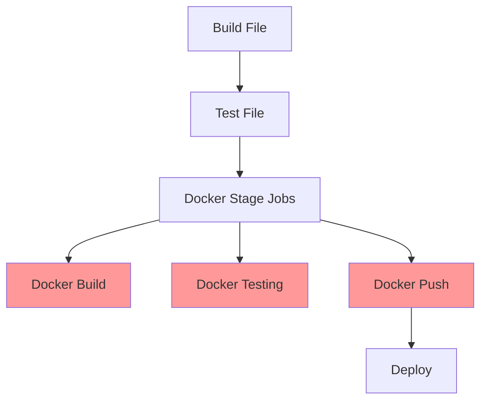
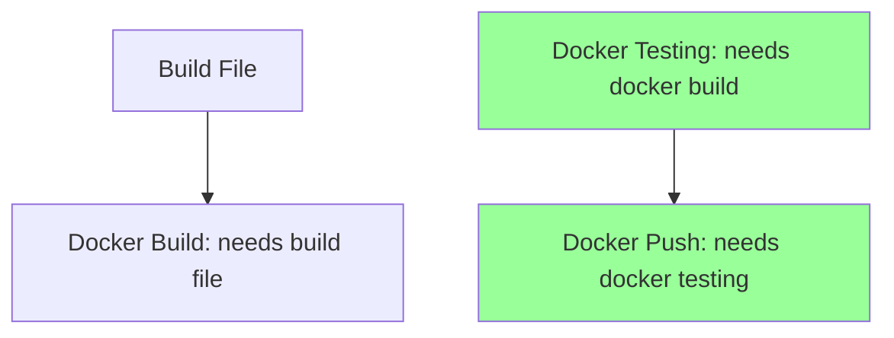
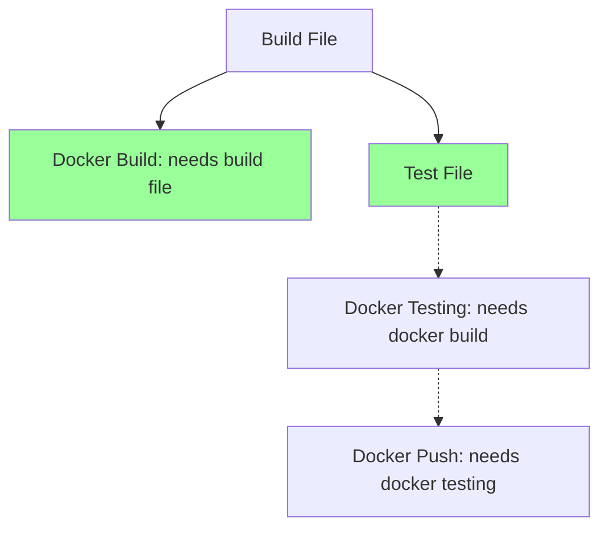

Session 16: Artifacts - Storing Job Data

## Modifying Existing Workflow

### Job Naming and Cleanup
Updated job names to be more descriptive and aligned with their functions:
- Build job renamed to `build file`
- Test job renamed to `test file`  
- Deploy job renamed to deploy to AWS EC2 (implying deployment target)

Removed unnecessary sleep commands from build and test jobs to streamline execution.

```diff
! Existing Workflow Changes:
- Old: sleep commands in build and test
+ New: Direct execution without delays

build file:
  script:
    - echo "Building file..."
    
test file:
  script:
    - echo "Testing file..."
```

> [!NOTE]
> Initial workflow had three jobs in sequence: build file → test file → deploy. Subsequent additions introduced Docker-related jobs.

## Adding Docker Jobs

Added three new jobs specifically for Docker image handling to extend the CI/CD pipeline capabilities.

### Docker Jobs Configuration
- **Docker build**: Simulates image building
- **Docker testing**: Tests the built image
- **Docker push**: Pushes image to Docker Hub

All three jobs assigned to a new `Docker` stage, executed after the `test` stage.

> [!IMPORTANT]
> Stages control execution order at the pipeline level. Jobs within the same stage run in parallel by default.

### Job Implementation Details
Jobs use echo commands for demonstration (actual Docker commands introduced later).

```yaml
docker build:
  stage: docker
  script:
    - echo "Building Docker image..."
    - sleep 15

docker testing:
  stage: docker
  script:
    - echo "Testing Docker image..."
    - sleep 10
    - exit 1  # Intentionally fails for demonstration

docker push:
  stage: docker
  script:
    - echo "Logging to Docker Hub..."
    - echo "Pushing Docker image to Docker Hub..."
```

## Pipeline Execution Behavior

### Default Parallel Execution
Jobs within the same stage execute simultaneously across different runners/VMs.



> [!WARNING]
> Parallel execution can lead to logical errors (e.g., pushing image before it's built or tested successfully).

### Observed Issues
- Push job completed first despite requiring build artifacts
- Test job failed deliberately
- Deploy skipped due to upstream failure

```diff
- Parallel Issues: Jobs ran out of logical order
! Push (successful echo) → Test (failed) → Build (completed last)
- Expected: Build → Test → Push
```

## Using the `needs` Keyword

### Purpose and Functionality
The `needs` keyword enforces job dependencies and controls execution order:
- Executes jobs out of stage order
- Sequences jobs within the same stage  
- Creates a Directed Acyclic Graph (DAG) for dependency visualization

### Basic Usage
Specify job names that must complete successfully before the current job starts.

```yaml
docker testing:
  needs: ["docker build"]
  script:
    - # test commands

docker push:
  needs: ["docker testing"]
  script:
    - # push commands
```

### DAG Visualization
Represents job relationships and optimal execution paths.



## Implementing Dependencies

### Lab Demo: Adding Sequential Execution
Applied `needs` to ensure Docker jobs run in correct order:

1. **Commit changes** to trigger pipeline
2. **View pipeline stages** showing Docker stage
3. **Check job dependencies** in UI:
   - Docker testing waits for Docker build
   - Docker push waits for Docker testing
4. **Observe execution**:
   - Build completes → Testing starts → Testing finishes → Push starts

### Failure Handling
- Testing job fails with exit code 1
- Push and deploy jobs automatically skipped due to failed dependency

> [!IMPORTANT]
> The `needs` keyword ensures failed prerequisite jobs prevent downstream execution, maintaining pipeline integrity.

## Ignoring Stage Ordering

### Cross-Stage Dependencies
Jobs can depend on successful completion of jobs from previous stages, enabling concurrent stage execution.

### Lab Demo: Modified Dependencies  
Added dependency allowing Docker operations to start early:

```yaml
docker build:
  needs: ["build file"]  # Cross-stage dependency
  script:
    - # build commands
```

### Enhanced Pipeline Flow
- Build file completes → Docker build starts immediately  
- Test file and Docker build run concurrently across stages



> [!NOTE]
> Visualize via "Job Dependencies" view in pipeline UI. Hover over connections to see execution flow.

### Key Benefits
- **Efficiency**: Maximizes parallelism while maintaining logical dependencies  
- **Flexibility**: Mix sequential and parallel job execution across stages

## Summary of Changes

```diff
+ Added: Docker stage with build, test, push jobs
+ Added: needs keyword for proper job sequencing
+ Added: Cross-stage dependencies for concurrent execution
- Removed: Sleep commands for faster pipelines
- Fixed: Logical execution order issues
```

> [!IMPORTANT]
> The `needs` keyword is essential for complex pipelines requiring custom execution order and dependency management. Always visualize the DAG to verify expected flow before committing changes.

> [!WARNING]
> Ensure all prerequisite jobs complete successfully; failed jobs will skip dependents automatically, potentially breaking deployment workflows. Test failure scenarios thoroughly.
