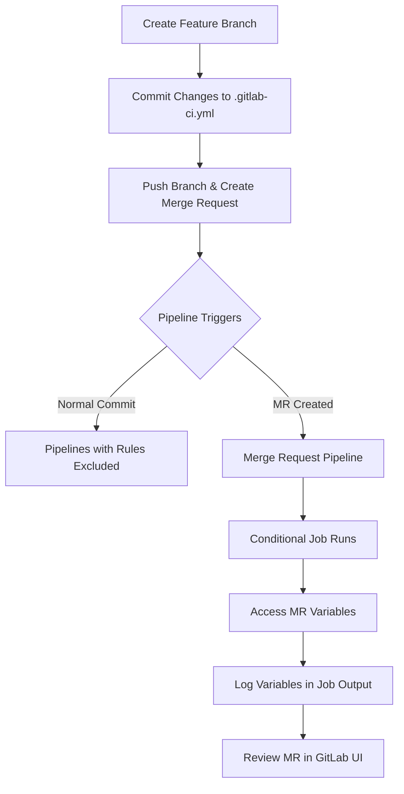

# Session 21: Intro to Merge Requests

## Rules in GitLab CI/CD

### Key Concepts

Rules are keywords used in GitLab CI/CD pipelines to include or exclude jobs based on predefined conditions. They are evaluated when the pipeline is created, allowing for conditional execution of jobs.

**Common Keywords for Rules:**
- `if`: Evaluates a condition (e.g., variable values, pipeline source).
- `changes`: Checks for changes in files or paths.
- `when`: Defines when a job should run (e.g., on_success, on_failure).
- `variables`: Matches against predefined or custom variables.

> [!NOTE]  
> Rules accept an array of conditions. If any rule evaluates to true, the job is included or excluded based on the configuration.

> [!IMPORTANT]  
> Using rules helps control pipeline flow without manual intervention, especially for event-specific jobs like merge requests.

### Using Rules with `if` Condition

To conditionally run a job only for merge requests, use the `CI_PIPELINE_SOURCE` variable with the `if` keyword.

**Example Rule:**
```yaml
job_name:
  script: echo "This runs only for merge requests"
  rules:
    - if: '$CI_PIPELINE_SOURCE == "merge_request_event"'
```

If the condition is true, the job is added to the pipeline; otherwise, it's excluded.

> [!WARNING]  
> Incorrect rule syntax can lead to jobs not running as expected. Always validate the YAML in the GitLab UI.

## Merge Request Predefined Variables

### Key Concepts

Merge request (MR) events provide specific predefined variables that can be accessed in CI/CD jobs. These variables are only available when the pipeline is triggered by a merge request event, not by regular commits.

**Common Merge Request Predefined Variables:**

| Variable | Description | Example Value |
|----------|-------------|---------------|
| `CI_MERGE_REQUEST_TARGET_BRANCH_NAME` | Name of the target branch (e.g., main, develop) | "main" |
| `CI_MERGE_REQUEST_SOURCE_BRANCH_NAME` | Name of the source branch | "feature-one" |
| `CI_MERGE_REQUEST_TITLE` | Title of the merge request | "Adds rules for merge request job" |
| `CI_MERGE_REQUEST_ASSIGNEE` | Username of the assigned user | "current-user" |
| `CI_MERGE_REQUEST_LABELS` | Comma-separated labels on the MR | "predefined-variables,testing-rules" |
| `CI_MERGE_REQUEST_IID` | Internal ID of the merge request | "1" |

> [!TIP] 💡  
> Use these variables for dynamic logging, notifications, or conditional logic in your pipelines. For example, echo `$CI_MERGE_REQUEST_TITLE` to log the MR title.

## Lab Demo: Creating a Merge Request with Rules

This demo demonstrates adding rules to a job for merge request events, creating a feature branch, committing changes, and creating an MR to trigger the conditional job.

### Pre-Step: Verify CI/CD YAML

Ensure your `.gitlab-ci.yml` includes a job configured with rules for merge request events.

**Updated `.gitlab-ci.yml` Example:**
```yaml
stages:
  - test
  - build
  - deploy

test_job:
  stage: test
  script: echo "Running tests"

build_job:
  stage: build
  script: echo "Building project"

merge_request_job:
  stage: deploy
  script:
    - echo "Merge Request Target Branch: $CI_MERGE_REQUEST_TARGET_BRANCH_NAME"
    - echo "Merge Request Source Branch: $CI_MERGE_REQUEST_SOURCE_BRANCH_NAME"
    - echo "Merge Request Title: $CI_MERGE_REQUEST_TITLE"
    - echo "Merge Request Assignee: $CI_MERGE_REQUEST_ASSIGNEE"
    - echo "Merge Request Labels: $CI_MERGE_REQUEST_LABELS"
  rules:
    - if: '$CI_PIPELINE_SOURCE == "merge_request_event"'
```

> [!NOTE]  
> This job only runs if the pipeline source matches "merge_request_event". Otherwise, it's excluded.

### Step 1: Create a Feature Branch

1. Open your GitLab project.
2. Navigate to the repository and create a new branch named `feature-one`.
3. Switch to the new branch.

```bash
git checkout -b feature-one
```

✅ Feature branch created.

### Step 2: Commit Changes

1. Edit `.gitlab-ci.yml` to add the rules for the `merge_request_job`.
2. Stage and commit the changes.

```bash
git add .gitlab-ci.yml
git commit -m "Add rules for merge request job"
```

✅ Changes committed to feature branch.

### Step 3: Create Merge Request

1. Push the branch to GitLab (if not done automatically).
   
   ```bash
   git push origin feature-one
   ```

2. In GitLab UI, go to **Merge Requests > New merge request**.
3. Set source branch to `feature-one` and target to `main`.
4. Enable "Start a merge request".
5. Enter title: "Add rules for merge request job".
6. Copy title to description.
7. Assign to yourself.
8. Add labels: "predefined-variables" (green) and "testing-rules" (blue).
9. Create the merge request.

> [!IMPORTANT]  
> Approvals may not be available in trial accounts; skip if necessary.

### Step 4: Observe Pipeline Behavior

**Normal Commit Pipeline (on feature branch):**
- Pipeline triggers with only `test_job` and `build_job`.
- `merge_request_job` is excluded due to rules.

```diff
! Pipeline Source: push (not merge_request_event) → Job Excluded
```

**Merge Request Pipeline:**
- After creating MR, a new pipeline is triggered.
- Label indicates "merge_request".
- Only `merge_request_job` runs.
- Variables populate and display in job logs (e.g., branch names, labels, title).

```diff
+ Pipeline Source: merge_request_event → Job Included → Variables Accessible
```

### Step 5: View Merge Request Details

1. In GitLab, open the Merge Request (e.g., via left sidebar or MR number).
2. Review:
   - Commits included.
   - Pipelines run.
   - Changes made.
   - Pipeline status.
3. Artifacts or reports (if any) are displayed here.

> [!TIP] 💡  
> Merge requests integrate deeply with CI/CD, showing job status and allowing custom workflows (e.g., blocking merges on failed pipelines).



## Key Takeaways

- Use `rules` with `if` conditions to control job execution based on pipeline sources.
- Merge request events unlock predefined variables for dynamic pipeline behavior.
- Rule-based pipelines prevent unnecessary job runs, improving efficiency.

```diff
+ ✅ Use Rules for Event-Specific Jobs
- Avoid Hardcoding Conditions; Leverage Predefined Variables
! ⚠️ Always Test Rules in Separate Branch to Verify Exclusion/Inclusion
```

> [!WARNING]  
> Jobs with incorrect rules may be skipped entirely, leading to missed automation. Validate in GitLab's Pipeline Editor.
