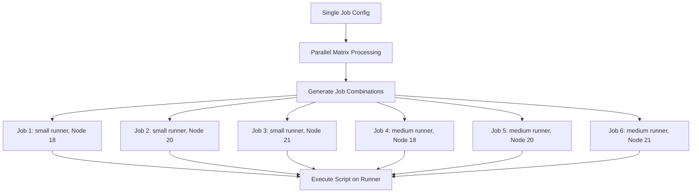

# Session 27: Use Job Images

## GitLab CI Parallel Keyword

### Key Concepts

GitLab CI's `parallel` keyword enables running a job multiple times in parallel within a single pipeline, improving overall pipeline speed by distributing workloads across multiple concurrent jobs.

#### Benefits of Parallelization
- **Workload Distribution**: Split large test suites or tasks into smaller, parallel-executing jobs.
- **Performance Gains**: Reduces total execution time (e.g., 100 test cases in 20 minutes vs. 10-15 minutes across 10 parallel jobs).

```diff
+ Advantage: Faster pipeline completion through concurrent job execution
- Limitation: Requires available runners to execute parallel jobs
! Note: Parallel jobs consume more resources but complete quicker overall
```

#### Parallel Matrix
- Extends the `parallel` keyword to run jobs multiple times with different variable values.
- Defines a matrix of variables to create combinations of job configurations.
- Useful for testing across multiple environments, versions, or configurations simultaneously.

```diff
+ Feature: Run single job template against multiple variable combinations
- Caveat: Matrix variable names must match job configuration placeholders
```

### Example Use Case: Testing on Multiple Node.js Versions

Running deployment or testing across different Node.js images and runner machines to ensure compatibility.

#### Variables Setup
| Variable | Values |
|----------|--------|
| `runner_machine` | `["saas-linux-small-amd64", "saas-linux-medium-amd64"]` |
| `node_version` | `["18", "20", "21"]` |

This creates 6 parallel jobs (2 machines × 3 versions).

### Lab Demo: Implementing Parallel Matrix

Follow these steps to configure parallel job execution with variable matrices:

1. **Define the Job with Parallel Matrix**:
   ```yaml
   deploy:
     image: node:$node_version
     tags:
       - $runner_machine
     parallel:
       matrix:
         - runner_machine: ["saas-linux-small-amd64", "saas-linux-medium-amd64"]
           node_version: ["18", "20", "21"]
     script:
       - node --version
       - npm --version
   ```

2. **Commit and Push the Changes**:
   - Save the updated `.gitlab-ci.yml` file.
   - Push to trigger a new pipeline.

3. **Observe Parallel Execution**:
   - View the pipeline: Notice the job shows count (e.g., "6 jobs").
   - Monitor jobs: Each runs on different machine/version combination.
   - Check job logs: Confirm correct Node.js version is used in each execution.

```diff
+ Correct: Use $variable_name to dynamically populate image tags and runner tags
- Incorrect: Hard-code values instead of leveraging matrix variables
```

> [!IMPORTANT]
> Pipeline validation displays the total number of generated jobs, but the editor visualization may not show individual parallel jobs.

> [!NOTE]
> If runners are unavailable, jobs will queue and execute as runners become free.

#### Pipeline Execution Flow



### Summary
The `parallel` keyword and matrix feature enable efficient workload distribution and comprehensive testing across multiple configurations. By dynamically varying job images and environments, you can validate compatibility without duplicating job definitions. Always validate pipelines to confirm the expected number of parallel jobs are created. 💡

### Corrections Made
No factual or spelling corrections were necessary in this transcript. The content was accurate as provided. ✅
