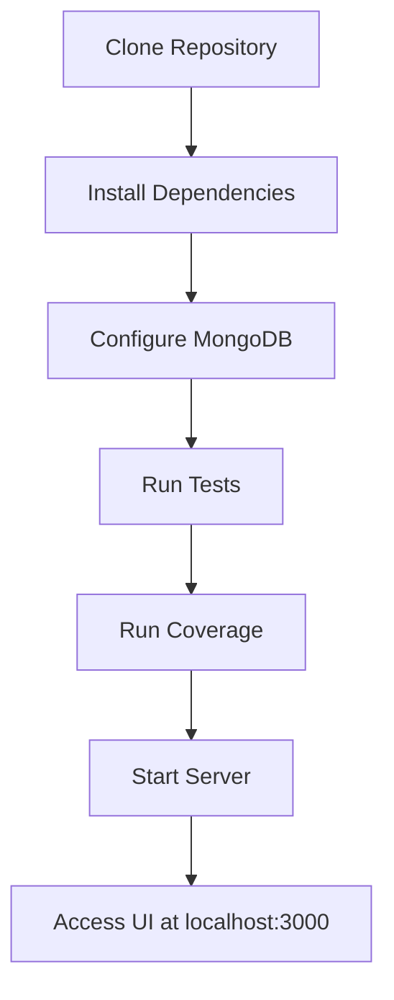

# Session 31: NodeJS Application Overview

## Key Concepts

### Application Source Code Overview
- 📝 The NodeJS application's source code is hosted on GitLab with documentation on how to run it locally.
- 📝 Core technologies used: NodeJS, Express for REST APIs, Mongoose for MongoDB connectivity, Mocha/Chai for testing, and NYC for coverage reports.

### Project Structure and Key Files

#### package.json
- 📋 Contains application metadata: name, version, author.
- 📋 Defines scripts: `start`, `test`, `coverage`.
- 📋 Dependencies: Express, Mocha JUnit Reporter, Mongoose, NYC Istanbul.
- 📋 Configured with 90% line coverage threshold.

#### Application Code (app.js)
- 📋 Backend business logic using Express.
- 📋 Connects to MongoDB via Mongoose requiring:
  - MongoDB URI
  - Username
  - Password
- 📋 Contains REST API endpoints.

#### Test Suite (app.test.js)
- 📋 Test cases using Chai and Chai HTTP.
- 📋 Generates `test_results.xml` for workflow integration.

#### Frontend Components
- 📋 `index.html`: Simple HTML page for the UI.
- 📋 `controller.js`: JavaScript logic for data fetching and display.
- 📋 Solar system-themed app showing planet details from cloud MongoDB.

#### Infrastructure Files
- 📋 `Dockerfile`: For container image building.
- 📋 Kubernetes manifests folder: Deployment configurations.

## Lab Demo: Running the NodeJS Application Locally

### Step 1: Clone the Repository
```bash
git clone [GitLab URL]
cd [project-directory]
```

### Step 2: Install Dependencies
```bash
npm install
```
- ✅ Creates `node_modules` folder with all required packages.

### Step 3: Run Tests (Initial Failure)
```bash
npm test
```
- ❌ Fails due to missing MongoDB connection parameters.

> [!WARNING]
> Test will fail without MongoDB URI, username, and password configured.

### Step 4: Configure MongoDB Connection (Demo Only)
- 📝 For local demo, hardcode MongoDB credentials in `app.js`:
  - MONGODB_URI: [your-mongodb-uri]
  - USERNAME: [your-username]
  - PASSWORD: [your-password]

### Step 5: Run Tests (Success)
```bash
npm test
echo $?
```
- ✅ Exit code 0 indicates all tests passed.
- ✅ Generates `test_results.xml` file.

### Step 6: Run Coverage Analysis
```bash
npm run coverage
echo $?
```
- ✅ Runs tests and generates coverage reports.
- ⚠️ Currently shows 88.88% coverage vs 90% threshold.
- ❌ Fails with exit code 1 due to threshold not met.
- 📋 Generated reports in `coverage/` folder:
  - `coverage.xml` (Cobertura format)
  - JSON summary
  - LCOV HTML reports

> [!NOTE]
> Coverage failure is intentional for GitLab Actions workflow demonstration.

### Step 7: Start the Application Server
```bash
npm start
```
- ✅ Server starts on port 3000.
- ✅ Access at: `http://localhost:3000`

### Step 8: Interact with the Application
- 🌌 Browse planets by entering planet numbers (e.g., 3 for Earth, 6 for Saturn).
- 📍 Displays hostname (shows local machine name "Silent Shadow" in demo).
- 📊 Pulls data from cloud-based MongoDB and renders in UI.

> [!IMPORTANT]
> In production deployment (like Kubernetes), hostname will display the pod/container name hosting the application.

## Flow of Application Execution



## Key Commands Summary

| Command | Purpose | Expected Outcome |
|---------|---------|------------------|
| `npm install` | Install dependencies | Creates node_modules folder |
| `npm test` | Run test suite | Exit 0 if pass, generates test_results.xml |
| `npm run coverage` | Code coverage analysis | Coverage reports, Exit 0 if ≥90% threshold |
| `npm start` | Start application server | Server running on port 3000 |

## Notable Takeaways

> [!NOTE]
> This demo familiarizes with local application structure before CI/CD pipeline implementation in GitLab Actions.

> [!WARNING]
> Never hardcode credentials in production code; use environment variables/secrets as implemented in GitLab Actions workflows.
