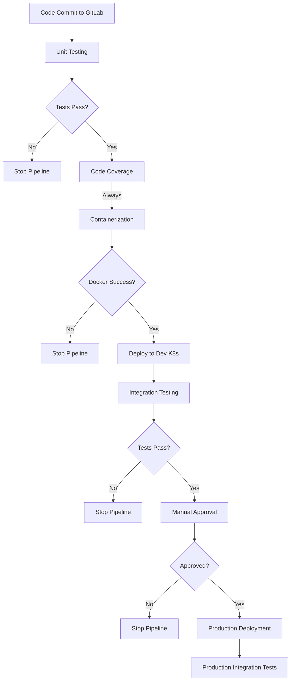

# Session 32: Run and Test NodeJS App on Local Machine

## DevOps Pipeline Requirements Overview

The DevOps pipeline for the NodeJS application focuses on automated testing, containerization, deployment, and integration through various stages. All code is hosted on a GitLab repository, with the pipeline designed to ensure quality through sequential validation steps.

## Key Concepts

### 1. Unit Testing Stage
- **Purpose**: Initiate pipeline with dependency installation and test execution
- **Commands**: 
  - `npm install` - Installs all project dependencies
  - `npm test` - Runs unit test cases
- **Reporting**: Downloads generated test reports
- **Error Handling**: Stops pipeline execution if any test failures occur

### 2. Code Coverage Stage
- **Purpose**: Provides code quality metrics alongside unit testing
- **Parallel Execution**: Runs both unit testing and code coverage simultaneously
- **Commands**:
  - `npm install` - Reinstalls packages for clean environment
  - `npm run coverage` - Executes code coverage analysis
- **Reporting**: Downloads coverage reports
- **Error Handling**: Ignores errors and continues pipeline (exceptional behavior)

### 3. Containerization Stage
- **Purpose**: Build and deploy application as containerized artifacts
- **Tools**: Docker for image creation and management
- **Operations**:
  - Build Docker image
  - Run Docker image for validation
  - Push image to container registry
- **Error Handling**: Stops pipeline on any Docker-related failures

### 4. Development Deployment Stage
- **Target**: Dev instance of Kubernetes cluster
- **Deployment Method**: Uses manifest files for declarative configuration
- **Commands**: `kubectl apply` - Applies Kubernetes manifests
- **Networking**: Retrieves Ingress URL for external access

### 5. Integration Testing Stage
- **Method**: Hits deployed application's Ingress URL endpoint
- **Purpose**: Validates end-to-end functionality in dev environment
- **Error Handling**: Stops pipeline on integration test failures

### 6. Manual Approval Stage
- **Purpose**: Human review checkpoint before production deployment
- **Participants**: Developers or reviewers
- **Actions**:
  - Review all pipeline artifacts (tests, coverage, containers, etc.)
  - Approve or decline deployment
- **Error Handling**: Stops pipeline permanently if declined

### 7. Production Deployment Stage
- **Replic Chandler**: Mirrors dev deployment process
- **Commands**: Same kubectl apply operations
- **Validation**: Runs integration tests after deployment
- **Testing**: Calls ingress endpoint to verify production functionality

## Pipeline Flow Summary



## Important Considerations

> [!IMPORTANT]
> The code coverage stage is unique - errors are intentionally ignored to allow pipeline continuation, enabling artifact generation even with coverage issues.

> [!WARNING]
> All stages implement fail-fast behavior except code coverage. Failed unit tests, Docker operations, integration tests, or declined approvals will halt the entire pipeline.

> [!NOTE]
> The pipeline uses a combination of GitLab for source control and GitHub Actions for workflow orchestration, implementing a hybrid CI/CD approach.

## Key Commands Reference

| Stage | Primary Commands | Reports Generated |
|-------|------------------|-------------------|
| Unit Testing | `npm install`, `npm test` | Unit test reports |
| Code Coverage | `npm install`, `npm run coverage` | Coverage reports |
| Containerization | `docker build`, `docker run`, `docker push` | - |
| Deployment | `kubectl apply` | Ingress URL |
| Integration Testing | HTTP requests to Ingress endpoint | Test results |

## Testing Strategy

The pipeline implements a layered testing approach:

```diff
+ Unit Tests: Validate individual code components
+ Code Coverage: Measure test completeness metrics
+ Integration Tests: Validate end-to-end system functionality
- Manual Approval: Human oversight for critical deployments
```

> [!NOTE]
> Integration testing occurs in both dev and production stages, ensuring consistent validation across environments.
