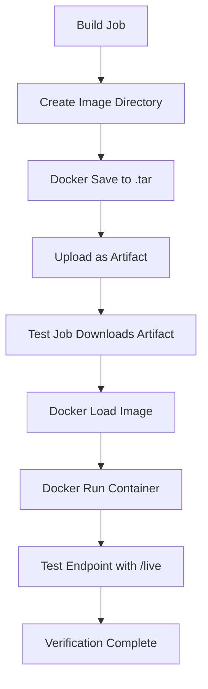

# Session 45: Docker Build and Testing

## Key Concepts

Testing Docker images before pushing them to a container registry is crucial in CI/CD pipelines. This ensures the image is functional before deployment. InGitLab CI, you can add a testing job that depends on the build job to verify the containerized application.

### Testing Workflow Overview
1. **Build Image**: Create the Docker image using a build job.
2. **Save as Artifact**: Use `docker save` to export the image as a tar file and upload it as a GitLab CI artifact.
3. **Test Job Dependency**: Create a test job that uses `needs` to download the artifact from the build job.
4. **Load and Test**: Use `docker load` to load the image, run it, and verify functionality with health check endpoints.

> [!IMPORTANT]
> Job artifacts can share files between jobs running on different runners, enabling dependency chains in multi-stage pipelines.

### Saving Docker Images
To pass a Docker image between jobs, save it as a tar file in a dedicated directory:

- Create an `image` directory
- Use `docker save <image>:<tag> -o image/myimage.tar`
- Configure artifacts in the job to upload the `image/` directory

> [!NOTE]
> Saving images allows testing without pushing to registries, reducing external dependencies and ensuring quality prior to publication.

### Job Dependencies with `needs`
The `needs` keyword specifies job dependencies, automatically downloading artifacts from required jobs:

```yaml
Docker_test:
  needs: 
    - Docker_build
```

This ensures the test job waits for the build completion and has access to its artifacts.

### Loading and Running Images for Testing
In the test job:
1. Load the image: `docker load -i image/myimage.tar`
2. Run the container in detached mode: `docker run -d --name test_container -p 3000:3000 <image>:<tag>`
3. Obtain container IP: `docker inspect test_container | grep IPAddress`
4. Test the application endpoint using a separate utility container

### Health Check Endpoint Testing
Using utility containers (like Alpine) for testing avoids installing curl/wget on the runner:

```bash
docker run alpine wget -qO- http://<container_ip>:3000/live | grep live
```

> [!WARNING]
> Ensure health check endpoints like `/live` exist in your application (e.g., Node.js app.js) for liveness verification.

### Pipeline Visualization


### Job Execution Flow
```diff
+ Docker Build Job: Creates and saves image as artifact
+ Docker Test Job: Loads image, runs container, verifies /live endpoint
+ Artifact Transfer: Enables cross-job image sharing
```

### Common Testing Commands
- `docker save <image> -o image/app.tar`: Export image
- `docker load -i image/app.tar`: Import image  
- `docker run -d --name app -p 3000:3000 <image>`: Run container
- `docker inspect app | grep -oP '"IPAddress": "\K[^"]+'`: Extract IP
- `docker run alpine wget -qO- http://<ip>:3000/live`: Test endpoint

> [!TIP]
> ⚠️ Remember container names must be unique within the runner instance.

## Lab Demo: Adding Docker Test Job

### Step-by-Step Lab
1. **Create Test Job Template**:
   - Copy build job configuration
   - Rename to "Docker_test"
   - Remove push commands, keep build steps

2. **Modify Build Job for Artifacts**:
   ```yaml
     build:
       stage: build
       script:
         - mkdir image
         - docker build -t solar_system_app:$CI_COMMIT_SHA .
         - docker save solar_system_app:$CI_COMMIT_SHA -o image/solar_system_image-$CI_COMMIT_SHA.tar
       artifacts:
         paths:
           - image/
   ```

3. **Configure Test Job Dependencies**:
   ```yaml
     Docker_test:
       stage: test
       image: docker:latest
       services:
         - docker:dind
       needs:
         - Docker_build
       script:
         - docker load -i image/solar_system_image-$CI_COMMIT_SHA.tar
         - docker run -d --name solar_app -p 3000:3000 solar_system_app:$CI_COMMIT_SHA
         - export CONTAINER_IP=$(docker inspect solar_app | grep -oP '"IPAddress": "\K[^"]+')
         - echo "Container IP: $CONTAINER_IP"
         - docker run alpine wget -qO- http://$CONTAINER_IP:3000/live | grep live
   ```

4. **Application Health Endpoints** (from app.js):
   - `/live` - Liveness check (returns "live")
   - `/ready` - Readiness check  
   - `/os` - Operating system details

5. **Commit and Trigger Pipeline**:
   - Push changes to trigger CI pipeline
   - Monitor job dependencies and artifact downloads

### Pipeline Results
✅ All jobs complete successfully  
💡 Test job downloads artifacts (HTTP 200)  
💡 Image loads successfully  
💡 Container runs and exposes port  
💡 Endpoint returns "live" status

> [!SUCCESS]
> The tested image passes verification and is ready for registry push.

### Corrections Made
- Corrected "NodeJS" to "Node.js"
- Corrected "you know" informal phrases removed for clarity
- Ensured consistent capitalization for proper nouns
