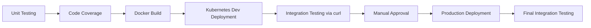

# Session 49: Project Status Meeting 3

## Deployment Pipeline Stages Overview

### Key Concepts

✅ **Completed Pipeline Stages**
- Unit testing job
- Code coverage job  
- Docker containerization job

💡 **Next Steps: Kubernetes Deployment**
- Deploy application/images to Kubernetes dev environment
- Required Kubernetes manifest files:
  - Deployment manifests
  - Service manifests
  - Ingress manifests

- Apply manifests to Kubernetes cluster
- Perform integration testing using curl command through ingress endpoint

⚠️ **Production Deployment Process**
- Repeat dev deployment steps on production server
- Include manual approval step for admin/reviewer review before production deployment

📝 **Preparation Plan**
- Upcoming session to discuss Kubernetes basics for team alignment
- Ensure all team members understand fundamentals before workflow development

> [!IMPORTANT]
> The pipeline evolves from individual job completion to full Kubernetes-based deployment with testing and approval gates. Manifest files are essential for Kubernetes resource deployment.

> [!NOTE]
> Integration testing validates end-to-end functionality through the ingress layer, ensuring the application is accessible and operational in the cluster.

> [!WARNING]
> Manual approval is mandatory before production deployment to prevent unintended changes in live environments.
