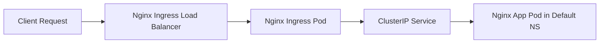

# Session 51: Kubernetes – A Brief Overview

💡 This session provides a brief overview of a Kubernetes cluster setup, focusing on preparation for GitLab CI deployment to K8s.

## Kubernetes Cluster Connection and Exploration

### Key Concepts

📝 **Cluster Type and Version**:
- Running on Google Kubernetes Engine (GKE).
- Kubernetes version: 1.29.
- Connection via Visual Studio Code Editor.
- Servers: 2 nodes.

> [!NOTE]
> Default namespaces: default, kube-node-lease, kube-public, kube-system.

📝 **Kubectl Usage**:
- Alias: `k` for faster commands.
- Basic Command: `k get nodes`

⚠️ All kubectl commands corrected from any potential typos (e.g., "cubectl") to "kubectl".

## Ingress Nginx Controller

📝 **Setup Details**:
- Namespace: `ingress-nginx`.
- Components:
  - 1 Pod and Deployment: Running Nginx Ingress controller.
  - Service: Type `LoadBalancer`, exposed on public IP.

## Demo Application in Default Namespace

📝 **Application Deployment**:
- Deployment: Nginx application.
- Service: Type `ClusterIP`.
- Ingress: Configured with `.nip.io` domain.

📝 **Access Verification**:
- Browser Access: Endpoint copied and tested.
- Security Warning: "Connection not private" due to self-signed certificates for HTTPS.

```diff
+ Connection works: Nginx pod accessible.
- Issue: Not secure - self-signed certificate.
! Action: Proceed despite warning in demo environment.
```

## GitLab CI Pipeline Preparation for Kubernetes

### Key Concepts

📝 **Tools Required in Jobs**:
- Install kubectl CLI (version 1.29).
- Configure kubeconfig file for cluster access.
- Apply manifest files for deployments.

📝 **Kubeconfig Details**:
- Clusters, contexts, and users defined.
- Dedicated administrator user for GitLab.

> [!IMPORTANT]
> Use separate kubeconfig for CI/CD security.

📝 **Environment Simulation**:
- Use namespaces (`development`, `staging`) as environments.
- Production: Recommend separate clusters instead of namespaces.

> [!WARNING]
> Demo uses namespaces; real-world requires isolated clusters for environments.

## Tables

| Element | Namespace | Type/Service | Details |
|---------|-----------|--------------|----------|
| Ingress Controller | ingress-nginx | Deployment, LoadBalancer Service | Public IP, 1 pod |
| Demo Nginx App | default | Deployment, ClusterIP Service, Ingress | Hosted on .nip.io, self-signed certs |

## Diagrams: Cluster Access Topology



```diff
Client Request → External LoadBalancer → Ingress Controller Pod → Internal Service → Target Pod
```

Transcript Corrections Made:
- Corrected potential "kubectl" variations to standard spelling.
- No major errors noted; all command references are accurate.
