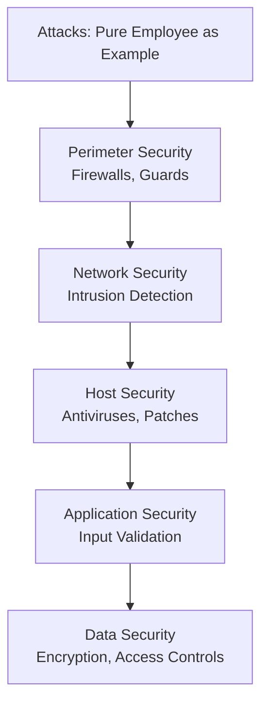

# Session 02: Pentest+

## Table of Contents
- [Overview](#overview)
- [Attack Motives and Classification](#attack-motives-and-classification)
- [Pentest Methodologies](#pentest-methodologies)
- [Planning and Scoping Phase](#planning-and-scoping-phase)
- [Security Controls](#security-controls)
- [Defense in Depth](#defense-in-depth)
- [Laws and Standards](#laws-and-standards)
- [Cyber Kill Chain](#cyber-kill-chain)
- [MITRE ATT&CK Framework](#mitre-attck-framework)
- [Planning Factors](#planning-factors)
- [Legal Constraints and Professionalism](#legal-constraints-and-professionalism)
- [Lab Demos](#lab-demos)

## Overview
Session 02 introduces the foundational concepts of penetration testing (pentesting) as defined by CompTIA Pentest+. It covers attack motives, classifications, methodologies, planning phases, risk management, security controls, frameworks like Cyber Kill Chain and MITRE ATT&CK, legal considerations, and professional ethics. The session emphasizes the ethical distinction between pentesters (who operate with permissions) and malicious actors. Theory is prioritized to build a strong base before practical phases.

## Attack Motives and Classification

### Key Concepts
- **Attack Motive**: Comprises **goal** + **method** + **vulnerability**. Goals include stealing data, disrupting services, causing financial loss, revenge, territory disputes, politics, or religion.
- **Passive Attacks**: Involve monitoring without interaction, e.g., sniffing network traffic for eavesdropping.
- **Active Attacks**: Entail interaction, modification, or disruption, e.g., DOS, man-in-the-middle, injection, session hijacking.

### Attack Classification
Attacks are classified into five types based on proximity and interaction:
1. **Sniffing**: Passive monitoring of data flow.
2. **Man-in-the-Middle**: Active interception and alteration.
3. **Eavesdropping**: Overhearing conversations (can be close-in).
4. **Shoulder Surfing**: Visual observation.
5. **Close-In Attacks**: Occur in close proximity, e.g., installing malware on-site or eavesdropping nearby.
6. **Insider Attacks**: Originate from within the organization, e.g., backdoors planted by disgruntled employees via malware or Trojans.
7. **Distribution Attacks**: Compromise hardware/software before delivery via suppliers, e.g., infecting PCs pre-installation to gain network access.

## Pentest Methodologies

### Key Concepts
Pentest methodologies provide structured phases for ethical hacking. They vary by organization but share common themes.

### CompTIA Methodology
Four stages:
1. **Planning and Scoping**: Define engagement, risks, and permissions.
2. **Information Gathering**: Collect target intelligence.
3. **Attacks and Exploits**: Execute exploitation.
4. **Reporting and Communication**: Document findings and mitigation recommendations.

```diff
+ Planning & Scoping in CompTIA: Critical for defining risks like inherent vulnerabilities without mitigations, ensuring controlled testing.
- Skipping Scoping: Leads to unintended impacts, e.g., server crashes during DOS testing without clear boundaries.
! Always align with client risk tolerance.
```

### NIST SP800-115 Methodology
Four stages: Planning, Discovery, Attack, Report (similar to CompTIA but with phase name variations).

### EC-Council Methodology
Expands stages with sub-phases:
- **Planning**: Includes permissions.
- **Reconnaissance**.
- **Scanning and Enumeration**.
- **Gaining Access**.
- **Privilege Escalation**.
- **Maintaining Access**.
- **Backdoor and Covering Tracks**.
- **Reporting**.

## Planning and Scoping Phase

### Key Concepts
This phase plans the engagement, focusing on risk and legal permissions.

#### Risk and Risk Management
- **Risk Definition**: Likelihood of an event (harmful or beneficial) occurring on an asset, e.g., injury risk from learning cycling or financial loss from lotteries.
- **Risk Types**:
  - **Inherent Risk**: Known risks without mitigations, e.g., unpatched malware-prone laptops.
  - **Residual Risk**: Leftover risk post-mitigation (100% mitigation impossible).
  - **Risk Exceptions**: Accepted risks despite policies, e.g., implementing high-risk policies for business needs.
- **Risk Handling Strategies**:
  - **Avoidance**: Opt for less risky activities, e.g., canceling risky travel.
  - **Transference**: Shift risk to third parties, e.g., insurance for health expenses.
  - **Mitigation**: Apply controls to reduce risk, e.g., Windows 7 with added security in constrained scenarios.
  - **Acceptance**: Tolerate risk for objectives; includes **appetite** (overall risk willingness) and **tolerance** (specific task limits).

> [!NOTE]
> Balance security controls with budget, employee usability, and business impacts.

### Deep Dive: Risk Triangle
Time, cost, and quality form a balance:
- Limited time reduces quality.
- High-quality testing increases cost and required resources.
- Adjust based on target (small/large org, network size).

## Security Controls

### Key Concepts
Security controls mitigate risks; categorized into seven types, grouped under administrative, logical/technical, and physical.

### Seven Categories
1. **Compensatory**: Replace primary controls, e.g., policies instead of costly next-gen firewalls or dual firewalls for budget constraints.
2. **Corrective**: Reduce attack impacts, e.g., antiviruses mitigate malware, fire extinguishers for building fires.
3. **Detective**: Identify threats, e.g., CCTVs, IDS/IPS, alarms, honeypots.
4. **Deterrent**: Deter attacks via warnings, e.g., danger signs, CCTV surveillance notices.
5. **Directive**: Enforce policies/compliance, e.g., Acceptable Use Policies (AUPs).
6. **Preventive**: Block attacks, e.g., firewalls, multi-factor authentication, guards, RFID cards.
7. **Recovery**: Restore post-incident, e.g., Disaster Recovery Plans (DRPs), backups.

## Defense in Depth

### Key Concepts
Layer multiple controls from outer to inner layers to complicate breaches:
- **Outer Layers**: Policies, guidelines, physical security (fences, guards).
- **Inner Layers**: Perimeter, network, host, application, data security.
- Flow: Employee (threat) → Perimeter → Network → Host → Application → Data (target).



> [!IMPORTANT]
> Attackers must bypass each layer; implement awareness training, baselines, and data classification.

## Laws and Standards

### Key Concepts
Adhere to standards for ethical testing.

### Standards Overview
- **OWASP (Open Web Application Security Project)**: Guides for web apps, APIs, IoT; provides Top 10 vulnerabilities.
- **OSSTMM (Open Source Security Testing Methodology Manual)**: Thorough methodology; outdated (last 2010), but useful for beginners.
- **ISSF (Information System Security Assessment Framework)**: Tool recommendations per stage; last updated 2015.
- **PTES (Penetration Testing Execution Standard)**: Execution guidelines; outdated (2009); prefer NIST SP800-115.

> [!NOTE]
> Prioritize trending OWASP Top 10 to address common risks.

## Cyber Kill Chain

### Key Concepts
Lockheed Martin's 7-phase model for attack lifecycle, aiding defense.

### Phases
1. **Reconnaissance**: Gather info (e.g., email addresses).
2. **Weaponization**: Create payloads (e.g., malware for backdoor).
3. **Delivery**: Deploy via phishing or USB.
4. **Exploitation**: Abuse vulnerabilities.
5. **Installation**: Implant backdoors/Trojans.
6. **Command and Control (C2)**: Establish remote access.
7. **Actions on Objectives**: Achieve goals (e.g., data deletion).

## MITRE ATT&CK Framework

### Key Concepts
Adversarial Tactics, Techniques, and Common Knowledge (ATT&CK) maps attacker behaviors.

### Structure
- **Matrices**: Platforms (Enterprise, Mobile, ICS).
- **Tactics**: Phases (e.g., Reconnaissance).
- **Techniques**: Sub-methods (e.g., Gather info).
- **Mitigations**: Defenses per technique.
- **CTI (Cyber Threat Intelligence)**: Groups (e.g., APTs like Blue Mockerbird), tools used.

- Explore via MITRE ATT&CK site for Windows/Linux tactics, e.g., reconnaissance techniques.

## Planning Factors

### Key Concepts
Consider these during scoping.

### Factors
- **Target Audience**: Scope for org/network size.
- **Objective**: Define goals.
- **Resources**: Tools/people; affects time/cost/quality.
- **Compliance**: Use checklists for audits.
- **Communication**: Define contacts.
- **Presentation**: Report preferences.
- **Security Structure/Constraints**: Tech barriers.
- **Depth**: Thoroughness level.

> [!WARNING]
> Misaligning factors leads to poor quality or budget overruns.

## Legal Constraints and Professionalism

### Key Concepts
Ethical pentesters avoid legal pitfalls via contracts.

### Legal Documents
- **Written Permissions**: Signature-required; includes authorized party, scope, data handling, report guidelines, termination, validity. Essential for scans.
- **Scope of Work (SoW)**: Tasks, timeline, responsibilities, payment.
- **Master Service Agreement (MSA)**: Template for recurring clients.
- **NDA (Non-Disclosure Agreement)**: Confidentiality; may restrict naming clients.
- **Service Level Agreement (SLA)**: Service standards.

### Professionalism
- **Laws by Jurisdiction**: Vary (fines to imprisonment); research per country.
- **Cloud Permissions**: Get from provider (e.g., AWS) to avoid impacting others.
- **Termination**: Stop if real attacks occur; consult lawyers.
- **Pentester Definition**: Threat actor with permissions (distinguishes from criminals).

## Lab Demos
No explicit labs in transcript; explore MITRE ATT&CK hands-on (10-15 min).

## Summary

### Key Takeaways
```diff
+ Attack Classification: Five types (sniffing to distribution); CompTIA's 4-stage methodology prioritizes scoping and reporting.
- Risk Oversights: Neglect inherent risks without mitigations or ignore residual risks post-controls.
+ Cyber Kill Chain: Phase-specific defenses prevent objective achievement.
- Permission Omissions: Skip written authorizations risks legal action.
! Professional Ethos: Permissions differentiate pentesters from hackers; align plans with quality-cost-time triangle.
```

### Expert Insight
**Real-world Application**: In corporate environments, apply Cyber Kill Chain to detect breaches early (e.g., monitor reconnaissance); use MITRE ATT&CK for tool-based audits.

**Expert Path**: Master NIST SP800-115 for structured testing; practice legal drafts with lawyers; pursue CEH/EC-Council certs for advanced methodologies.

**Common Pitfalls**: 
- Assuming inherent risks are "acceptable" without mitigation.
- Overestimating compliance without checklists; solutions: Use OWASP/OSCP for modern standards.
- Ignoring defense in depth, leaving isolated layers vulnerable.
- Lesser Known Things: Insider attacks (originating within orgs) often undetected via pre-existing access; distribution attacks target supply chains preemptively. Always review Cloud provider SLAs for multi-tenant impacts. Consult CTI for adversary TTPs (tactics, techniques, procedures) to predict attacks.

**Transcript Corrections Noted**: Renamed "power till chain" to "Cyber Kill Chain"; "Loit Martin" to "Lockheed Martin"; "miter back" to "MITRE ATT&CK"; Clarified "sniffing uh real time example eavesdropping" as separate examples not overlaps; Corrected "Doors injection exit. Third is your closing attack" to "DOS injection attacks. Third is your close-in attacks" for accuracy.
