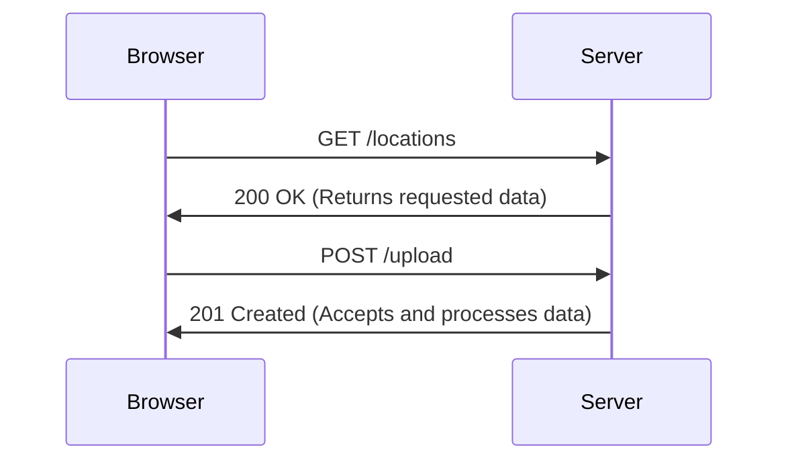
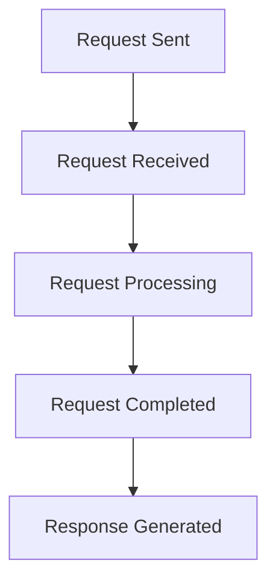
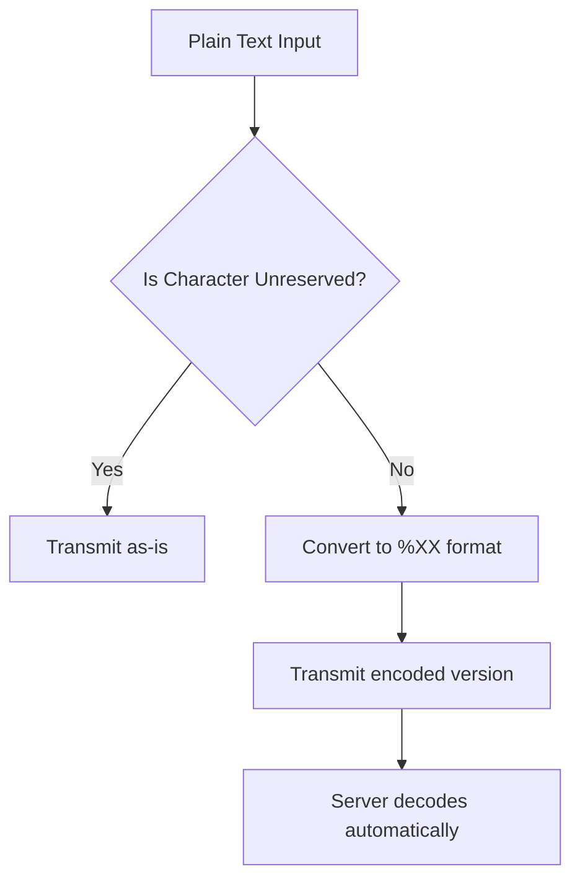

# Session 08: Pentest+ Information Gathering with Maltego and Recon-ng

- **[Metasploitable 3 Installation Challenges](#metasploitable-3-installation-challenges)**
- **[Recap of Previous Session Tools](#recap-of-previous-session-tools)**
- **[Introduction to Maltego](#introduction-to-maltego)**
- **[Maltego Demonstration: Information Gathering on certifiedhacker.com](#maltego-demonstration-information-gathering-on-certifiedhackercom)**
- **[Maltego Advanced Features](#maltego-advanced-features)**
- **[Maltego Lab Exercise](#maltego-lab-exercise)**
- **[Maltego Performance and Accuracy Discussion](#maltego-performance-and-accuracy-discussion)**
- **[Introduction to Recon-ng Framework](#introduction-to-recon-ng-framework)**
- **[Recon-ng Basics and Commands](#recon-ng-basics-and-commands)**
- **[Recon-ng Workspace Management](#recon-ng-workspace-management)**
- **[Subdomain Enumeration with Recon-ng](#subdomain-enumeration-with-recon-ng)**
- **[Report Generation with Recon-ng](#report-generation-with-recon-ng)**
- **[Contact and Profile Enumeration with Recon-ng](#contact-and-profile-enumeration-with-recon-ng)**
- **[HTTP Methods Overview](#http-methods-overview)**
- **[HTTP Response Codes Overview](#http-response-codes-overview)**
- **[URL Encoding and UTF-8](#url-encoding-and-utf-8)**
- **[Certificates and Vulnerability Assessment Overview](#certificates-and-vulnerability-assessment-overview)**
- **[Class Wrap-up and Q&A](#class-wrap-up-and-qa)**

## Metasploitable 3 Installation Challenges

**Overview**
Students encountered significant difficulties installing Metasploitable 3, particularly with the VMware plugin failures during manual installation. The installation process was described as lengthy and prone to multiple failures (5-6 times on average). Some students eventually succeeded after abandoning the manual process and downloading OVA files instead, which took about 1 hour to locate and import into VMware.

**Key Concepts**
- **Manual Installation Issues**: VMware plugin installation would progress partially but frequently fail
- **OVA File Alternative**: Students resorted to downloading exact OVA packages matching the Ubuntu version from online sources
- **Time Investment**: Significant time spent troubleshooting (approximately 1 hour for some students)

## Recap of Previous Session Tools

**Overview**
The instructor briefly reviewed tools covered in the previous session for information gathering, focusing on tools that extract specific records and data from target websites.

**Key Concepts**
- **MX Record Tool**: Extracts mail exchange server information from domains
- **Domain-related Tools**: Various tools for collecting domain information like DNS records

> [!NOTE]
> Maltego was the only tool from the previous session that wasn't covered yet, with today's session focusing on graphical data mapping.

## Introduction to Maltego

**Overview**
Maltego is a comprehensive information gathering tool designed for mapping and visualizing data in a graphical structure. It comes pre-installed on Linux systems and is available in a free Community Edition that requires a trial API key for advanced features.

**Key Concepts**
- **Tool Purpose**: Graphical mapping of collected information from target websites and domains
- **Installation**: Pre-installed on Linux distributions (can be accessed via Application menu as "Information Gathering" tool)
- **Pricing Options**: Community Edition (free with trial API), Professional Edition (paid)
- **Authentication**: Requires free account registration on Maltego's community page to obtain API key for 2-3 years

## Maltego Demonstration: Information Gathering on certifiedhacker.com

**Overview**
The instructor demonstrates Maltego's capabilities using certifiedhacker.com as a target website, showing how to create graphs and extract various types of information through different transforms.

**Key Concepts**
- **Target Selection**: certifiedhacker.com was chosen as the demonstration website
- **Workspace Creation**: All work begins with creating a new blank graph workspace

### Basic Maltego Workflow

1. **Graph Creation**:
   - Click "New" button to create a new document/graph
   - Access the Entity Palette (left sidebar) to select information gathering components

2. **Infrastructure Selection**:
   - Navigate to "Infrastructure" section
   - Drag and drop "Website" entity onto the graph
   - Double-click the website entity to enter target URL (e.g., www.certifiedhacker.com)

3. **Transform Execution**:
   - Right-click the website entity to access context menu
   - Select "All Transforms" or specific transforms to gather information
   - Or choose individual transforms like "Web Technologies", "To Domains", "To IP Addresses"

## Maltego Advanced Features

**Overview**
Beyond basic information gathering, Maltego offers advanced features for relationship building, geolocation, and detailed data analysis through its various transforms.

**Key Concepts**

### Entity Relationships and Visualization
- **Detail View**: Right sidebar provides access to node details and relationship building capabilities
- **Node Selection**: Click entities to explore relationships between different data points (domains, IPs, technologies)

### Specific Transforms Covered

| Transform Type | Description | Example Output |
|---|---|---|
| Web Technologies | Identifies technologies used by website (Apache, Nginx, etc.) | Technology stack analysis |
| To Domains | Extracts all associated domains | Subdomains, DNS records |
| To IP Addresses | Finds IP addresses for domains | IP geolocation data |
| To Location (Geolocation) | Maps IP to geographic location | City, country, latitude/longitude |
| To Ports | Lists open ports from Shodan | Port numbers and services |
| Host Information | Additional target details | DNS names, netblocks |

### Transform Selection Strategy
- **Run All Transforms**: Provides comprehensive data but can be overwhelming
- **Selective Execution**: Start with specific transforms like web technologies for focused analysis
- **Graph Linking**: Build relationships between entities to create comprehensive target maps

### Advanced Data Analysis
- **Shodan Integration**: Leverages Shodan database for port scanning and device discovery
- **WhoIs Data**: Extracts owner information and netblock details
- **Public Device Monitoring**: Identifies publicly accessible devices using integrated monitoring tools

### Entity Deletion and Reset
- **Clean Workspace**: Remove specific nodes or relationships using delete operations
- **Restart Analysis**: Clear all data to begin fresh investigation with different parameters

## Maltego Lab Exercise

**Overview**
Students were given a hands-on exercise to practice Maltego information gathering techniques.

**Key Concepts**
- **Time Allocation**: 10-15 minutes for experimentation
- **Task Requirements**:
  - Create new graph workspace
  - Drag "Website" entity to workspace
  - Double-click to set target website
  - Experiment with available transforms to extract information
  - Build entity relationships where possible

> [!IMPORTANT]
> Large-scale data collection may be IP-restricted by target websites.

## Maltego Performance and Accuracy Discussion

**Overview**
The instructor addressed performance concerns and data accuracy questions raised during the Maltego demonstration.

**Key Concepts**
- **Resource Intensity**: Maltego is memory-intensive and can consume significant CPU/RAM resources
- **System Requirements**: Requires substantial system resources; users may need to allocate additional RAM to VM
- **Accuracy Levels**: Approximately 70% accuracy depending on data sources used
- **Configuration Adjustment**: Users can customize RAM allocation within Maltego settings
- **Data Source Variety**: Combines multiple information sources for comprehensive collection

## Introduction to Recon-ng Framework

**Overview**
Recon-ng is an information gathering framework similar to Metasploit, featuring multiple modules for collecting reconnaissance data. The framework relies on marketplace modules for specific functionality.

**Key Concepts**
- **Framework Design**: Module-based architecture focused on web-based reconnaissance
- **Marketplace System**: Download and install modules from integrated marketplace
- **Command-Line Interface**: All operations performed through command-line interface
- **Multi-Source Integration**: Leverages various APIs and data sources for information collection

### Recon-ng Installation and Setup

1. **Launch**: Execute "recon-ng" command
2. **Interface Navigation**: Use built-in help system ("help" command) for available options
3. **Module Marketplace**: Access marketplace for downloading specialized modules

## Recon-ng Basics and Commands

**Overview**
The framework provides core commands for managing workspaces, modules, and operations.

**Key Concepts**

### Core Commands Table

| Command | Description | Usage |
|---|---|---|
| `help` | Display available commands | Basic navigation |
| `dashboard` | Show activity summary | Workspace overview |
| `back` | Return to previous menu level | Navigation |
| `db` | Database operations | Data management |
| `exit` | Exit framework | Session termination |
| `marketplace` | Access module marketplace | Module installation |
| `search [term]` | Search marketplace | Find specific modules |
| `options` | Manage module options | Module configuration |
| `run` | Execute current module | Perform reconnaissance |

## Recon-ng Workspace Management

**Overview**
Recon-ng uses workspace-based organization for different reconnaissance targets and operations.

**Key Concepts**
- **Workspace Creation**:
  - Use `workspaces create [name]` command
  - Example: `workspaces create pentest`
- **Workspace Navigation**: Framework moves to specified workspace automatically
- **Domain Insertion**:
  - Switch to created workspace
  - Use `db insert domains` for target domain
  - Enter domain name when prompted (e.g., certifiedhacker.com)

### Sample Commands
```bash
workspaces create pentest
db insert domains
# Enter: certifiedhacker.com
show domains  # Verify domain insertion
```

## Subdomain Enumeration with Recon-ng

**Overview**
The instructor demonstrates subdomain discovery using Recon-ng modules, focusing on finding subdomains for certifiedhacker.com.

**Key Concepts**
- **Module Selection**: Choose domain-related modules from marketplace
- **Third-Party Integration**: Many modules require API keys for external service access
- **Brute Force Approach**: Use dictionary-based enumeration when API-dependent modules fail

### Module Categories
- **Domain Host Modules**: DNS-based discovery (hacker_target, google_hacker, netcraft)
- **Subdomain Spy Module**: Requires Spyce API key
- **Brute Force Module**: Included with Recon-ng installation

### Step-by-Step Subdomain Discovery

1. **Workspace Setup**:
   ```bash
   workspaces create pentest
   db insert domains
   # certifiedhacker.com
   ```

2. **Brute Force Execution**:
   - Install from marketplace: `marketplace install recon/domains-hosts/brute_force`
   - Load module: `modules load recon/domains-hosts/brute_force`
   - Set source: `options set SOURCE certifiedhacker.com`
   - Run enumeration: `run`

3. **Output Analysis**:
   - Results shown in A RECORD format
   - Includes IP address, country, host information
   - Example outputs: blog.certifiedhacker.com, ftp.certifiedhacker.com, etc.

### Common Findings
- Multiple subdomain discoveries (e.g., mail.certifiedhacker.com, autodiscover.certifiedhacker.com)
- IP geolocation data from reverse lookups

## Report Generation with Recon-ng

**Overview**
Recon-ng supports multiple report formats for documenting gathered information, with customizable output options.

**Key Concepts**
- **Report Module**: Dedicated reporting module for exporting results
- **Supported Formats**: CSV, HTML, JSON, List, Proxifier, Pushpin, XLSX, XML
- **Customization Options**:
  - Creator name
  - Customer name
  - File location
  - Sanitize sensitive data

### Report Generation Steps

1. **Install Reporting Module**:
   ```bash
   marketplace install reporting/html
   ```

2. **Configure Module**:
   ```bash
   modules load reporting/html
   options set CREATOR [name]
   options set CUSTOMER [target]
   options set FILENAME /path/to/report.html
   ```

3. **Generate Report**: Execute `run` command

### HTML Report Features
- **Metadata**: Includes creation date, author information
- **Data Structure**: Domain, hosts, collection module information
- **Security**: Option to anonymize sensitive data

## Contact and Profile Enumeration with Recon-ng

**Overview**
Recon-ng provides modules for discovering contacts and social media profiles associated with domains and usernames.

**Key Concepts**
- **Contact Discovery**: Extract email addresses and personnel information from domains
- **Profile Hunting**: Search usernames across multiple social media platforms
- **Data Sources**: Integrates with WhoIs for organization data extraction

### Contact Enumeration Module

1. **Module Setup**:
   ```bash
   workspaces create contacts
   marketplace install recon/contacts/gather/http/web/spoke
   modules load recon/contacts/gather/http/web/spoke
   options set SOURCE facebook.com
   run
   ```

2. **Sample Results**:
   - Domain contacts: domain@facebook.com
   - Personal contacts with title, role, and country information

### Profile Discovery Module

1. **Module Configuration**:
   ```bash
   marketplace install recon/profiles/profiles/profiler
   modules load recon/profiles/profiles/profiler
   options set SOURCE [username]
   run
   ```

2. **Platform Coverage**: Searches using What's My Name database across multiple social platforms
3. **Error Handling**: Common "page not found" errors indicate profile non-existence

### Module Selection Guidelines
- **API-Free Options**: Prefer modules not requiring external API keys
- **Data Quality**: WhoIs integration recommended for reliable contact information
- **Exploration**: Test different modules in personal time to understand capabilities

## HTTP Methods Overview

**Overview**
HTTP methods represent different operations that can be performed against web resources, essential for understanding web application functionality and security.

**Key Concepts**
- **Request-Response Model**: Browser sends method requests to servers which respond accordingly

### Core HTTP Methods

| Method | Purpose | Example Use Case |
|---|---|---|
| `GET` | Retrieve information from server | Viewing web pages, API data retrieval |
| `POST` | Send data to server | Form submissions, file uploads |
| `DELETE` | Remove resources from server | Deleting user accounts or content |
| `PUT` | Create/update resources | Creating new records in databases |
| `CONNECT` | Establish tunnel to target host/service | HTTPS proxy connections, VPN setup |
| `HEAD` | Retrieve headers without body | Checking resource metadata without downloading |
| `OPTIONS` | Query available methods | Discovering supported operations |

### Additional Methods
- **TRACE**: Debugging method that echoes received requests (functions as network echo tool)

### Browser-Server Interaction


> [!IMPORTANT]
> Each method serves specific security and data transmission purposes in web applications.

## HTTP Response Codes Overview

**Overview**
HTTP response codes indicate the status of client requests to servers, categorized into five main series for different types of responses.

**Key Concepts**
- **Client-Server Communication**: Response codes provide feedback on request processing status
- **Five Code Series**: Each series represents different response types and scenarios

### Response Code Categories

| Series | Category | Description | Common Codes |
|---|---|---|---|
| 1xx | Informational | Request processing status | 100 Continue, 101 Switching Protocols |
| 2xx | Successful | Request completed successfully | 200 OK, 201 Created |
| 3xx | Redirection | Resource relocation | 301 Moved Permanently, 307 Temporary Redirect, 308 Permanent Redirect |
| 4xx | Client Error | Bad or malformed requests | 400 Bad Request, 401 Unauthorized, 403 Forbidden, 404 Not Found |
| 5xx | Server Error | Server-side processing failures | 500 Internal Server Error, 503 Service Unavailable |

### Request Processing Stages


#### Detailed Code Breakdown

**2xx Success Codes**:
- **200 OK**: Request processed successfully, data returned
- **201 Created**: Resource creation confirmed

**3xx Redirection Codes**:
- **301 Moved Permanently**: Permanent domain/protocol changes (e.g., twitter.com → x.com)
- **305 Use Proxy**: Requires proxy server access
- **307/308 Temporary/Permanent Redirect**: Server maintenance or reconfiguration

**4xx Client Error Codes**:
- **400 Bad Request**: Protocol mismatch (HTTP vs HTTPS)
- **401 Unauthorized**: Authentication required
- **402 Payment Required**: Subscription/service charges
- **403 Forbidden**: Access denied despite authentication
- **404 Not Found**: Requested resource doesn't exist
- **408 Request Timeout**: Processing exceeded time limits

**5xx Server Error Codes**:
- **500 Internal Server Error**: Unexpected server failures
- **503 Service Unavailable**: Service maintenance or temporary unavailability
- **504 Gateway Timeout**: Upstream server response delays

## URL Encoding and UTF-8

**Overview**
URL encoding uses UTF-8 standard to convert special characters into browser-compatible format, commonly used in web queries and API calls.

**Key Concepts**
- **Encoding Purpose**: Convert plaintext characters to encoded format for URL transmission
- **Standard**: UTF-8 encoding with percentage representation (%XX)
- **Security Applications**: Bypass filters and manipulate URL parameters

### Character Classification

**Unreserved Characters** (no encoding):
- Alphabetic: A-Z, a-z
- Numeric: 0-9
- Special: `-` `.` `_` `~`

**Reserved Characters** (require encoding):
- Symbols: `:` `/` `?` `#` `[` `]` `@` `!` `$` `&` `'` `(` `)` `*` `+` `,` `;` `=`
- Other: `%`

### Common UTF-8 Encodings

| Character | Encoded Form | Usage Context |
|---|---|---|
| Space ( ) | `%20` | Query parameters, file paths |
| Plus (+) | `%2B` | Mathematical/formula URLs |
| Greater Than (>) | `%3E` | HTML/compare operators |
| Less Than (<) | `%3C` | HTML/compare operators |
| Null Character | `%00` | Buffer manipulation, path traversal |
| Percent (%) | `%25` | Literal percent signs |
| Forward Slash (/) | `%2F` | Path separators in URLs |
| Back Slash (\) | `%5C` | Windows file path escapes |
| Question Mark (?) | `%3F` | Query string separators |

### Encoding Strategy


> [!NOTE]
> Browsers automatically handle UTF-8 encoding for web requests, but manual encoding may be necessary for security testing or API interactions.

## Certificates and Vulnerability Assessment Overview

**Overview**
The session concludes with a brief mention of certificate verification and vulnerability assessment preparation.

**Key Concepts**
- **Certificate Verification**: Previously covered methods using who.is and sslopper.com for domain certificate analysis
- **Vulnerability Integration**: CVE information deferred to dedicated vulnerability assessment module
- **Assessment Scope**: Builds upon current information gathering techniques

## Class Wrap-up and Q&A

**Overview**
The session concludes with instructor addressing student questions and preparing for future sessions.

**Key Concepts**
- **Curriculum Progress**: Pentest+ represents intermediate-level penetration testing certification
- **Prerequisites**: Students new to penetration testing should complete Certified Hacker (CH) first
- **Recommended Path**: New students should review CH content before proceeding with Pentest+
- **Class Scheduling**: Sessions remain scheduled for same time (6 PM weekly)
- **Review Guidance**: Students encouraged to review previous recordings and prepare questions

## Summary

### Key Takeaways
```diff
+ Passive information gathering combines multiple tools and techniques
+ Maltego excels at visual data mapping and relationship discovery
+ Recon-ng framework provides modular reconnaissance capabilities
+ HTTP methods and response codes are fundamental to web application analysis
+ URL encoding standards (UTF-8) enable secure character transmission
- Data accuracy varies by source and should be verified through multiple channels
- Resource-intensive tools may require system configuration adjustments
```

### Expert Insight

#### Real-world Application
**Production Environment Usage**: Organizations employ these passive gathering techniques during initial reconnaissance phases of penetration testing engagements. Maltego's visual mapping helps teams identify attack surfaces, while Recon-ng's modular approach allows customization for specific target environments. Companies like consulting firms and security vendors integrate these tools into automated workflows for threat intelligence gathering.

#### Expert Path
**Advanced Mastery Techniques**: 
- Custom module development in Recon-ng for organization-specific reconnaissance needs
- Maltego transform chaining for complex multi-hop information correlation
- API key management strategies for multiple intelligence sources
- Automated script integration combining passive and active scanning techniques

**Skill Progression**: Beginners should start with community editions, graduate to professional versions, then focus on custom tool development and automated workflow creation.

#### Common Pitfalls
**Common Issues and Resolutions**:
- **API Rate Limiting**: Occurs when collecting data from multiple sources simultaneously; resolution involves implementing delays and using proxy rotation
  - Resolution: Configure request throttling, use multiple API keys from different accounts
  
- **False Positive Data**: Domain enumeration tools sometimes report stale DNS records from cached data
  - Resolution: Cross-verify findings with multiple sources and manual DNS querying

- **Resource Exhaustion**: Maltego and Recon-ng consuming excessive system resources during large-scale scans
  - Resolution: Limit transform scope, increase system RAM allocation, perform incremental scanning

- **Missing Dependencies**: Recon-ng modules failing due to absent system libraries
  - Resolution: Install required packages (`sudo apt install libxml2-dev`, etc.) before module execution
  
- **IP Blocking**: Targets detecting and blocking reconnaissance traffic
  - Resolution: Implement VPN/proxy rotation, reduce scan frequency, distribute scans across time periods

- **Stale Certificate Data**: SSL verification tools returning outdated certificate information
  - Resolution: Use multiple certificate validation sources and check Certificate Transparency logs

**Prevention Strategies**: Always combine passive techniques with active verification, implement scanning policies, and maintain updated tools with latest API keys and dependencies.
