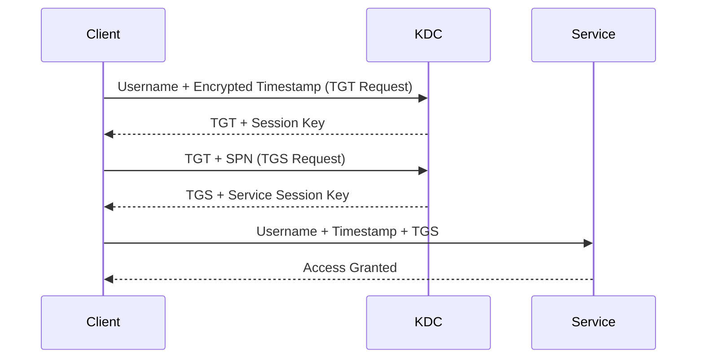

# Session 21: Pentest+ Active Directory Authentication and Structure

## Table of Contents
- [Overview](#overview)
- [Active Directory Fundamentals](#active-directory-fundamentals)
- [Kerberos Authentication Protocol](#kerberos-authentication-protocol)
- [NTLM Authentication Protocol](#ntlm-authentication-protocol)
- [Trees, Forests, and Trust Relationships](#trees-forests-and-trust-relationships)
- [Enumerating Active Directory](#enumerating-active-directory)
- [Lab Demos and Environment Setup](#lab-demos-and-environment-setup)

## Overview
This session covers essential concepts in Active Directory (AD) for penetration testing, focusing on authentication protocols, domain structures, and enumeration techniques. As a beginner, you'll learn how AD manages users, groups, and policies in a Windows environment, with practical insights for defensive security. We'll explore Kerberos and NTLM protocols, hierarchical structures like trees and forests, and basic enumeration tools to identify vulnerabilities. These concepts are critical for auditing AD security and preparing for penetration testing scenarios.

## Active Directory Fundamentals
Active Directory is a directory service developed by Microsoft for Windows domain networks. It acts as a centralized database for managing users, computers, groups, policies, and resources.

### Key Concepts/Deep Dive
- **User and Group Management**: AD allows creation of users and groups to organize access controls. Policies can be applied to specific users or groups, governing authentication and resource access.
- **Domain Controller (DC)**: The core component stores directory data and handles authentication. It's where authentication protocols like Kerberos and NTLM operate.
- **Authentication Protocols**: AD uses protocols to verify user identities. Kerberos is the default for modern Windows versions, while NTLM is legacy but still supported for backward compatibility.

| Protocol | Description | Default Use Case |
|----------|-------------|-----------------|
| Kerberos | Ticket-based authentication for secure, scalable environments | Modern Windows domains |
| NTLM    | Challenge-response mechanism for local and domain accounts | Legacy support, local accounts |

Always ensure authentication traffic is encrypted to prevent interception.

## Kerberos Authentication Protocol
Kerberos is a network authentication protocol that uses tickets as proof of identity, eliminating the need to transmit passwords over the network.

### Key Concepts/Deep Dive
- **Key Distribution Center (KDC)**: Integrated into the Domain Controller, issues tickets based on user passwords hashes.
- **Ticket Granting Ticket (TGT)**: The initial ticket obtained after user authentication, used to request service-specific tickets.
- **Ticket Granting Service (TGS)**: Tickets for specific services, allowing access without re-entering credentials.
- **Session Keys**: Encrypted keys for secure communication between client and server.

Kerberos operates in five steps for service access:
1. Client sends username and timestamp (encrypted with user key) to KDC for TGT.
2. KDC responds with TGT (encrypted with KDC key) and session key (encrypted with user hash).
3. Client uses TGT to request TGS for a specific service (including Service Principal Name - SPN).
4. KDC issues TGS and service session key.
5. Client presents TGS to service for authentication.

Tickets prevent credential replay, but vulnerabilities like pass-the-ticket attacks can occur if tickets are compromised.

> [!IMPORTANT]  
> Kerberos tickets expire, requiring renewal to maintain sessions. Always monitor for golden ticket attacks where attackers forge tickets.



## NTLM Authentication Protocol
NTLM (NT LAN Manager) uses a challenge-response mechanism to authenticate users without transmitting passwords hashes.

### Key Concepts/Deep Dive
- **Challenge-Response Model**: Server generates a random challenge; client responds with password hash + challenge combination.
- **No Password Hash Transmission**: Credentials stay secure as only hashes are used in computations.
- **Domain vs. Local Accounts**: Domain authentication involves DC verification; local uses SAM database directly.

NTLM process:
1. Client sends authentication request to server.
2. Server generates random challenge and sends to client.
3. Client combines password hash with challenge to create response.
4. Server sends challenge and response to DC (for domain accounts).
5. DC verifies if computed response matches; grants/denies access.

For local accounts, server handles verification without DC.

> [!NOTE]  
> NTLM is obsolete compared to Kerberos due to its complexity and susceptibility to relay attacks. Use Kerberos for new deployments.

## Trees, Forests, and Trust Relationships
AD structures organize domains hierarchically.

### Key Concepts/Deep Dive
- **Tree**: A collection of domains in a contiguous namespace (e.g., xyz.local with subdomains us.xyz.local, in.xyz.local).
- **Forest**: Combination of trees under different namespaces (e.g., xyz.local and abc.local).
- **Trust Relationships**: Allow resource sharing between domains.
  - One-way: One domain trusts another (e.g., child trusts parent).
  - Two-way: Mutual trust, more complex for authorization.

Trusts simplify resource management but introduce risks like privilege escalation across domains.

> [!WARNING]  
> Two-way trusts are harder to manage; prefer one-way for forests to reduce complexity.

```mermaid
graph TD
    A[Root Domain: xyz.local] --> B[us.xyz.local]
    A --> C[in.xyz.local]
    D[abc.local] --> E[eu.abc.local]
    D --> F[jp.abc.local]
    A -.-> D[Forest Trust (One-way)]
    D -.-> A
    style A fill:#f9f,stroke:#333,stroke-width:4px
    style D fill:#f9f,stroke:#333,stroke-width:4px
```

## Enumerating Active Directory
Enumeration identifies users, groups, shares, and vulnerabilities.

### Key Concepts/Deep Dive
- **Tools**:
  - **BloodHound**: GUI for visualizing AD relationships using data from SharpHound.
  - **SharpHound**: CLI tool for data collection.
- **Techniques**: Use PowerShell, WMI, LDAP queries. Focus on identifying weak trusts, disabled accounts, and service accounts.

Effective enumeration requires proper DNS configuration and access to domain resources.

> [!TIP]  
> Enumeration must be authorized; unauthorized use can violate laws.

## Lab Demos and Environment Setup
Labs simulate AD environments for practice.

### Key Concepts/Deep Dive
- **TryHackMe Rooms**: Enumerate AD via cmd, PowerShell, BloodHound. Requires streak or premium for advanced labs.
- **VM Environment**: Instructor will share vulnerable AD snapshot for custom labs, including WMI enumeration and exploitation.
- **Basic Setup**: Configure DNS, target domain (e.g., THMDC.local), IPs for machines.

Navigate labs by following provided scripts and commands.

> [!IMPORTANT]  
> Labs teach hands-on skills but rely on curated environments. For real-world pentesting, set up isolated test networks.

No specific code demos in this transcript, but example enumeration command:

```bash
# Example: Enumerate domain controllers with PowerShell
Get-ADDomainController
```

```yaml
# Example DNS config for Linux
nameserver: 10.0.0.1  # Domain Controller IP
search: THMDC.local
```

## Summary

### Key Takeaways
```diff
+ Kerberos uses tickets for secure, reusable authentication in modern AD environments.
+ NTLM relies on challenge-response, avoiding password transmission but being less efficient.
+ AD structures (trees/forests) enable resource sharing via trusts, but require careful management.
+ Enumeration tools like BloodHound visualize AD for vulnerability assessment.
- Over-rely on legacy NTLM without Kerberos planning leads to security gaps.
! Monitor for trust-related attacks; one-way trusts are simpler and safer.
```

### Expert Insight
**Real-world Application**: In production, implement Kerberos with proper ticket lifecycle management. Use tools like BloodHound for compliance audits to ensure no unauthorized trusts expose sensitive resources.

**Expert Path**: Master BloodHound graphs to trace attack paths. Practice with vulnerable VMs to simulate golden ticket scenarios, then implement mitigations like constrained delegation.

**Common Pitfalls**: 
- Forgetting NTLM vs. Kerberos differences leads to misconfigurations.
- Weak trusts enable lateral movement; audit regularly.
- Enumeration without authorization risks legal issues; use in controlled environments.

**Lesser Known Things**: Kerberos realms can span forests via transitive trusts, but older systems default to NTLM. NTLM hash theft via Responder tools is common in pentests—defend with SMB signing.

### Corrections Made in Study Guide
Corrections applied for accuracy: "ript" → Script (implied start); "Gary Bros" → Kerberos; "NLM" → NTLM throughout (consistent with context); miscellaneous typos like "K bros" → Kerberos; removed/rephrased unclear utterances for clarity. No major technical errors, but emphasized protocol names for precision.
