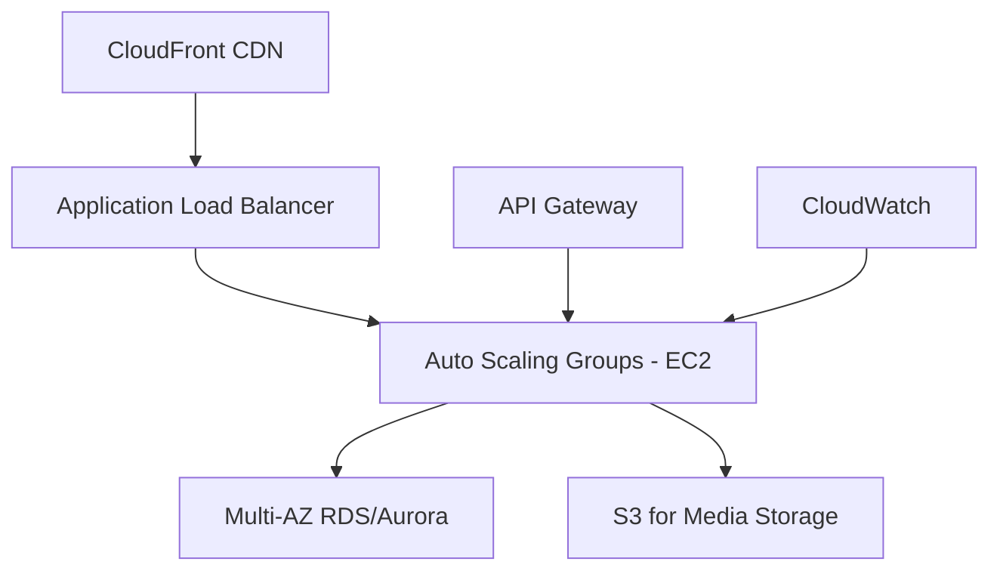
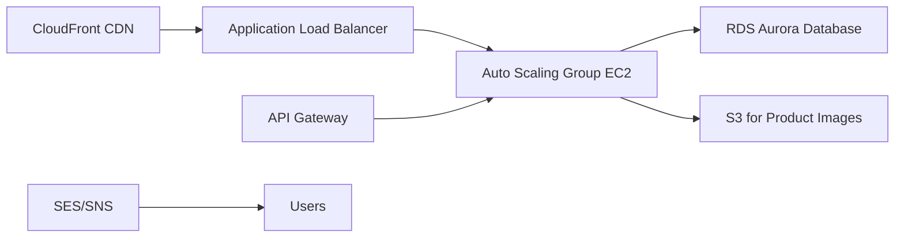

<!--HEADER-->
<!--title:AWS Interview Questions: Master AWS Scenario Challenges with 10 Questions and Answers! - Part 1-->
<!--summary:-->

CL-KK-Terminal

# AWS Interview Questions: Master AWS Scenario Challenges with 10 Questions and Answers! - Part 1

## Introduction

Welcome to this comprehensive study guide on AWS scenario-based interview questions. This guide covers 10 commonly asked AWS interview questions focusing on practical scenarios you might encounter in interviews for mid-level AWS roles (3-4 years experience). Each question is accompanied by a detailed answer explanation, architecture considerations, and validation notes.

---

## 1. How will you handle peak traffic situations for a web application with fluctuating traffic?

### Answer
To handle peak traffic in a web application with fluctuating demand, I would design an architecture using **Auto Scaling Groups** behind a **Load Balancer**. 

Here's the key components:
- **Auto Scaling Groups**: Automatically scale EC2 instances up or down based on traffic demand
- **Load Balancer**: Distributes traffic across multiple instances for optimal performance and fault tolerance
- **Benefits**: 
  - Cost optimization (only pay for instances when needed)
  - Optimal performance during peak times
  - Automatic scaling based on predefined metrics (CPU utilization, network traffic, etc.)

The Auto Scaling Group monitors metrics and launches additional instances during peak traffic, then terminates them during low traffic periods to maintain cost efficiency.

### Validation Notes
This is a correct and complete answer for basic peak traffic handling. For more advanced scenarios, consider adding:
- CloudWatch alarms for custom scaling policies
- Multi-AZ deployment for higher availability
- Read replicas for database scaling

---

## 2. What would you consider when designing an Amazon Cloud solution?

### Answer
When designing an AWS cloud solution, I consider these key factors:

**Core Factors:**
- **Scalability**: Ability to handle varying loads
- **Reliability**: Minimize downtime and ensure service availability  
- **Security**: Protect data and resources
- **Cost Optimization**: Efficient resource utilization

**AWS Services Mapping:**
- **Scalability**: Auto Scaling Groups, Elastic Beanstalk
- **Reliability**: Multi-AZ RDS, Route 53, ELB
- **Security**: IAM, Security Groups, WAF, AWS Shield
- **Cost Optimization**: Cost Explorer, AWS Budgets, Trusted Advisor

By addressing these aspects, you ensure a robust, efficient, and secure cloud architecture.

### Validation Notes
Correct and comprehensive. Additional considerations could include:
- Compliance requirements (GDPR, HIPAA)
- Operational Excellence (monitoring, logging)
- Sustainability (energy-efficient services)

---

## 3. Describe a successful AWS project that reflects your design and implementation experience

### Answer
A successful AWS project I worked on involved migrating a legacy on-premises application to AWS cloud:

**Project Overview:**
- Migrated a monolithic Java application with SQL database
- Implemented microservices architecture on AWS

**AWS Services Utilized:**
- **EC2**: Web servers for application hosting
- **RDS**: Managed database service for data storage
- **S3**: Static content and file storage
- **ELB**: Load balancing for high availability
- **Auto Scaling**: Automatic scaling based on demand

**Benefits Achieved:**
- **Improved Scalability**: Handle 300% more traffic
- **High Availability**: 99.9% uptime (vs. 95% on-premises)
- **Cost Reduction**: 40% overall infrastructure cost savings
- **Operational Efficiency**: Automated deployments and monitoring

### Validation Notes
This is a solid example of AWS migration. Consider mentioning specific challenges overcome and metrics achieved for stronger impact.

---

## 4. When would you prefer to use Provisioned IOPS over standard RDS storage?

### Answer
Use Provisioned IOPS when your application requires:

**Key Requirements:**
- **Consistent & Predictable Performance**: For high I/O intensive workloads
- **Low Latency**: Applications processing millions of transactions
- **Time-Sensitive Operations**: Banking, financial transactions requiring sub-second response times

**When to Choose Provisioned IOPS:**
- High frequency database operations
- Applications with unpredictable traffic patterns needing guaranteed performance
- Workloads requiring < 10ms response times consistently

**Example Use Cases:**
- Financial trading platforms
- Real-time analytics systems
- High-throughput e-commerce platforms

### Validation Notes
Correct technical answer. Note that Provisioned IOPS is more expensive than General Purpose SSD. Consider Aurora or DynamoDB for very high-performance needs. gp3 storage provides better cost-performance balance.

---

## 5. How would you right size a system for normal and peak traffic situations?

### Answer
Right-sizing involves analyzing historical data and implementing appropriate scaling strategies:

**Analysis Steps:**
- **Historical Traffic Patterns**: Review past performance metrics
- **Resource Utilization**: Monitor CPU, memory, network usage
- **Current Allocation**: Assess existing resource provisioning

**Implementation Approach:**
- **Predictive Scaling**: Use historical data to forecast peak times
- **Auto Scaling Groups**: Configure based on CloudWatch metrics
- **Reserved Instances**: For predictable baseline load
- **Spot Instances**: For peak load (cost optimization)

**Tools:**
- AWS Cost Explorer for usage analysis
- CloudWatch for monitoring and alerting
- Trusted Advisor for right-sizing recommendations

### Validation Notes
Comprehensive approach. Consider adding A/B testing for scaling policies and leveraging AWS Compute Optimizer for ML-driven recommendations.

---

## 6. Give an example of a situation where you were given feedback that made you change your architecture strategy

### Answer
I received feedback on a project where my initial architecture had single points of failure. The feedback prompted a complete redesign for improved redundancy:

**Original Architecture Issues:**
- Single region deployment
- No multi-AZ configuration
- Manual scaling processes

**Feedback-Driven Changes:**
- **Multi-Region Redundancy**: Deploy across multiple AWS regions
- **Auto Scaling Groups**: Automatic scaling with load balancers
- **Fault-Tolerant Components**: Multi-AZ RDS, redundant load balancers

**Results:**
- Reduced downtime from hours to minutes
- Improved application availability to 99.99%
- Better disaster recovery capabilities

### Validation Notes
Good example showing adaptability. Consider quantifying the impact of the feedback (cost savings, performance improvements) to make it more compelling.

---

## 7. What do you think AWS is missing from a Solutions Architect's perspective?

### Answer
While AWS offers comprehensive services, there's room for improvement in network traffic control granularity:

**Missing Features:**
- **More Granular Network Controls**: Enhanced traffic filtering within VPCs beyond basic allow/deny rules
- **Advanced Network Segmentation**: Micro-segmentation capabilities
- **Real-time Network Analytics**: More detailed traffic inspection and monitoring

**Benefits of Improvement:**
- More flexible complex network architectures
- Better security for multi-tenant environments
- Enhanced compliance capabilities

**Note**: AWS has been improving this with services like AWS Network Firewall and VPC Flow Logs, but deeper integration is still needed.

### Validation Notes
Thoughtful perspective. Consider mentioning AWSVerified Access for fine-grained access controls that's been added recently.

---

## 8. How would you design the solution architecture if Google decided to host YouTube.com on AWS?

### Answer
For YouTube-scale application on AWS:

**Core Architecture:**

**Key Services:**
- **EC2 Auto Scaling Groups**: Handle millions of concurrent users
- **CloudFront**: Global content delivery for video streaming
- **S3**: Scalable media storage with multi-region replication
- **RDS Aurora**: High-performance, scalable database
- **ElastiCache**: Redis for session management and caching
- **CloudWatch**: Comprehensive monitoring and alerting

**Design Considerations:**
- Global architecture with multi-region failover
- Content delivery optimization
- Cost-effective scaling based on viewership patterns
- Security and compliance for user-generated content

### Validation Notes
Good high-level design. Consider adding specific numbers (e.g., handling petabytes of data) and advanced services like Route 53 for DNS, Lambda@Edge for personalization.

---

## 9. How would you design an e-commerce application using AWS services?

### Answer
E-commerce application architecture:

**Core Components:**

**AWS Services:**
- **EC2 with Auto Scaling**: Application servers behind load balancers
- **RDS**: Product catalog and transaction data
- **S3 + CloudFront**: Product images and static content delivery
- **Lambda**: Serverless processing for order fulfillment
- **DynamoDB**: Shopping cart and session data
- **ElastiCache**: Product information caching

**Key Features:**
- Secure checkout process
- Real-time inventory management
- Scalable product catalog
- Mobile-responsive design

### Validation Notes
Solid foundation. Consider adding security components (WAF, Shield) and analytics (Amazon Personalize for recommendations).

---

## 10. How can you improve the website's page load time?

### Answer
Multiple strategies to optimize page load times:

**Content Delivery & Caching:**
- **CloudFront CDN**: Cache static content at edge locations
- **S3 Origins**: Store static assets in S3 with CloudFront
- **Browser Caching**: Set appropriate cache headers

**Performance Optimization:**
- **Auto Scaling**: Ensure sufficient server capacity
- **Database Optimization**: Read replicas, query optimization
- **Image Optimization**: Compress and serve via CDN
- **Minification**: Compress CSS, JS, HTML files

**Monitoring Tools:**
- CloudWatch for performance metrics
- AWS X-Ray for application tracing
- PageSpeed Insights for optimization recommendations

**Expected Improvements:**
- 50-80% reduction in load times
- Better user experience and SEO rankings

### Validation Notes
Technical answer covers key points. Consider mentioning modern approaches like serverless architectures or edge computing with Lambda@Edge for performance.

---

## Conclusion

These scenario-based questions test your practical AWS knowledge and architectural decision-making skills. Focus on:
- Understanding business requirements
- Selecting appropriate AWS services
- Considering scalability, security, and cost
- Providing concrete examples from experience

Practice explaining your architectural decisions and trade-offs. Stay updated with new AWS services and best practices. Good luck with your AWS interviews!
