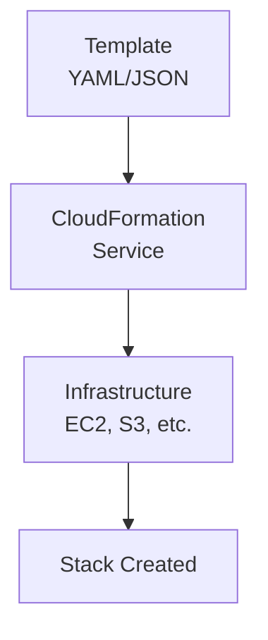
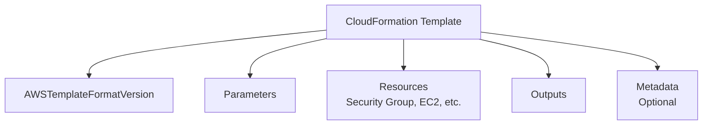
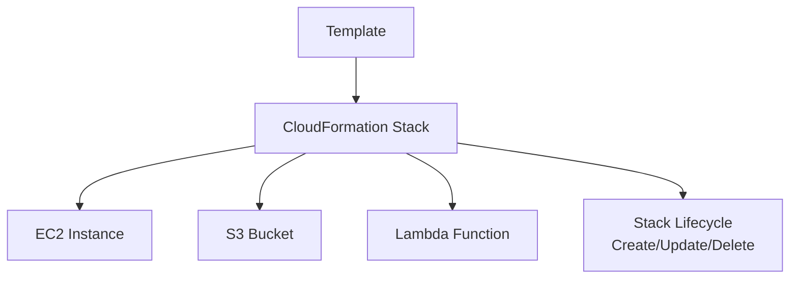
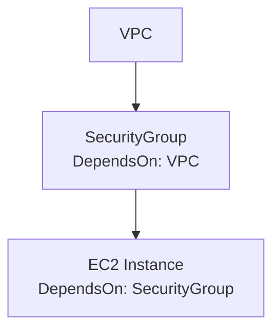
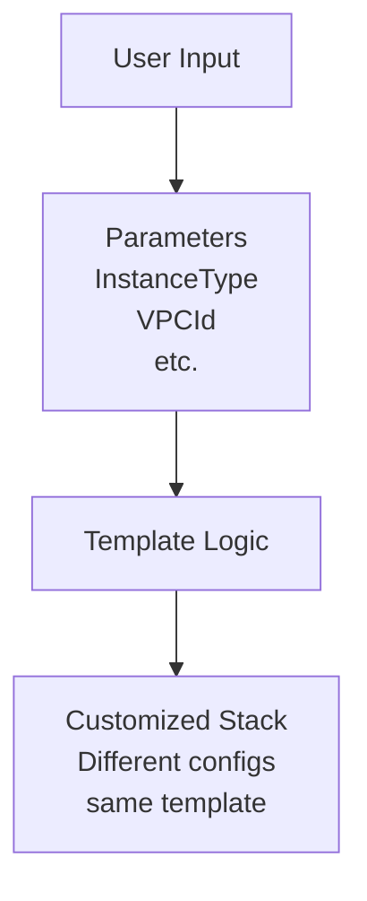
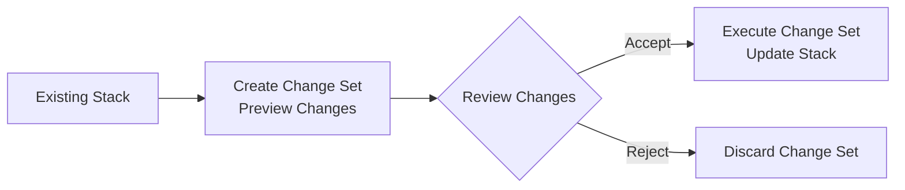
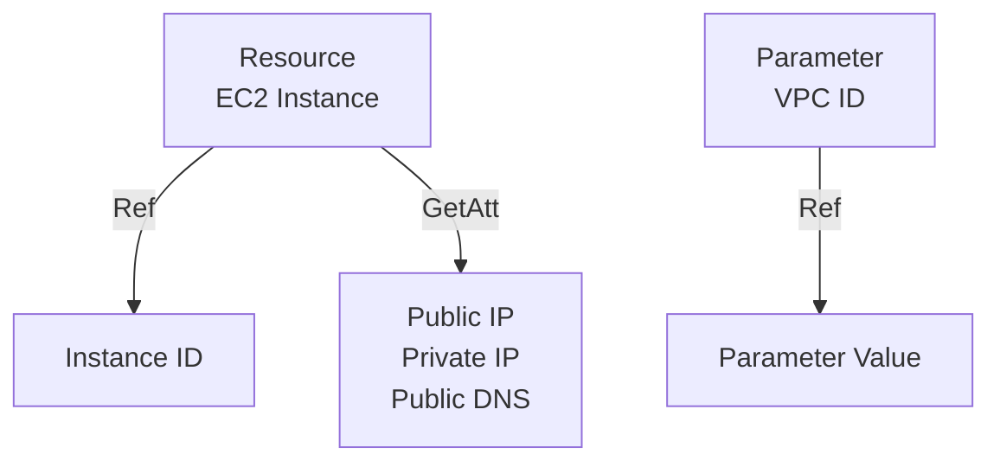
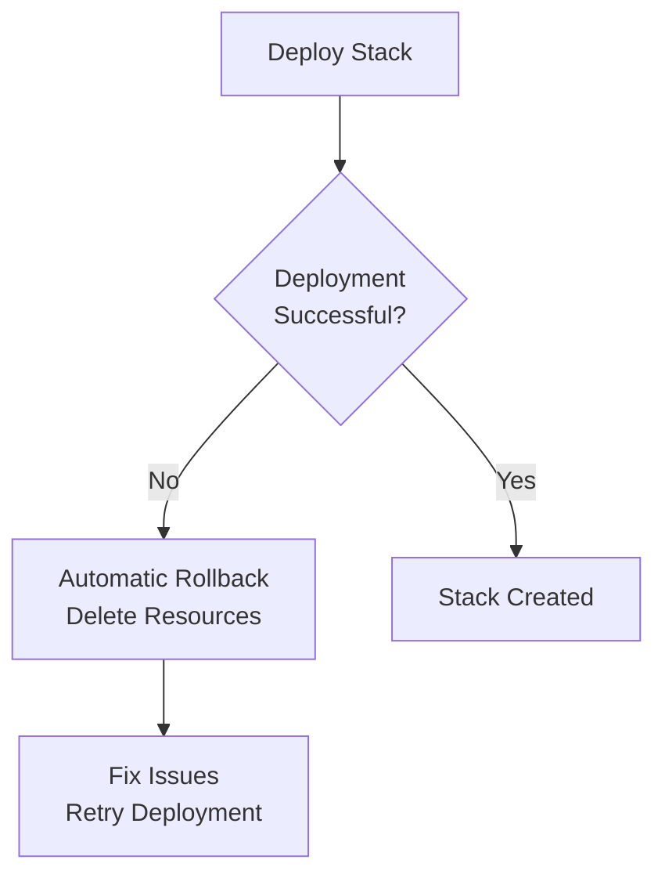
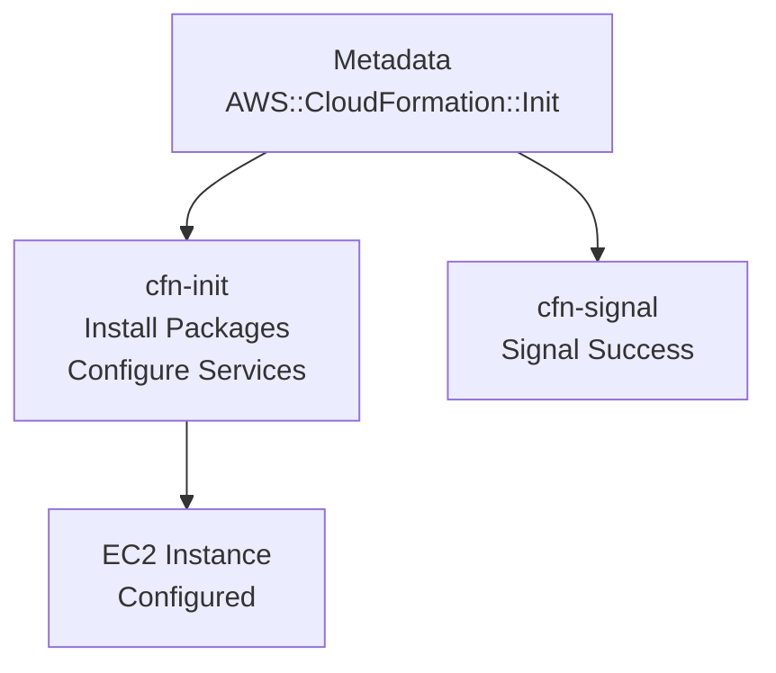
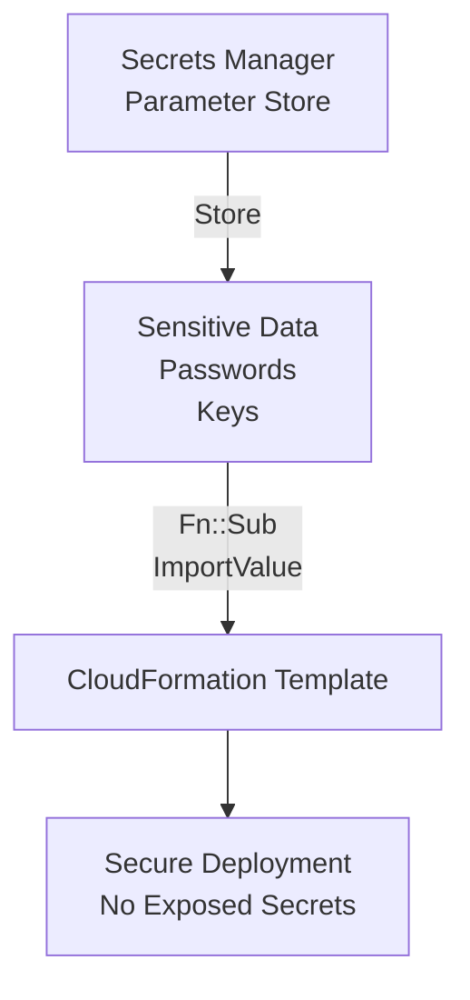

# Master AWS CloudFormation: Top 10 Interview Questions & Answers | Infrastructure as Code Explained

CL-KK-Terminal

## Introduction

AWS CloudFormation is a powerful infrastructure-as-code service that allows you to define and provision AWS resources using code in YAML or JSON format. This document provides detailed answers to the top 10 interview questions on AWS CloudFormation.

## 1. What is AWS CloudFormation?

**Answer:** AWS CloudFormation is an infrastructure-as-code service that defines and provisions AWS infrastructure using code. It creates resources in a safe, consistent, and automated manner. Instead of manual setup, you write templates in YAML or JSON to define infrastructure. CloudFormation enables organizations to create, update, and manage infrastructure using code.

**Diagram:**

**Note:** Correct answer with good explanation. Could emphasize that CloudFormation supports over 500 resource types and integrates with many AWS services.

## 2. Components of AWS CloudFormation

**Answer:** A CloudFormation template consists of several components:
- **AWSTemplateFormatVersion**: Specifies template format version
- **Parameters**: Allows customization with user inputs
- **Resources (required)**: Defines AWS resources to create
- **Outputs**: Provides information about created resources post-deployment
- **Metadata**: Optional template-level information, including AWS::CloudFormation::Init

Parameters enable template reuse, Resources define what to build, Outputs expose stack information.

**Diagram:**

**Note:** Correct. The Resources block is the only required section. AWSTemplateFormatVersion is optional and defaulted if omitted.

## 3. What is a CloudFormation Stack?

**Answer:** A CloudFormation stack is a collection of AWS resources created as a single unit from a template. When you deploy a template, you're creating a stack. Stacks are created through Console, CLI, or SDK by submitting templates. You can update stacks to modify/add resources.

**Diagram:**

**Note:** Correct. Stacks are region-specific and stack names must be unique within a region per account. Stack deletion removes all resources unless specified otherwise.

## 4. How to Handle Dependencies

**Answer:** CloudFormation handles dependencies automatically in most cases. For complex scenarios, use the `DependsOn` attribute to explicitly define resource creation order. This ensures VPC is created before Security Groups, etc.

**Diagram:**

**Note:** Correct. CloudFormation uses resource properties and references to automatically determine dependencies. `DependsOn` is case-sensitive and overrides automatic detection.

## 5. CloudFormation Parameters

**Answer:** CloudFormation parameters customize templates without modifying code. They allow user inputs and enable template reuse with different configurations. Common parameters include InstanceType, VPCId, SecurityGroupIds. They support validation and default values.

**Diagram:**

**Note:** Correct. Parameters have types (String, Number, CommaDelimitedList), constraints, and descriptions. Parameters are resolved at runtime.

## 6. CloudFormation Change Sets

**Answer:** Change sets preview changes to existing stacks before applying them. They show the impact of modifications, allowing you to review and decide whether to proceed. You create a change set, review it, then execute or discard.

**Diagram:**

**Note:** Correct. Especially valuable for production environments to avoid unintended changes and understand update costs.

## 7. CloudFormation Functions: Ref vs GetAtt

**Answer:**
- **Ref**: Returns parameter values or logical IDs/ARNs of resources (e.g., ARN of created resource)
- **GetAtt**: Retrieves attributes of resources (e.g., PublicIp, PrivateIp, DNS names)

Ref is for IDs/ARNs, GetAtt for other resource attributes.

**Diagram:**

**Note:** Correct. These are intrinsic functions: `!Ref` in YAML, `Fn::Ref` in JSON. For lists like SubnetIds, use GetAtt (e.g., GetAtt: [MyLoadBalancer, DNSName]).

## 8. CloudFormation Rollback

**Answer:** CloudFormation automatically rolls back failed deployments by default, deleting created resources. In CLI, use `--rollback-on-error` to enable this. Rollback ensures clean state after failures.

**Diagram:**

**Note:** Correct. You can disable rollback (`--disable-rollback`) to debug issues, keeping partially created resources. Rollback only affects new resources, not existing ones.

## 9. CloudFormation Metadata

**Answer:** Metadata contains additional information for template processing. Specifically, `AWS::CloudFormation::Init` works with CloudFormation helper scripts (cfn-init, cfn-signal, cfn-get-metadata) to configure EC2 instances during stack creation - installing packages, enabling services, writing files.

**Diagram:**

**Note:** Correct. Works only on EC2 instances. The helper scripts must be installed on the instance AMI or added during launch.

## 10. Securing Sensitive Information

**Answer:** Never hardcode sensitive data in templates. Store passwords, keys in AWS Secrets Manager or Systems Manager Parameter Store. Use `Fn::Sub` or import values from these services without exposing data.

**Diagram:**

**Note:** Correct. Use IAM policies to restrict access. For versions, use SSM Dynamic References or Secrets Manager references.
