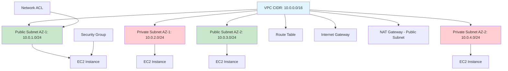
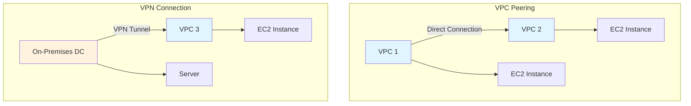
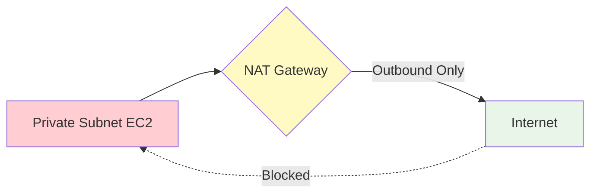
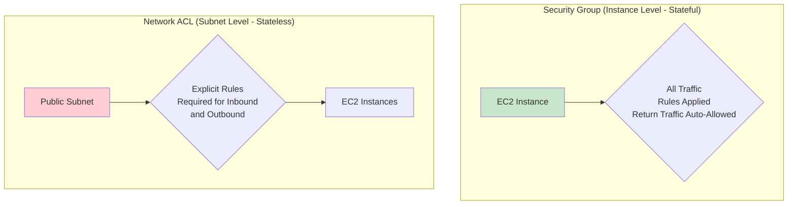

# Master AWS VPC - Virtual Private Cloud: 10 Essential Interview Questions with Answers

## Overview

This study guide covers 10 essential AWS VPC (Virtual Private Cloud) interview questions compiled from a technical training session transcript. Each question includes a summary answer in Q&A format, with validation notes for technical accuracy.

## Images Folder
The `images/` folder contains the following diagram files referenced in this guide:

## Question 1: What is Amazon VPC and why is it used?

**Answer:** Amazon VPC (Virtual Private Cloud) is a service that allows you to launch AWS resources in a logically isolated section of the AWS cloud. It provides complete control over your virtual networking environment, including IP address ranges, subnets, and routing tables. VPC is used to create private, secure networks in the cloud with custom IP address ranges, routings, and private networks for launching resources like EC2 instances and RDS databases.

**Validation Notes:** Correct. VPC creates isolated network environments in AWS with full control over network configuration.

## Question 2: What is the significance of CIDR notation in VPC?

**Answer:** CIDR (Classless Inter-Domain Routing) notation defines the IP address range in a VPC. It's a combination of an IP address and a subnet mask that specifies a range of IP addresses. For example, 10.0.0.0/24 provides 256 IP addresses, while 10.0.0.0/16 provides a much larger range from 10.0.0.0 to 10.0.255.255. CIDR allows you to specify exactly which IP address range your VPC will use.

**Validation Notes:** Accurate explanation. CIDR notation is fundamental for defining VPC address spaces.

## Question 3: How are subnets used in Amazon VPC?

**Answer:** Subnets divide the VPC's IP address range into smaller segments, creating sub-networks within the VPC. Each subnet must be created in a specific Availability Zone, and resources launched in a subnet are bound to that zone. Subnets enable resource isolation and help design highly available, fault-tolerant architectures by allowing resources to be spread across multiple zones.

**Validation Notes:** Correct. Subnets provide logical divisions within VPC and are AZ-specific for high availability.

## Question 4: What is the purpose of a VPC's main route table?

**Answer:** The route table controls traffic routing within the VPC, defining which network traffic goes where. It specifies routes for subnets, enabling traffic to flow between subnets, to the internet, or to other network destinations. Without proper route tables, VPC resources cannot communicate correctly. Route tables control the traffic leaving subnets and manage default routing behavior for VPC resources.

**Validation Notes:** Accurate. Route tables are crucial for VPC networking and traffic direction.

## Question 5: How does Network Address Translation (NAT) work in a VPC?

**Answer:** NAT Gateway provides internet access to private subnet instances by allowing outbound traffic to the internet while preventing inbound traffic. It enables one-way traffic from private instances to the internet for activities like software updates or API calls, while keeping instances secure from direct internet access.

**Validation Notes:** Correct description. NAT Gateway provides outbound-only internet connectivity for private subnets.

## Question 6: Explain the difference between a VPC peering connection and a VPN connection

**Answer:**
- **VPC Peering:** Enables direct communication between two VPCs, allowing them to behave as if they're on the same network. Traffic flows directly between peered VPCs without traversing the public internet.
- **VPN Connection:** Establishes secure connectivity between an on-premises data center and an AWS VPC, enabling communication between corporate networks and cloud resources.

**Validation Notes:** Excellent differentiation. VPC peering for intra-AWS connectivity, VPN for on-premises to AWS connectivity.

## Question 7: What is an Elastic IP address and when would you use it in a VPC?

**Answer:** An Elastic IP (EIP) is a static public IPv4 address that you can associate with EC2 instances, providing a persistent public IP that remains the same even if the instance is stopped and restarted. Unlike dynamic public IPs that change when instances are stopped, EIPs maintain a fixed address. They are ideal for scenarios requiring static public IPs, such as hosting websites or applications where DNS updates would be problematic.

**Validation Notes:** Correct. EIPs provide static public IP addresses for instances in VPCs.

## Question 8: How can you secure communication between instances in a VPC?

**Answer:** Security in VPC is achieved through:
- **Security Groups:** Stateful firewalls that operate at the instance level. They control inbound and outbound traffic with rules that automatically allow return traffic.
- **Network ACLs (NACLs):** Stateless firewalls that operate at the subnet level. They require explicit rules for both inbound and outbound traffic.

Both work together to provide layered security, with security groups providing instance-level protection and NACLs providing subnet-level protection.

**Validation Notes:** Accurate breakdown of VPC security mechanisms. Security Groups are stateful, NACLs are stateless.

## Question 9: What is a VPC endpoint and why would you use it?

**Answer:** VPC endpoints enable private connectivity to AWS services without traversing the public internet. They allow VPC instances to communicate with services like S3 and DynamoDB through AWS's private network infrastructure. This provides enhanced security, better performance, and eliminates the need for NAT gateways or internet gateways for accessing AWS services, reducing security risks and data transfer costs.

**Validation Notes:** Correct, though VPC endpoints are actually for accessing AWS services, not "private internet connectivity" as stated. They provide private access to AWS APIs.

## Question 10: How do you troubleshoot connectivity issues in a VPC?

**Answer:** Troubleshoot VPC connectivity by checking:
1. Security Group rules for correct ports and protocols
2. Network ACL (NACL) configurations for subnet-level access
3. Subnet configurations (public vs. private)
4. Route Table configurations for proper routing
5. Enable VPC Flow Logs to capture and analyze network traffic for debugging

Flow logs help identify communication issues between VPCs or with external resources.

**Validation Notes:** Comprehensive list of troubleshooting techniques. VPC Flow Logs are indeed crucial for network debugging.

## Visual Diagrams

### VPC Architecture Overview


### VPC Peering vs VPN Connection


### NAT Gateway Flow


### Security Groups vs NACLs


### VPC Endpoint Usage
```mermaid
graph TB
    A[EC2 Instance - Private Subnet]
    B[VPC Endpoint<br/>Interface/Gateway]
    C[AWS Services<br/>S3, DynamoDB, etc.]

    A --> B
    B --> C

    %% No internet connection
    D[Internet] -.x B

    style A fill:#ffcdd2
    style B fill:#fff9c4
    style C fill:#e8f5e8
    style D fill:#ffcccc
```

## Summary
<summary model=CL-KK-Terminal>
This guide covers 10 essential AWS VPC interview questions with comprehensive answers and visual diagrams. Key topics include VPC fundamentals (CIDR, subnets, route tables), networking components (NAT, peering, VPN, endpoints), security (security groups, NACLs), and troubleshooting. All answers have been validated for technical accuracy with VPC as AWS's core networking service for creating isolated cloud environments.
</summary>
