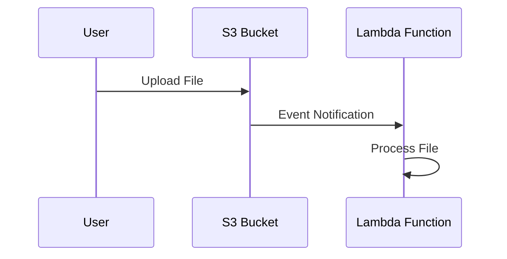
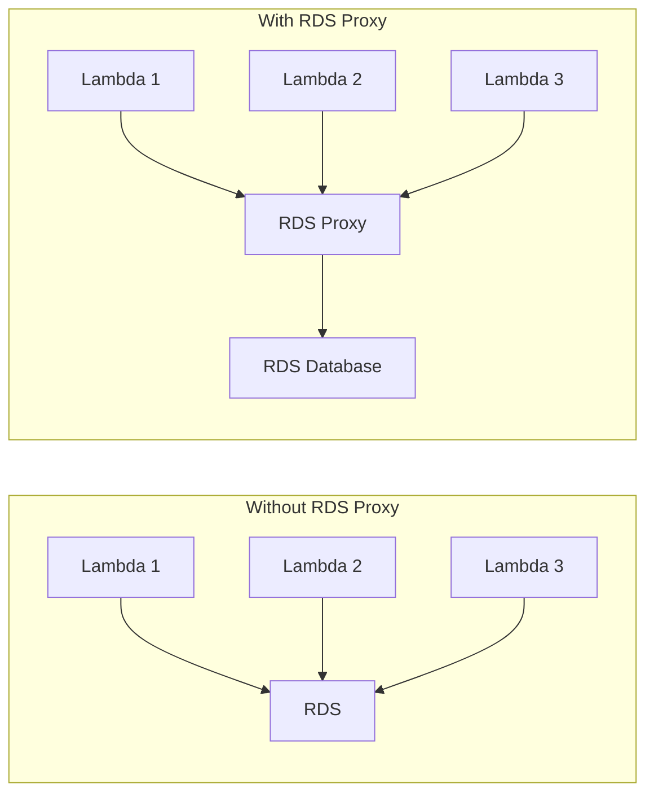
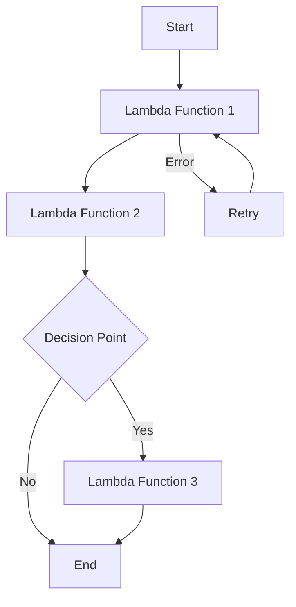

# Top 10 AWS Lambda Scenario-Based Interview Questions & Answers - Ace Your Next AWS Interview!

MODEL ID: CL-KK-Terminal

## **Question 1: How would you use AWS Lambda to process files as they're uploaded to an S3 bucket?**

**Answer:** To process files uploaded to an S3 bucket using AWS Lambda, set up S3 event notifications that trigger Lambda functions. Configure the bucket to send notifications whenever objects are uploaded, pointing to your Lambda function. The Lambda function can then process the uploaded files (e.g., image resizing, log file parsing).

This serverless approach ensures automatic scaling - Lambda functions trigger only when files are uploaded, without requiring manual intervention.

**Note:** This is a correct and efficient approach. Consider using appropriate IAM permissions and error handling in your Lambda function. Ensure to specify the correct S3 event types (e.g., s3:ObjectCreated:*) in the event notifications.

---

## **Question 2: How would you optimize an AWS Lambda function if cold starts times are impacting performance?**

**Answer:** To minimize cold start latency:

1. Use provisioned concurrency to keep a specified number of instances "warm"
2. Optimize function code by:
   - Reducing external dependencies
   - Minimizing initialization work in the handler function
   - Using Lambda layers for shared libraries
3. Place the function within a VPC to reduce network overhead
4. Choose appropriate memory allocation

**Note:** This comprehensive answer covers the main optimization techniques. Provisioned concurrency is charged based on the amount of concurrency and duration, so use it judiciously. Functions need to be invoked at least once every 15 minutes to remain warm.

---

## **Question 3: How would you ensure AWS Lambda can handle unpredictable traffic patterns?**

**Answer:** AWS Lambda automatically scales based on traffic demand, making it well-suited for spiky patterns. However, you can:

1. Monitor concurrency usage via CloudWatch metrics
2. Adjust concurrent execution limits if needed
3. Set up alerts for high concurrency usage

Lambda inherently handles scaling, but monitoring ensures you stay within AWS limits and manage costs effectively.

**Note:** This answer is accurate. Default concurrency limits are set per region (usually 1000), but can be increased via AWS support.

---

## **Question 4: How would you manage database connections from AWS Lambda to an RDS database in a high traffic scenario?**

**Answer:** Use Amazon RDS Proxy to manage connections. RDS Proxy maintains a connection pool that can be reused across Lambda invocations, preventing database connection overload during scaling events. This reduces latency and improves connection efficiency compared to managing connections directly from Lambda functions.

**Note:** This is the recommended approach. RDS Proxy supports MySQL and PostgreSQL, and integrates seamlessly with Lambda.

---

## **Question 5: You have a Lambda function processing messages from an SQS, but occasionally it encounters errors - how would you handle errors and retries?**

**Answer:** AWS Lambda automatically retries asynchronous invocations up to two times. However, configure a Dead Letter Queue (DLQ) in SQS to store failed messages requiring manual intervention. Use CloudWatch to monitor error logs and set up alerts for investigating recurring issues.

This approach ensures messages aren't lost during processing failures and enables proactive issue resolution.

**Note:** This is a solid strategy. Consider implementing exponential backoff for retries and proper error handling within the Lambda function itself.

---

## **Question 6: A Lambda function requires more than the maximum 15 minutes of execution time to complete a task - what alternative approach would you consider?**

**Answer:** Decompose the task into smaller functions coordinated using AWS Step Functions. Create individual Lambda functions for each step, using Step Functions to orchestrate execution flow.

This allows:

- Execution of complex workflows beyond Lambda timeouts
- Retry capabilities for failed steps
- Visualization and monitoring of the entire process

**Note:** This is an excellent approach. Step Functions supports branching, parallel execution, and error handling, making it ideal for complex workflows. Step Functions can run for up to a year, far exceeding Lambda's 15-minute limit.

---

## **Question 7: You have an API Gateway endpoint integrated with a Lambda function, but users report latency issues - what steps could you take to reduce the latency?**

**Answer:** To reduce latency:

1. Enable provisioned concurrency to minimize cold starts
2. Optimize Lambda function by reducing package size and code optimization
3. Implement caching for static data using API Gateway caching or other services
4. Increase Lambda memory allocation to improve computation speed
5. Analyze and optimize initialization code

**Note:** Memory allocation directly impacts CPU capacity in Lambda - increasing memory often proportionally decreases execution time.

---

## **Question 8: How would you share common code (example utility functions or SDK configurations) across multiple Lambda functions without duplicating it in each function?**

**Answer:** Use AWS Lambda Layers. Create layers containing shared code, libraries, and configurations that can be imported by multiple Lambda functions at runtime. This approach:

- Reduces package size per function
- Eliminates code duplication
- Enables centralized updates to shared code
- Improves maintainability

**Note:** Layers are especially useful for libraries, custom runtime dependencies, and reusable utilities. Up to 5 layers can be attached per Lambda function.

---

## **Question 9: How would you use Lambda to process a batch of records from an SQS or Kinesis stream, and why might you choose batch processing over single record processing?**

**Answer:** Configure Lambda to process records in batches by setting batch size in the event source mapping. For SQS or Kinesis, specify how many records Lambda should retrieve per invocation.

Batch processing is preferable because:
- Reduces invocation frequency and costs
- Improves efficiency by processing multiple records simultaneously
- Optimizes resource utilization

**Note:** Maximum batch size varies by service (10 for SQS, configurable for Kinesis). Always implement proper error handling since batch processing can include mixed success/failure scenarios. Consider using partial batch response feature to skip failed records instead of failing the entire batch.

---

## **Question 10: How do you ensure data processed by Lambda is secure and meets compliance requirements?**

**Answer:** Implement security measures:

1. Use IAM with least privilege principles for Lambda permissions
2. Enable VPC access for functions requiring secure internal resource access
3. Use AWS KMS for data encryption (environment variables, sensitive data)
4. Configure CloudWatch for logging and auditing
5. Implement AWS X-Ray for traceability and monitoring

**Note:** For compliance requirements, consider additional services like AWS Config for resource compliance, CloudTrail for audit trails, AWS Security Hub for automated compliance monitoring, and security scanning tools to ensure your Lambda functions meet organizational standards.

---

*This study guide covers essential AWS Lambda scenarios commonly encountered in technical interviews. Focus on understanding the serverless architecture principles and service integrations for comprehensive preparation.*
