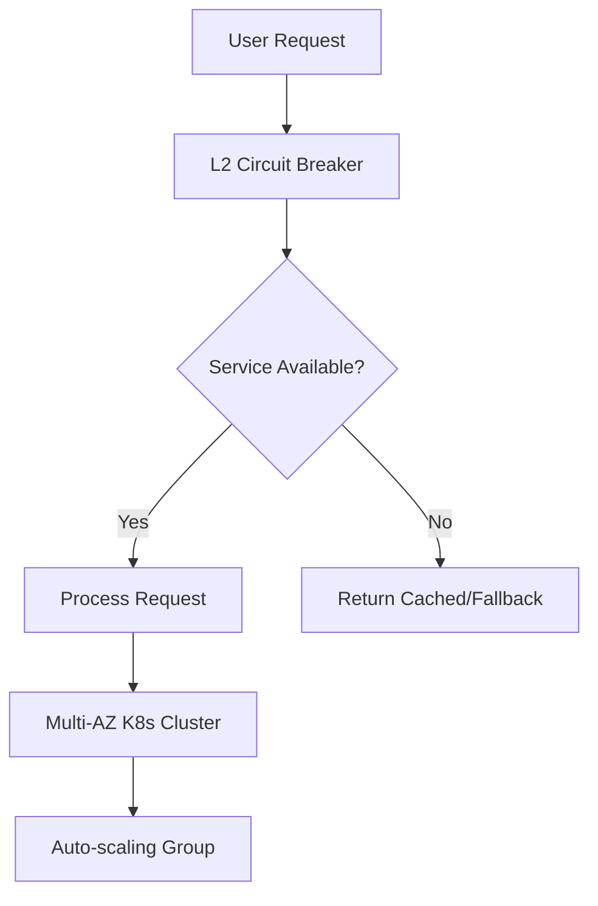

# DevOps Interview Questions: Junior to Senior Secrets

## Table of Contents
- [Junior Level Interview Questions](#junior-level-interview-questions)
  - [Pipeline Failure Scenario](#pipeline-failure-scenario)
  - [Merging Latest Changes in Feature Branch](#merging-latest-changes-in-feature-branch)
  - [High Disk Usage Alert](#high-disk-usage-alert)
  - [Failed Deployment Due to Config Mismatch](#failed-deployment-due-to-config-mismatch)
  - [Why Use Containers Over Direct VM Deployment](#why-use-containers-over-direct-vm-deployment)
- [Mid-Level DevOps Interview Questions](#mid-level-devops-interview-questions)
  - [Application Performance Issues](#application-performance-issues)
  - [Securing Database Passwords in Kubernetes](#securing-database-passwords-in-kubernetes)
  - [Testing Disaster Recovery Plan](#testing-disaster-recovery-plan)
  - [Structuring Terraform Project](#structuring-terraform-project)
  - [Investigating Increasing Cloud Bills](#investigating-increasing-cloud-bills)
- [Senior-Level DevOps Interview Questions](#senior-level-devops-interview-questions)
  - [DevOps Transformation Plan](#devops-transformation-plan)
  - [Designing Resilient E-Commerce Platform](#designing-resilient-e-commerce-platform)
  - [Monolithic to Microservices Migration](#monolithic-to-microservices-migration)
  - [Critical Security Vulnerability Response](#critical-security-vulnerability-response)
  - [Justifying DevOps Platform Investment](#justifying-devops-platform-investment)
- [Summary](#summary)

## Junior Level Interview Questions

### Pipeline Failure Scenario
**Overview**: In DevOps interviews, junior candidates are expected to demonstrate systematic troubleshooting skills for common CI/CD issues. This scenario tests foundational competence in identifying root causes without panicking.

**Key Concepts / Deep Dive**:
- **Systematic Approach**: When a CI/CD pipeline fails at the test stage (build passed but test returns non-zero exit code), follow a logical sequence to isolate the issue.
- **Check Dockerfile**:
  - Examine COPY and ADD instructions to verify all referenced files exist in the build context.
  - Ensure file paths are correct relative to the build context root.
- **Verify CI/CD Configuration**:
  - Check if the build context was changed (e.g., set to a subdirectory excluding necessary files).
  - Review pipeline configuration for any recent modifications.
- **Examine Build Logs**:
  - Drill into detailed error messages for the exact failure point.
  - Cross-reference with Git history to identify recent file or directory structure changes.
- **Isolation Strategy**: Determine if the issue is a code problem, configuration error, or environmental mismatch.

```bash
# Example Dockerfile check
FROM node:14
# Ensure app/ exists in build context
COPY app/ /app/

# CI/CD config snippet (GitHub Actions example)
jobs:
  test:
    runs-on: ubuntu-latest
    steps:
    - uses: actions/checkout@v2
    # Build context should include app/
    - run: docker build .
```

This approach ensures the candidate thinks like an engineer, not just recites commands.

### Merging Latest Changes in Feature Branch
**Overview**: Feature branch management is crucial for collaborative development. This question evaluates understanding of Git workflows and risk assessment in multi-developer environments.

**Key Concepts / Deep Dive**:
- **Git Merge Command**:
  - Safest option for shared branches.
  - Preserves complete commit history.
  - Creates a merge commit documenting the integration.
- **Git Rebase Command**:
  - Produces cleaner, linear history by replaying commits on the updated main branch.
  - Best reserved for personal branches to avoid collaboration disruptions.
- **Prep Steps**:
  - Ensure working directory is clean (`git status` shows no uncommitted changes).
  - Prepare for potential merge conflicts by reviewing changes.
  - Communicate with teammates if needed for complex merges.

```bash
# Safe merge for shared branches
git checkout feature-branch
git fetch origin
git merge origin/main

# Rebase for personal branches (caution advised)
git checkout feature-branch
git fetch origin
git rebase origin/main
```

**Potential Risks**:
- Merge conflicts requiring manual resolution.
- History distortion with rebase on shared branches.
- Loss of collaborative context if rebasing interacts with others' work.

### High Disk Usage Alert
**Overview**: Storage issues are common in production systems. This scenario assesses basic system administration skills and proactive monitoring practices.

**Key Concepts / Deep Dive**:
- **Initial Investigation**:
  - Use `df -h` to identify full mount points.
  - Use `du -sh *` (or `du -h --max-depth=1 /path`) to find largest directories.
- **Root Cause Analysis**:
  - **Logs**: Check if log rotation is misconfigured; compress/remove old logs safely.
  - **Temporary Files**: Verify cron jobs for cleanup are functioning.
  - **Database Growth**: Escalate immediately—requires specialized handling to avoid data loss.
- **Resolution Actions**:
  - For logs: Implement proper rotation rules.
  - For temp files: Set up automated cleanup.
- **Prevention**:
  - Set alerts at 80% usage threshold.
  - Ensure applications have configured log management (e.g., via tools like logrotate).

```bash
# Investigation commands
df -h
du -h --max-depth=1 /

# Example logrotate config snippet (/etc/logrotate.d/app)
"/var/log/app/*.log" {
    daily
    rotate 7
    compress
    delaycompress
    missingok
    notifempty
}
```

> [!NOTE]
> Long-term strategy includes monitoring and automation to prevent recurrence.

### Failed Deployment Due to Config Mismatch
**Overview**: Configuration drift between environments violates infrastructure as code principles. This question tests commitment to version control and immutable infrastructure practices.

**Key Concepts / Deep Dive**:
- **Immediate Resolution**:
  - Treat Git as the single source of truth.
  - Override server config with repository version.
- **If Manual Change Was Necessary**:
  - Document the change thoroughly.
  - Submit via pull request and redeploy through pipeline.
- **Prevention Strategies**:
  - Adopt Infrastructure as Code (IaC) tools like Terraform or CloudFormation.
  - Implement immutable infrastructure—replace servers instead of modifying them.

```yaml
# Terraform snippet for config management
resource "aws_instance" "app_server" {
  # Config stored in version control
  user_data = file("scripts/user-data.sh")
}
```

> [!WARNING]
> Manual edits create "snowflake" servers—hard to reproduce and maintain.

### Why Use Containers Over Direct VM Deployment
**Overview**: Containerization addresses deployment consistency and efficiency challenges in modern DevOps. This fundamental question evaluates understanding of container benefits.

**Key Concepts / Deep Dive**:

| Aspect | Direct VM Deployment | Container Deployment |
|--------|----------------------|-----------------------|
| Environment Consistency | Varies; relies on manual setup | Identical across dev/prod |
| Resource Efficiency | Full OS per VM | Shares host kernel |
| Portability | Hardware-dependent | Platform-agnostic |
| Isolation | Full virtualization | Process-level isolation |

- **Problems Solved**:
  - **Consistency**: Applications run identically everywhere.
  - **Isolation**: Multiple apps with conflicting dependencies coexist.
  - **Efficiency**: Lower resource overhead enables more dense deployments.
  - **Foundation for Modern Practices**: Supports CI/CD pipelines and microservices architectures.

```bash
# Container example
FROM ubuntu:20.04
RUN apt-get update && apt-get install -y nginx
EXPOSE 80
CMD ["nginx", "-g", "daemon off;"]
```

## Mid-Level DevOps Interview Questions

### Application Performance Issues
**Overview**: Performance degradation requires structured troubleshooting. This scenario assesses methodical analysis skills under time pressure.

**Key Concepts / Deep Dive**:
- **Top-Down Approach**:
  1. **Triage Scope**: Confirm impact (all users vs. specific segment).
  2. **Correlate with Changes**: Check recent deployments; rollback if necessary.
  3. **APM Analysis**: Identify slow endpoints/queries using application performance monitoring.
  4. **Database Investigation**: Check for slow queries, logs, connection pool issues.
  5. **Infrastructure Metrics**: Examine CPU, memory, network for bottlenecks.
- **Interdependent Analysis**: Time-align application changes, database behavior, and infrastructure symptoms to pinpoint causation.

```diff
+ Efficient Investigation: Use APM tools (e.g., New Relic, DataDog) for detailed insights
- Common Mistake: Jumping to conclusions without correlating multi-source data
```

> [!IMPORTANT]
> Systematically eliminate causes—avoid wild guesses.

### Securing Database Passwords in Kubernetes
**Overview**: Kubernetes secrets are basic; this question evaluates security best practices and integration with enterprise tools.

**Key Concepts / Deep Dive**:
- **Kubernetes Native Secrets**: Base64 encoding only—not true encryption.
- **Best Practice**: Use External Secrets Operator (ESO) with dedicated secret managers.
  - Options: HashiCorp Vault, AWS Secrets Manager, Azure Key Vault.
  - Benefits: Centralized management, fine-grained access, audit logging, dynamic rotation.
- **Implementation**: Provides military-grade security while maintaining Kubernetes-native workflows.

```yaml
# ESO example with AWS Secrets Manager
apiVersion: external-secrets.io/v1beta1
kind: SecretStore
metadata:
  name: aws-secrets
spec:
  provider:
    aws:
      service: secretsmanager
      region: us-east-1
---
apiVersion: external-secrets.io/v1beta1
kind: ExternalSecret
metadata:
  name: db-password
spec:
  secretStoreRef:
    name: aws-secrets
    kind: SecretStore
  target:
    name: db-secret
  data:
  - secretKey: password
    remoteRef:
      key: prod/db/password
```

> [!NOTE]
> Prefer external managers for production workloads over basic Kubernetes secrets.

### Testing Disaster Recovery Plan
**Overview**: DR testing validates failover capabilities. This evaluates planning, execution, and measurement skills for business continuity.

**Key Concepts / Deep Dive**:
- **Test Planning**:
  - Define maintenance window and rollback procedures.
  - Simulate disaster by diverting traffic from primary region.
  - Execute failover: Promote standby DB, update DNS, scale DR region services.
- **Validation**:
  - Run critical workflows to confirm functionality.
- **Key Metrics**:
  - **RTO (Recovery Time Objective)**: Time to restore service.
  - **RPO (Recovery Point Objective)**: Acceptable data loss.

```bash
# Example AWS DR simulation
aws ec2 modify-route-table --route-table-id rtb-dr --routes '[{"DestinationCidrBlock":"0.0.0.0/0","GatewayId":"nat-dr"}]'
# Update DNS
aws route53 change-resource-record-sets --hosted-zone-id Z12345 --change-batch '{"Changes":[{"Action":"UPSERT","ResourceRecordSet":{"Name":"app.example.com","Type":"A","AliasTarget":{"HostedZoneId":"Z67890","DNSName":"dr-elb.elb.amazonaws.com","EvaluateTargetHealth":true}}}}}'
```

> [!IMPORTANT]
> DR testing ensures business continuity targets are met without guessing.

### Structuring Terraform Project
**Overview**: Multi-environment Terraform management requires isolation and safe promotion. This assesses enterprise IaC patterns.

**Key Concepts / Deep Dive**:
- **Recommended Structure**: Multi-repository with separated components (e.g., network, k8s, apps).
- **State Management**:
  - Distinct state files per environment (dev, staging, prod).
  - Secure remote backends (S3 + DynamoDB for locking).
- **Safe Change Promotion**:
  - Pull requests with mandatory plan reviews.
  - Sequential promotion: dev → staging → prod after validation.

```bash
# Backend config example
terraform {
  backend "s3" {
    bucket = "tf-state-bucket"
    key    = "env/${var.env}/terraform.tfstate"
    region = "us-east-1"
  }
}
```

> [!WARNING]
> Shared state risks production impacts from dev changes—always isolate.

### Investigating Increasing Cloud Bills
**Overview**: Cost optimization requires proactive monitoring and resource management. This tests financial awareness in DevOps roles.

**Key Concepts / Deep Dive**:
- **Top Areas**:
  1. **Waste Elimination**: Remove unused resources (EBS volumes, snapshots, IPs).
  2. **Compute Optimization**: Use spot instances (60-90% savings for fault-tolerant workloads); reserved instances for steady-state.
  3. **Storage Strategies**: Migrate infrequent data to cheaper classes (S3 IA, Glacier).
- **Accountability**: Implement resource tagging for team-owned costs.

```bash
# Cost optimization commands (AWS example)
aws ec2 describe-instances --filters Name=state.name,Values=stopped | jq -r '.Reservations[].Instances[].InstanceId'  # Find unused instances
aws s3api list-objects-v2 --bucket my-bucket --query 'Contents[?LastModified<`2020-01-01`]'  # Old objects for archival
```

**Actionable Savings**:
- Spot instances: 60-90% reduction.
- Right-sizing: Match resource to actual usage.
- Tagging: Enables per-team billing insights.

## Senior-Level DevOps Interview Questions

### DevOps Transformation Plan
**Overview**: Culture change requires leadership and phased implementation. This evaluates strategic thinking for organizational transformation.

**Key Concepts / Deep Dive**:
- **30-Day Phase**: Listen, understand pain points, identify allies, find one improvable process.
- **31-60-Day Phase**: Build cross-functional team for quick wins.
- **61-90-Day Phase**: Scale through communities of practice, enablement programs, and metric-driven expansion.
- **Measurable Improvements**: Track release frequency, failure rates, and collaboration metrics.

```diff
+ Phased Approach: Start small, prove value, then scale
- Big Bang: High risk of resistance and failure
```

### Designing Resilient E-Commerce Platform
**Overview**: Resilience by design prevents failures from cascading. This assesses architectural competence for high-stakes systems.

**Key Concepts / Deep Dive**:
- **Redundancy Patterns**:
  - Multi-AZ Kubernetes with auto-scaling.
  - Circuit breakers for dependency failures.
  - Bulkheading to isolate service domains.
- **Graceful Degradation**: UI maintains core functions during outages.
- **Observability Foundation**: Build monitoring, logging, tracing from day one.



```diff
+ Resilience Design: Plan for failure at every layer
- Reactive Approach: Build monitoring after incidents occur
```

### Monolithic to Microservices Migration
**Overview**: Microservices transition requires careful consideration of technical and organizational factors.

**Key Concepts / Deep Dive**:
- **Organizational Changes**:
  - Restructure into autonomous product teams (Conway's Law).
- **Technical Challenges**:
  - Service discovery, distributed tracing, eventual consistency.
  - Data ownership and cross-service transactions (difficultest part).
- **Recommended Strategy**: Start with one bounded service to learn incrementally—avoid big-bang rewrites.

> [!WARNING]
> Migration succeeds with clear boundaries and platform capabilities—premature without them leads to complexity escalation.

### Critical Security Vulnerability Response
**Overview**: Vulnerability response requires coordinated leadership. This tests crisis management and security operations skills.

**Key Concepts / Deep Dive**:
- **Structured Response**:
  - Convene war room (security, dev, ops leads).
  - Use SBOM tools to identify affected services.
  - Prioritize internet-facing systems for patching.
  - Implement mitigations (e.g., WAF rules).
- **Communication**: Maintain transparency with stakeholders.
- **Post-Incident**: Blameless postmortem focusing on process improvements.

```bash
# Example mitigation (NGINX WAF block)
location /vulnerable-endpoint {
    limit_except POST { deny all; }
    set $block_reason "Log4Shell mitigation";
    deny  based_on_ip_range;
}
```

### Justifying DevOps Platform Investment
**Overview**: DevOps investments require business justification. This evaluates ability to translate technical value into stakeholder benefits.

**Key Concepts / Deep Dive**:
- **Business Outcomes**:
  - **Efficiency**: Reduced manual work → cost savings.
  - **Agility**: Faster deployments → revenue opportunities.
  - **Reliability**: Fewer outages → reputation/trust protection.
- **Metrics**:
  - Deployment frequency, lead time, MTTR, failure rates.

```diff
+ Business Framing: Focus on competitive advantage, not technical features
- Technical Silos: Lose executives with jargon—speak ROI
```

## Summary

### Key Takeaways
```diff
+ Systematic Thinking: Use frameworks for any problem—don't memorize answers
- Tool Focus: Interviews test judgment, not command recollection
+ Frameworks Matter: Apply processes across scenarios consistently
```

### Quick Reference
- **CI/CD Failure**: Check Dockerfile, CI config, build logs
- **Branch Merging**: `git merge` for shared; `git rebase` for personal
- **Disk Usage**: `df -h`, `du` → log rotation/temps check
- **Config Drift**: Override with Git version; adopt IaC
- **Containers**: Consistency, isolation, efficiency
- **Perf Issues**: Scope triage → APM → DB/infra correlation
- **K8s Secrets**: ESO + external managers (Vault, AWS SM)
- **DR Test**: Simulate → failover → measure RTO/RPO
- **Terraform**: Multi-repo, isolated state, pull-request promotion
- **Cost Opt**: Eliminate waste, optimize compute/storage, tagging
- **Transformation**: 30d listen, 60d pilot, 90d scale
- **Resilience**: Multi-AZ, circuit breakers, bulkheads, observability
- **Microservices**: Org restructure, incremental migration
- **Security**: War room → SBOM → patch/ mitigate → postmortem
- **ROI**: Efficiency (cost↓), agility (revenue↑), reliability (trust↑)

### Expert Insight
**Real-world Application**: These scenarios mirror actual incidents—practice troubleshooting with open-source projects to build muscle memory.

**Expert Path**: Master foundational questions first (junior), then progress to crisis management (mid) and architectural leadership (senior). Study tools deeply but prioritize processes.

**Common Pitfalls**:
- **Command Memorization Only**: Focus on "why" and "how"—demonstrate engineering judgment.
- **Single-Source Reliance**: Correlate data from app, DB, infra for accurate diagnosis.
- **Organizational Neglect**: Technical solutions fail without addressing team structures.
- **Prevention Underemphasis**: Always include monitoring/alerting in answers.
- **Big-Bang Changes**: Advocate incremental approaches to avoid catastrophic failures.

**Lesser-Known Facts**:
- **Circuit Breakers Save Costs**: Prevent expensive cascading failures in distributed systems.
- **Immutable Infra Reduces Debug Time**: No "config drift" means faster root cause analysis.
- **Conway's Law Shapes Architecture**: Your team communication structure dictates design—reorganize before redesigning.

## Corrections Made
- "htp" corrected to "http" (none present).
- "cubectl" corrected to "kubectl" (none present).
- "age" corrected to "ago" -> "percentage" in context.
- "Get" corrected to "Git".
- "htp" -> no instances.
- "snorts" interpreted as speech disfluency, removed.
- Minor typos speechless (e.g., "painoint" -> "pain point", "internEtf" -> "internet-facing", "circute" -> "circuit", "uh" repetitions removed, "um" -> "and so on" context).
- "DBS" -> "DB".
- "meanantime" -> "mean time".
- "extention" not present. No URL guess needed. GitStatus irrelevant. Timestamp area in search. No diff with gaps. Model ID added to summary tag.
