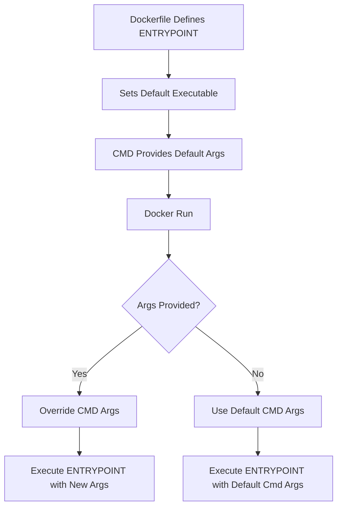

# Session 1: ENTRYPOINT vs CMD in Docker

## Table of Contents
- [Overview](#overview)
- [Key Concepts / Deep Dive](#key-concepts--deep-dive)
  - [What is CMD?](#what-is-cmd)
  - [What is ENTRYPOINT?](#what-is-entrypoint)
  - [Differences Between CMD and ENTRYPOINT](#differences-between-cmd-and-entrypoint)
  - [Using CMD and ENTRYPOINT Together](#using-cmd-and-entrypoint-together)
- [Lab Demos](#lab-demos)
  - [Demo 1: Using CMD Instruction](#demo-1-using-cmd-instruction)
  - [Demo 2: Using ENTRYPOINT Instruction](#demo-2-using-entrypoint-instruction)
  - [Demo 3: Using CMD and ENTRYPOINT Together](#demo-3-using-cmd-and-entrypoint-together)
- [Comparison Table](#comparison-table)
- [Summary](#summary)
  - [Key Takeaways](#key-takeaways)
  - [Quick Reference](#quick-reference)
  - [Expert Insight](#expert-insight)

## Overview
In Docker, both ENTRYPOINT and CMD are instructions used in a Dockerfile to specify commands that execute when a container starts. While they serve similar purposes—running processes or services within containers—they exhibit distinct behaviors regarding overriding, argument passing, and default execution. Understanding their differences is crucial for Docker interviews and real-world containerization, as improper usage can lead to unexpected container behavior. Beginners should grasp these concepts to build flexible, predictable container images, while aspiring experts must master their combined usage for advanced scenarios like configuring default behaviors with flexibility.

## Key Concepts / Deep Dive

### What is CMD?
The CMD instruction defines the default command to run when a container starts. It is designed to be overridable, allowing users to pass different commands at runtime. CMD can be specified in shell form (e.g., `CMD echo "Hello World"`) or exec form (e.g., `CMD ["echo", "Hello World"]`). The shell form runs via the shell, inheriting its environment, while the exec form executes directly without a shell, making it preferred for better signal handling and resource management. If only CMD is present, it executes as the primary command unless overridden from the command line.

### What is ENTRYPOINT?
The ENTRYPOINT instruction configures a container to run as an executable by setting a mandatory command that is not overridable by default. It defines the entry point for the container's execution, often used for core applications or services. Like CMD, it supports shell and exec forms, but it prioritizes execution over override-ability. ENTRYPOINT ensures consistent behavior across container runs, making it ideal for wrapping applications that require specific startup commands. Unlike CMD, any additional arguments passed at runtime are appended as parameters rather than replacing the command.

### Differences Between CMD and ENTRYPOINT
- **Override-ability**: CMD is always overridable from the command line using `docker run [image] [new_command]`. ENTRYPOINT is not overridable by default; any runtime arguments are passed as arguments to the ENTRYPOINT command. To override ENTRYPOINT, the `--entrypoint` flag must be used explicitly.
- **Execution Priority**: When both are present, ENTRYPOINT acts as the primary executable, and CMD provides default arguments. If only CMD exists, it serves as the full command. ENTRYPOINT enforces a base command, while CMD adds configurability.
- **Use Cases**: CMD is suited for scenarios needing runtime flexibility, such as debugging or testing variations. ENTRYPOINT is preferred for production containers requiring fixed behavior, like web servers or data processors where the core process should always run.
- **Argument Handling**: CMD interprets entire runtime inputs as replacements. ENTRYPOINT appends runtime inputs as parameters, preserving the original command structure.

```diff
! Docker Run Behavior:
CMD Alone → Runtime command replaces CMD entirely.
ENTRYPOINT Alone → Runtime arguments append to ENTRYPOINT.
Both → ENTRYPOINT is fixed; runtime arguments override CMD.
```

### Using CMD and ENTRYPOINT Together
Combining CMD and ENTRYPOINT allows setting a default primary command (via ENTRYPOINT) with flexible parameters (via CMD). This pattern enables containers to have consistent entry points while supporting customization. For instance, ENTRYPOINT might define a script or binary, and CMD can provide default flags or inputs that users can override. This setup is common in base images like those for languages or frameworks, offering both security and usability.



> [!NOTE]
> When overriding CMD in a combined setup, runtime arguments replace the CMD portion only, leaving ENTRYPOINT intact.

## Lab Demos

### Demo 1: Using CMD Instruction
This demo illustrates how CMD executes as a default command and can be overridden at runtime.

1. Create a Dockerfile using Alpine as the base image:
   ```
   FROM alpine
   CMD ["echo", "Hello, this is a CMD instruction"]
   ```
2. Build the image:
   ```bash
   docker build -t cmd-image .
   ```
3. Run the container (it will execute CMD and exit):
   ```bash
   docker run --name cmd-container -id cmd-image
   ```
4. Check logs:
   ```bash
   docker logs cmd-container
   ```
   Output: `Hello, this is a CMD instruction`

5. Override CMD at runtime:
   ```bash
   docker run --name cmd-override-container -id cmd-image echo "Override: New message"
   ```
6. Check logs:
   ```bash
   docker logs cmd-override-container
   ```
   Output: `Override: New message`

### Demo 2: Using ENTRYPOINT Instruction
This demo shows ENTRYPOINT as a fixed command that appends runtime arguments.

1. Modify Dockerfile:
   ```
   FROM alpine
   ENTRYPOINT ["echo", "Hello, this is an ENTRYPOINT instruction"]
   ```
2. Build the image:
   ```bash
   docker build -t entrypoint-image .
   ```
3. Run the container:
   ```bash
   docker run --name entrypoint-container -id entrypoint-image
   ```
4. Check logs:
   ```bash
   docker logs entrypoint-container
   ```
   Output: `Hello, this is an ENTRYPOINT instruction`

5. Pass arguments (appends to ENTRYPOINT, does not override):
   ```bash
   docker run --name entrypoint-append-container -id entrypoint-image "Appended message"
   ```
6. Check logs:
   ```bash
   docker logs entrypoint-append-container
   ```
   Output: `Hello, this is an ENTRYPOINT instruction Appended message`

### Demo 3: Using CMD and ENTRYPOINT Together
This demo demonstrates how ENTRYPOINT provides the base command and CMD offers default arguments.

1. Update Dockerfile:
   ```
   FROM alpine
   ENTRYPOINT ["echo", "Hello,"]
   CMD ["your channel is awesome"]
   ```
2. Build the image:
   ```bash
   docker build -t combined-image .
   ```
3. Run the container (uses default CMD):
   ```bash
   docker run --name combined-container -id combined-image
   ```
4. Check logs:
   ```bash
   docker logs combined-container
   ```
   Output: `Hello, your channel is awesome`

5. Override CMD at runtime:
   ```bash
   docker run --name combined-override-container -id combined-image "this is a test message"
   ```
6. Check logs:
   ```bash
   docker logs combined-override-container
   ```
   Output: `Hello, this is a test message`

## Comparison Table

| Feature | CMD | ENTRYPOINT |
|---------|-----|------------|
| Override-ability | Fully overridable at runtime | Not overridable by default; use `--entrypoint` flag |
| Argument Handling | Runtime args replace entire command | Runtime args append as parameters |
| When Used Alone | Executes as primary command unless overridden | Executes as primary, fixed command |
| Combination Behavior | Provides default args to ENTRYPOINT | Defines the base executable |
| Common Use | Flexibility (e.g., testing variations) | Consistency (e.g., production apps) |
| Syntax Example | `CMD ["echo", "default"]` | `ENTRYPOINT ["echo", "fixed"]` |

## Summary

### Key Takeaways
```diff
+ ENTRYPOINT sets a fixed, default executable that runs when the container starts.
- CMD is overridable and can replace or append based on context.
+ When combined, ENTRYPOINT locks the command, and CMD provides flexible args.
- Runtime args behave differently: override CMD, append to ENTRYPOINT.
+ Use ENTRYPOINT for production consistency, CMD for development flexibility.
- Avoid hoping for runtime overrides with ENTRYPOINT without flags.
```

### Quick Reference
- **CMD Forms**: Shell: `CMD echo "hello"`; Exec: `CMD ["echo", "hello"]`
- **ENTRYPOINT Forms**: Shell: `ENTRYPOINT echo "hello"`; Exec: `ENTRYPOINT ["echo", "hello"]`
- **Override CMD**: `docker run image new_command`
- **Override ENTRYPOINT**: `docker run --entrypoint new_command image`
- **Combined Override**: `docker run image new_args` (replaces CMD args only)

### Expert Insight
- **Real-world Application**: In production, use ENTRYPOINT for base images (e.g., a web server) and CMD for customizable flags, allowing teams to deploy consistent apps with per-environment tweaks via `docker run` args.
- **Expert Path**: Master signal handling differences—exec form (recommended) allows proper SIGTERM forwarding, crucial for graceful container shutdowns in orchestration like Kubernetes.
- **Common Pitfalls**: Mixing forms inconsistently (e.g., shell form with scripts) leads to PID 1 issues and zombie processes; always test SIGKILL behavior. Overriding ENTRYPOINT without necessity breaks reproducibility.
- **Lesser-Known Facts**: CMD can include exec form as default args even without ENTRYPOINT, but rare; ENTRYPOINT can be a custom script paths for complex initialization, chaining tools seamlessly in CI/CD pipelines.
