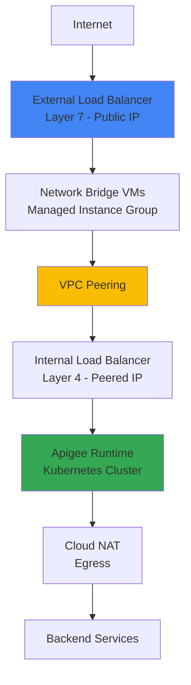

# Section 3: Apigee Basics

## 3.1 Introduction to Apigee

**Apigee** is Google Cloud's **API Management Platform** that provides comprehensive tools for designing, securing, deploying, monitoring, and scaling APIs.

### 🎯 What is API Management?

**API Management** = Unified platform for all API needs including:
- API Gateway (traffic routing)
- Security (authentication, authorization)
- Analytics and monitoring
- Developer portal
- Monetization

---

## 3.2 Need of API Management & Apigee Organization

### 🔑 Why API Management?

#### 1. **Unified Platform**
- As organizations create more APIs, need centralized management
- Single platform for all API operations

#### 2. **Decoupling Backend Services**
```
Consumers → API Gateway → Backend Services
```

**Benefits**:
- ✅ Hide backend services from consumers
- ✅ Evolve backends without impacting clients
- ✅ Change backend URLs without changing consumer URLs
- ✅ Only routing changes needed in API gateway

#### 3. **Offload Common Tasks**
- Authentication & access control
- CORS (Cross-Origin Resource Sharing)
- Rate limiting & throttling
- Caching
- Routing

#### 4. **Observability**
- Unified logs, analytics, and monitoring
- Intelligent insights for API program evolution

#### 5. **API Discovery & Monetization**
- Developer Portal for API discovery
- Subscribe, test, and understand APIs
- Monetize APIs

### 📊 Without vs With API Management

**Without API Management**:
```diff
- Teams work in silos (Boomi, MuleSoft, Spring Boot, Python)
- Consumers call backend services directly
- No centralized security
- Difficult to manage
```

**With API Management**:
```
External/Internal Consumers
    ↓
API Gateway (api.example.com)
    ├─ Security layer
    ├─ Mediation & transformation
    ├─ OAuth 2.0 authentication
    ├─ Caching
    └─ Routing based on path
         ↓
    ┌────┼────┬────┬────┐
    ↓    ↓    ↓    ↓    ↓
  Boomi MuleSoft Spring Python Other
```

### 📝 Apigee Terminology

| Term | Definition |
|------|------------|
| **API Proxy** | API hosted on Apigee layer, acts on behalf of backend |
| **Target Service** | Backend service that proxy routes to |
| **API Developer** | Team that owns and creates Apigee APIs |
| **App Developer** | Consumer/client that uses the APIs |

### 🏢 Apigee Organization

> [!IMPORTANT]
> **Apigee Organization** ≠ **Google Cloud Organization**

**Apigee Organization**:
- Has 1:1 relationship with GCP Project
- Project ID of GCP project = Apigee Organization ID
- Eval org = Apigee instance in a project

**Example**:
```
GCP Organization (Company root)
    ↓
GCP Project (project-id-12345)
    ↓
Apigee Organization (org ID = project-id-12345)
```

---

## 3.3 Provision Apigee Eval Org

### 📋 Eval Org vs Paid Org

**Eval Org Characteristics**:
- ⏰ **60-day free trial** (auto-deleted after 60 days)
- ❌ Cannot be extended
- ❌ Cannot be converted to paid org
- ⚠ Backup API code by exporting before expiration

### 🛠 Provisioning Steps

#### **Step 1: Enable APIs**

Enable required APIs:
- Apigee API
- Compute Engine API
- Service Networking API

```
Search "Apigee" → Try Apigee for Free → Enable APIs
```

#### **Step 2: Networking**

**VPC Peering Setup**:
1. Select VPC network (default or custom)
2. Allocate peering IP range
   - Auto-detect unused IP range
   - Or provide custom IP range
3. Establish private connection to Google services

```
Select Network: default
    ↓
Allocate peering range (automatic)
    ↓
Establish private connection
```

#### **Step 3: Apigee Eval Org**

**Choose Regions**:
- **Analytics Region**: Where analytics data is stored
- **Runtime Region**: Where API gateway runs

```
Analytics Region: asia-south1 (Mumbai)
Runtime Region: asia-south1 (Mumbai)
```

> [!NOTE]
> This step provisions:
> - API runtime (gateway)
> - Management plane
> - Takes longest time (10-15 minutes)

#### **Step 4: Access Routing**

**Options**:
1. **No Internet Access**: Only accessible from VPC
2. **Enable Internet Access** (recommended for hands-on):
   - Provisions external load balancer
   - Uses Network Bridge VMs
   - Accessible via `<IP>.nip.io` domain
   - Google-managed SSL certificate

**Configuration**:
```
Enable internet access: ✓
Subnetwork: Choose runtime region subnet
Hostname: <LOAD_BALANCER_IP>.nip.io
```

> [!WARNING]
> SSL certificate provisioning can take 10-15 minutes. API won't work until certificate is active.

### 🔍 Post-Provisioning

**Verify Components**:
- Navigate to API Proxies → See `hello-world` proxy
- Check Environment Groups → See hostname
- Test endpoint: `https://<IP>.nip.io/hello-world`

**Environment Group**:
```
Management → Environments → Environment Groups
    ↓
eval-group
    ├─ Hostname: <IP>.nip.io
    └─ Environment: eval
```

---

## 3.4 EVAL Architecture and Walkthrough

### 🏗 Apigee Architecture Components

**Key Concept**: Apigee is a **fully managed service**
- All components created/managed by Google Cloud
- In Google's own VPC and project
- Your project has separate VPC

### 🌐 Network Architecture



### 📦 Provisioning Step Breakdown

#### **Step 2: Networking**
- Created VPC peering between your VPC and Google-managed VPC
- Allocated unused IP range from your VPC for peering
- Established **Private Service Access**

#### **Step 3: Apigee Eval Org**

**In Google-Managed VPC**:
1. **Runtime Instance**: Kubernetes cluster
2. **Internal Load Balancer** (Layer 4): Fronts Kubernetes cluster
3. **Cloud NAT**: For egress traffic
4. **Peered IP**: Internal LB uses IP from peered range

**Result**: Your VPC can access Apigee runtime via internal IP

#### **Step 4: Access Routing**

**In Your VPC**:
1. **External Load Balancer** (Layer 7): Public-facing with public IP
2. **Network Bridge VMs**: Managed instance group in runtime region
   - Uses internal IP from regional subnet
   - Runs scripts to forward traffic to internal LB

**Traffic Flow**:
```
Internet
    ↓
External Load Balancer (Public IP)
    ↓
Network Bridge VMs (Your VPC, Internal IP)
    ↓
VPC Peering
    ↓
Internal Load Balancer (Google VPC, Peered IP)
    ↓
Apigee Runtime (Kubernetes)
```

### 🔍 Verify Components in GCP Console

#### **1. Load Balancer**
```
Search "Load Balancing"
    ↓
See external load balancer
    ├─ External IP
    ├─ Certificate (for <IP>.nip.io)
    └─ Backend: Managed instance group
```

#### **2. Compute Engine VMs**
```
Compute Engine → Instance Groups
    ↓
Managed Instance Group
    ├─ Region: Runtime region
    ├─ Internal IP: From regional subnet
    └─ Metadata: endpoint IP, startup script URL
```

#### **3. VPC Network**
```
VPC Network → Subnets
    ↓
Runtime region subnet (e.g., asia-south1)
    └─ IP range: 10.160.x.x (matches VM IPs)
```

#### **4. VPC Peering**
```
VPC Network → VPC Network Peering
    ↓
Service Networking Peering
    └─ Peered range: 10.9.124.0/22
```

#### **5. Apigee Runtime Instance**
```
Apigee → Instances
    ↓
eval-instance
    ├─ IP: 10.9.124.2 (from peered range)
    ├─ Location: Runtime region
    └─ Attached to: eval environment
```

#### **6. Environment Group**
```
Apigee → Management → Environment Groups
    ↓
eval-group
    ├─ Hostname: <LOAD_BALANCER_IP>.nip.io
    └─ Linked to: eval environment
```

### 📊 Architecture Diagram

```
┌─────────────────────────────────────────────────────────────┐
│                      Your GCP Project                        │
│  ┌────────────────────────────────────────────────────────┐ │
│  │                    Your VPC (default)                   │ │
│  │                                                          │ │
│  │  ┌──────────────────────────────────────────────────┐  │ │
│  │  │  Regional Subnet (asia-south1: 10.160.0.0/20)    │  │ │
│  │  │                                                    │  │ │
│  │  │  Network Bridge VMs (10.160.0.x)                  │  │ │
│  │  └──────────────────────────────────────────────────┘  │ │
│  │                                                          │ │
│  │  External Load Balancer (Public IP)                     │ │
│  └────────────────────────────────────────────────────────┘ │
└─────────────────────────────────────────────────────────────┘
                            ↕ VPC Peering
┌─────────────────────────────────────────────────────────────┐
│                  Google-Managed VPC                          │
│  ┌────────────────────────────────────────────────────────┐ │
│  │  Peered Range (10.9.124.0/22)                          │ │
│  │                                                          │ │
│  │  Internal Load Balancer (10.9.124.2)                    │ │
│  │           ↓                                              │ │
│  │  Apigee Runtime (Kubernetes Cluster)                    │ │
│  │           ↓                                              │ │
│  │  Cloud NAT → Backend Services                           │ │
│  └────────────────────────────────────────────────────────┘ │
└─────────────────────────────────────────────────────────────┘
```

---

## 3.5 Cloud Console vs Classic UI

### 🖥 UI Comparison

**Classic UI**:
- Legacy interface at `apigee.com`
- **Shutdown date**: August 29, 2025
- Being phased out

**Cloud Console UI**:
- Integrated with Google Cloud Console
- All features migrated from Classic UI
- Better integration with GCP services
- Includes Developer Portals (last feature migrated)

> [!NOTE]
> This course uses **Cloud Console UI** exclusively.

**Benefits of Cloud Console**:
- ✅ Integrated with GCP services
- ✅ Easier networking, monitoring, app integration
- ✅ Access to functions and resources across projects
- ✅ Modern, unified experience

---

## 3.6 Explore and Test hello-world Proxy

### 🔍 Proxy Components

**Auto-Generated Proxy**:
- Name: `hello-world`
- Revision: 1 (deployed to `eval` environment)
- Base path: `/hello-world`
- Target: `mocktarget.apigee.net/user`

### 📝 Apigee URL Structure

```
https://<HOSTNAME>/hello-world/xml
│                  │            │
└─ Hostname        └─ Base Path └─ Path Suffix
   (API Gateway)
```

**Terminology**:
- **Hostname**: `<IP>.nip.io` (from environment group)
- **Base Path**: `/hello-world`
- **Path Suffix**: Anything after base path (e.g., `/xml`)

### 🧪 Testing

**Endpoint Summary**:
```
Base Path: /hello-world
Target: mocktarget.apigee.net/user
```

**Test Requests**:
```
GET https://<IP>.nip.io/hello-world
→ Returns: Hello, Guest!

GET https://<IP>.nip.io/hello-world/xml
→ Returns: Hello, Guest! (not XML, because target is /user)
```

> [!IMPORTANT]
> Apigee runtime validates requests use configured hostnames. Direct load balancer IP won't work.

### 🔧 Postman Setup

**Collection Variables**:
```
apigee_host = <IP>.nip.io
```

**Environment Variables**:
```
Environment: eval-environment
Variable: apigee_host = <IP>.nip.io
```

**Variable Precedence**:
```
Environment Variable (highest)
    ↓
Collection Variable (fallback)
```

---

## 3.7 Update Target URL and Test with CURL

### 🛠 Updating Proxy

**Problem**: Want to call `mocktarget.apigee.net/xml` but proxy targets `/user`

**Solution**: Update target endpoint to remove `/user` suffix

#### **Developer Tab Overview**

```
Proxy Endpoint (default)
    ├─ PreFlow
    ├─ Conditional Flows
    ├─ PostFlow
    └─ Route Rule → Routes to Target Endpoint

Target Endpoint (default)
    ├─ PreFlow
    ├─ Conditional Flows
    ├─ PostFlow
    └─ HTTPTargetConnection → Backend URL
```

**XML Structure**:
```xml
<ProxyEndpoint name="default">
  <PreFlow/>
  <Flows/>
  <PostFlow/>
  <RouteRule name="default">
    <TargetEndpoint>default</TargetEndpoint>
  </RouteRule>
</ProxyEndpoint>

<TargetEndpoint name="default">
  <PreFlow/>
  <Flows/>
  <PostFlow/>
  <HTTPTargetConnection>
    <URL>https://mocktarget.apigee.net</URL>
  </HTTPTargetConnection>
</TargetEndpoint>
```

**Change**:
```diff
- <URL>https://mocktarget.apigee.net/user</URL>
+ <URL>https://mocktarget.apigee.net</URL>
```

**Save & Deploy**:
1. Save → Creates new revision (immutable once deployed)
2. Deploy → Revision 2 to eval environment

**Test**:
```
GET https://<IP>.nip.io/hello-world/xml
→ Returns: XML response
```

### 🖥 CURL Testing

**Basic CURL**:
```bash
curl https://<IP>.nip.io/hello-world
# Returns: Hello, Guest!

curl https://<IP>.nip.io/hello-world/xml
# Returns: XML response
```

**Using Custom Hostname**:
```bash
curl -k --resolve eval.example.com:443:<LOAD_BALANCER_IP> \
  https://eval.example.com/hello-world
```

**Explanation**:
- `-k`: Skip certificate verification
- `--resolve`: Resolve hostname to specific IP
- `eval.example.com:443:<IP>`: Map hostname to load balancer IP

---

## 3.8 Introduction to Apigee Flows and Policies

### 🔄 Flows: Building Blocks of Proxies

**Flow** = Configuration place to attach policies

**Policy** = Functionality/logic to execute

**Policy Step** = Attaching a policy to a flow

### 📊 Flow Types (in execution order)

```
1. PreFlow       → Always executes first
2. Conditional Flow → Executes only if condition is met
3. PostFlow      → Always executes after core logic
4. PostClientFlow → Executes after response sent to client
```

### 🏗 Endpoints

**Proxy Endpoint**: Closer to consumer
**Target Endpoint**: Closer to backend

> [!NOTE]
> Endpoints are NOT physical endpoints, they are **configuration places**.

### 🔁 Request/Response Flow

```mermaid
graph LR
    Client[Client] -->|Request| PE_Pre[Proxy Endpoint<br/>PreFlow]
    PE_Pre --> PE_Cond[Conditional Flow]
    PE_Cond --> PE_Post[PostFlow]
    PE_Post --> TE_Pre[Target Endpoint<br/>PreFlow]
    TE_Pre --> TE_Cond[Conditional Flow]
    TE_Cond --> TE_Post[PostFlow]
    TE_Post --> Backend[Backend API]
    
    Backend -->|Response| TE_Post_Res[Target Endpoint<br/>PostFlow]
    TE_Post_Res --> TE_Cond_Res[Conditional Flow]
    TE_Cond_Res --> TE_Pre_Res[PreFlow]
    TE_Pre_Res --> PE_Post_Res[Proxy Endpoint<br/>PostFlow]
    PE_Post_Res --> PE_Cond_Res[Conditional Flow]
    PE_Cond_Res --> PE_Pre_Res[PreFlow]
    PE_Pre_Res --> PE_PostClient[PostClientFlow]
    PE_PostClient --> Client
    
    style PE_Pre fill:#e74c3c
    style PE_Post fill:#e74c3c
    style TE_Pre fill:#3498db
    style TE_Post fill:#3498db
```



### 📍 When to Use Each Endpoint

**Proxy Endpoint (Request)**:
- Authentication with proxy
- Rate limiting
- Request validation

**Target Endpoint (Request)**:
- Authentication with backend
- Request transformation for backend

**Target Endpoint (Response)**:
- Remove sensitive headers from backend
- Response transformation

**Proxy Endpoint (Response)**:
- Add headers for consumer
- Response formatting

**PostClientFlow**:
- Message logging
- Analytics (limited policies allowed)

### 📄 XML Configuration

**Proxy Endpoint XML**:
```xml
<ProxyEndpoint>
  <PreFlow name="PreFlow">
    <Request>
      <!-- Policies here -->
    </Request>
    <Response>
      <!-- Policies here -->
    </Response>
  </PreFlow>
  
  <Flows>
    <Flow name="ConditionalFlow">
      <Condition>proxy.pathsuffix MatchesPath "/xml"</Condition>
      <Request>
        <!-- Policies here -->
      </Request>
      <Response>
        <!-- Policies here -->
      </Response>
    </Flow>
  </Flows>
  
  <PostFlow name="PostFlow">
    <Request/>
    <Response/>
  </PostFlow>
  
  <PostClientFlow>
    <!-- Limited policies -->
  </PostClientFlow>
</ProxyEndpoint>
```

---

## 3.9 Create Conditional Flow and Attach Policy

### 🎯 Use Case

Convert XML response to JSON **only** for `/xml` endpoint when client requests JSON

### 🛠 Implementation Steps

#### **1. Create Conditional Flow**

```
Proxy Endpoint → Add Flow
    ↓
Name: get-xml
Condition Type: Path and Verb
Path: /xml
Verb: GET
```

**Generated Condition**:
```xml
<Condition>(proxy.pathsuffix MatchesPath "/xml") and (request.verb = "GET")</Condition>
```

#### **2. Attach Policy**

```
get-xml Flow → Response → Add Step
    ↓
Create New Policy → XML to JSON
Name: XML-to-JSON-response-conversion
```

**Policy XML**:
```xml
<XMLToJSON name="XML-to-JSON-response-conversion">
  <Source>response</Source>
  <OutputVariable>response</OutputVariable>
</XMLToJSON>
```

**Source**: `response` (because added in response section)

#### **3. Add Condition to Policy Step**

**Condition**: Only convert if client accepts JSON

```xml
<Step>
  <Name>XML-to-JSON-response-conversion</Name>
  <Condition>request.header.Accept Matches "application/json*"</Condition>
</Step>
```

### 🧪 Testing

**Without Accept Header**:
```
GET https://<IP>.nip.io/hello-world/xml
→ Returns: XML response
```

**With Accept Header**:
```
GET https://<IP>.nip.io/hello-world/xml
Headers: Accept: application/json
→ Returns: JSON response
```

### 📊 Flow Variables

**Used in Conditions**:
- `proxy.pathsuffix`: Path after base path
- `request.verb`: HTTP method
- `request.header.Accept`: Accept header value

> [!NOTE]
> Flow variables allow accessing request/response information and policy execution status.

---

## 3.10 Introduction to Flow Variables

### 📚 Flow Variable Reference

**Official Documentation**: Flow variable reference (link in resources)

**Categories**:
- Request variables
- Response variables
- System variables
- Target variables
- Proxy context variables

### 🔍 Common Flow Variables

#### **Request Variables**
```
request.formparam.<name>      → Form parameter
request.header.<name>         → Request header
request.queryparam.<name>     → Query parameter
request.content               → Request payload
request.verb                  → HTTP method
```

#### **Response Variables**
```
response.content              → Response payload
response.header.<name>        → Response header
response.status.code          → HTTP status code
```

#### **System Variables**
```
system.region.name            → Data center region
system.time                   → Current time
```

#### **Proxy Variables**
```
proxy.pathsuffix              → Path after base path
proxy.basepath                → Base path
apiproxy.name                 → Proxy name
apiproxy.revision             → Revision number
```

#### **Target Variables**
```
target.url                    → Target URL
target.copy.pathsuffix        → Whether to copy path suffix
```

#### **Load Balancing Variables**
```
loadbalancing.client.is       → Boolean for load balancing
is.error                      → Boolean for error state
```

### 🎯 Operators for Conditions

#### **MatchesPath** (for paths)
```xml
<Condition>proxy.pathsuffix MatchesPath "/xml"</Condition>
<Condition>proxy.pathsuffix MatchesPath "/xml/*"</Condition>      <!-- Single level -->
<Condition>proxy.pathsuffix MatchesPath "/xml/**"</Condition>     <!-- Multiple levels -->
<Condition>proxy.pathsuffix MatchesPath "/xml/*/something"</Condition>
```

#### **Matches** (for strings)
```xml
<Condition>request.header.Accept Matches "application/json*"</Condition>
```

#### **Equals** (=)
```xml
<Condition>request.verb = "GET"</Condition>
```

#### **Regex** (~)
```xml
<Condition>proxy.pathsuffix ~ "/xml.*"</Condition>
```

### 🧪 Enhanced Example

**Condition**: Convert XML to JSON only if client accepts JSON

```xml
<Step>
  <Name>XML-to-JSON-response-conversion</Name>
  <Condition>request.header.Accept Matches "application/json*"</Condition>
</Step>
```

**Test**:
```
Accept: application/json        → Converts to JSON
Accept: application/json;q=0.9  → Converts to JSON (matches pattern)
Accept: application/xml         → Does NOT convert
```

---

## 3.11 Create Your First Proxy - HTTPBin

### 🌐 HTTPBin API

**URL**: `httpbin.org`

**Purpose**: Simple API for learning and testing

**Example Endpoints**:
```
GET /xml          → Returns XML
GET /uuid         → Returns unique ID
GET /anything     → Echoes request
```

### 🛠 Create Proxy

**Steps**:
```
API Proxies → Create New
    ↓
Type: Reverse Proxy
Name: httpbin
Base Path: /rest/httpbin/v1
Backend URL: https://httpbin.org
    ↓
Deploy to: eval environment
```

**Result**:
- Proxy created and deployed
- Base path: `/rest/httpbin/v1`
- Target: `https://httpbin.org`

### 🧪 Testing

**Postman**:
```
GET https://<IP>.nip.io/rest/httpbin/v1/xml
→ Returns: XML response

GET https://<IP>.nip.io/rest/httpbin/v1/uuid
→ Returns: {"uuid": "..."}
```

> [!TIP]
> HTTPBin is excellent for practicing Apigee concepts and POCs without relying on specific backend APIs.

---

## 3.12 ExtractVariables Policy using No-Target Proxy

### 🎯 No-Target Proxy

**Purpose**: Proxy without backend service (no routing)

**Use Cases**:
- Testing policies
- POCs
- Pass-through proxy

**Create**:
```
API Proxies → Create New
Type: No Target
Base Path: /no-target
Deploy to: eval
```

**Behavior**:
```
GET /no-target        → Returns 200 (empty response)
POST /no-target       → Echoes request body
Body: "test"          → Returns: "test"
```

### 📝 ExtractVariables Policy

**Purpose**: Extract data from request/response into variables

**Policy Type**: Mediation (Extensible)

#### **Policy Structure**

```xml
<ExtractVariables name="EV-request-info">
  <Source>request</Source>
  <VariablePrefix>apigee</VariablePrefix>
  <IgnoreUnresolvedVariables>true</IgnoreUnresolvedVariables>
  
  <!-- Extract from URI Path -->
  <URIPath>
    <Pattern ignoreCase="true">/customers/{customer_id}</Pattern>
    <Pattern ignoreCase="true">/**/{customer_id}</Pattern>
  </URIPath>
  
  <!-- Extract Query Parameters -->
  <QueryParam name="first_name">
    <Pattern ignoreCase="true">{first_name}</Pattern>
  </QueryParam>
  
  <QueryParam name="time">
    <Pattern ignoreCase="true">{end_time}</Pattern>
    <Occurrence>2</Occurrence>  <!-- Second occurrence -->
  </QueryParam>
  
  <!-- Extract Headers -->
  <Header name="my-header">
    <Pattern ignoreCase="true">{my_header}</Pattern>
  </Header>
  
  <!-- Extract JSON Payload -->
  <JSONPayload>
    <Variable name="name">
      <JSONPath>$.account.address</JSONPath>
    </Variable>
  </JSONPayload>
  
  <!-- Extract XML Payload -->
  <XMLPayload>
    <Variable name="city">
      <XPath>/account/address/city</XPath>
    </Variable>
  </XMLPayload>
</ExtractVariables>
```

#### **Key Elements**

**Source**: Where to extract from (`request` or `response`)

**VariablePrefix**: Prefix for extracted variables (e.g., `apigee.customer_id`)

**IgnoreUnresolvedVariables**: Don't throw error if element not found

**Pattern**: Use `{variable_name}` to capture values

**Occurrence**: Which occurrence to extract (default: first)

### 🧪 Testing with Debug

**Request**:
```
GET /no-target/test/customers/12345?first_name=Nitish&time=2025-01-01&time=2026-01-01
Headers: my-header: some-value-123

POST /no-target/test/customers/12345
Body:
{
  "account": {
    "address": "123 Bower Lane, London"
  }
}
```

**Extracted Variables** (visible in Debug):
```
apigee.customer_id = 12345
apigee.first_name = Nitish
apigee.end_time = 2026-01-01  (second occurrence)
apigee.my_header = some-value-123
apigee.name = 123 Bower Lane, London
```

### 💡 URI Path Patterns

```xml
<!-- Exact match -->
<Pattern>/customers/{customer_id}</Pattern>
→ Matches: /customers/123

<!-- Wildcard (multiple levels) -->
<Pattern>/**/{customer_id}</Pattern>
→ Matches: /anything/something/123

<!-- Wildcard (single level) -->
<Pattern>/*/customers/{customer_id}</Pattern>
→ Matches: /v1/customers/123
```

---

## 3.13 Introduction to Tracing/Debugging

### 🐛 Debug Session

**Purpose**: Trace API requests through proxy flows

**Start Debug**:
```
Proxy → Debug Tab → Start Debug Session
    ↓
Environment: eval
Revision: Current deployed revision
Duration: 10 minutes
```

**Filters** (optional):
```
Only debug if:
- request.header.<name> = <value>
- proxy.pathsuffix = <path>
```

### 🔍 Debug UI

#### **Request List**
- Method (GET, POST, etc.)
- Status code (200, 404, etc.)
- Time elapsed (ms)

#### **Trace View**

```
Client → Proxy Request Flow → Target Request Flow → Backend
                                                        ↓
Client ← Proxy Response Flow ← Target Response Flow ← Backend
```

**Shapes**:
- **Blue Kite**: Start of flow segment
- **Red**: Error point
- **Circle**: Policy execution

### 📊 Analyzing Traces

**Click on Shapes**:
- View headers
- View content/payload
- View variables set
- View flow conditions

**Example - 404 Error**:
```
1. Click request → See invalid URI sent by client
2. Click target request → See exact URL sent to backend
3. Click target response → See error from backend
4. Identify: Error originated from backend (red in target response)
```

### 🔎 Debug Features

#### **Search**
```
Search: "/xml"
→ Highlights all shapes containing "/xml"
```

#### **Zoom**
```
= (equal)  → Zoom in
- (dash)   → Zoom out
0 (zero)   → Reset zoom
```

#### **Display Options**
- ☑ Flow conditions
- ☑ Disabled policies
- ☑ Skipped policies
- ☑ Flow information

#### **Classic UI**
- Switch to legacy debug UI if preferred

### ⚙ Debug Session Limits

**Limits**:
- **Duration**: 10 minutes (adjustable via API)
- **Transactions**: Max number of API calls per session

**Session ends when**:
- Timer expires, OR
- Transaction limit reached

**Session States**:
- **Active**: Currently recording
- **Completed**: Ended (retained for 24 hours)

> [!WARNING]
> Debug sessions contain sensitive information (headers, payloads). Use carefully!

### 🔒 Security Features

**Debug Masking**: Hide sensitive data in debug sessions

**Private Variables**: Prefix variables with `private.` to hide from debug

### 💾 Download & Offline Debug

**Download Debug Data**:
```
Debug Session → Download
→ Saves JSON file
```

**Use Cases**:
- Extensive analysis
- Support cases with Google Cloud
- Share with team members

**Offline Debug**:
```
Debug Tab → Upload Debug Session
→ Analyze downloaded session offline
```

---

## 3.14 Offline Debug

**Purpose**: Analyze downloaded debug sessions without live proxy

**Steps**:
1. Download debug session (JSON file)
2. Debug Tab → Upload
3. Analyze offline

**Benefits**:
- Review past sessions
- Share with team
- Attach to support tickets

---

## 3.15 AssignMessage Policy to Compose Response

### 📝 AssignMessage Policy

**Purpose**: Add, set, or remove headers/query params/payload

**Policy Type**: Mediation (Extensible)

### 🛠 Use Cases

#### **1. Set Default Values**

```xml
<AssignMessage name="AM-set-request-params">
  <AssignVariable>
    <Name>request.queryparam.first_name</Name>
    <Value>Hunt</Value>
    <Ref>request.queryparam.first_name</Ref>  <!-- Use value only if ref is empty -->
  </AssignVariable>
  <AssignTo type="request"/>
</AssignMessage>
```

**Behavior**: Set `first_name=Hunt` only if not provided by client

#### **2. Add Headers**

```xml
<AssignMessage name="AM-set-request-params">
  <Add>
    <Headers>
      <Header name="department">IT</Header>
      <Header name="my-proxy">{apiproxy.name}_{apiproxy.revision}</Header>
    </Headers>
  </Add>
  <AssignTo type="request"/>
</AssignMessage>
```

#### **3. Remove Headers**

```xml
<AssignMessage name="AM-compose-response">
  <Remove>
    <Headers>
      <Header name="my-header"/>
    </Headers>
  </Remove>
  <AssignTo type="response"/>
</AssignMessage>
```

#### **4. Set Payload**

```xml
<AssignMessage name="AM-compose-response">
  <Set>
    <Payload contentType="application/json">
    {
      "agent": "{request.queryparam.first_name}",
      "message": "This message will self-destruct in T minus {demo.end_time}"
    }
    </Payload>
  </Set>
  <AssignTo type="response"/>
</AssignMessage>
```

**Variables in Payload**:
- `{request.queryparam.first_name}`: System variable
- `{demo.end_time}`: Custom variable from ExtractVariables

#### **5. Assign Variables**

```xml
<AssignMessage name="AM-compose-response">
  <AssignVariable>
    <Name>planet</Name>
    <Value>Earth</Value>
  </AssignVariable>
</AssignMessage>
```

### 🧪 Complete Example

**Proxy Flow**:
```
PreFlow (Request):
  └─ AM-set-request-params (set defaults, add headers)

PostFlow (Response):
  └─ AM-compose-response (remove headers, set payload)
```

**Test**:
```
GET /no-target/test/customers/12345?first_name=Ethan&time=5

Response:
{
  "agent": "Ethan",
  "message": "This message will self-destruct in T minus 5"
}

Headers:
department: IT
my-proxy: no-target_4
(my-header removed)
```

**Without first_name**:
```
GET /no-target/test/customers/12345?time=10

Response:
{
  "agent": "Hunt",  ← Default value
  "message": "This message will self-destruct in T minus 10"
}
```

### ⚠ Common Mistakes

**Curly Braces in Variable Names**:
```diff
- <Name>{request.queryparam.first_name}</Name>  ❌ Wrong
+ <Name>request.queryparam.first_name</Name>   ✅ Correct
```

**Debugging**:
- Check Variables section in debug
- Variable name includes curly braces → Syntax error

### 💡 Additional Use Cases

- Override status codes
- Remove sensitive headers (e.g., Authorization before sending to target)
- Transform request/response
- Set error messages

---

## 3.16 Standard vs Extensible Proxy

### 📊 Policy Types

#### **Standard Policies**
- Basic functionalities
- Lightweight API solutions
- Examples: XML to JSON, Spike Arrest, CORS

#### **Extensible Policies**
- Advanced functionalities
- Customizable solutions
- Examples: ExtractVariables, AssignMessage, Quota

### 🏗 Proxy Types

**Standard Proxy**:
- Contains **only** standard policies
- ❌ Cannot be used to build API Products

**Extensible Proxy**:
- Contains **at least one** extensible policy
- ✅ Can be used to build API Products

### 💰 Cost Difference

**Pricing** (for same call volume):
```
Extensible Proxy = 5x cost of Standard Proxy
```

**Example**:
- Standard: $20 per 50 million calls
- Extensible: $100 per 50 million calls

### 🌍 Environment Compatibility

| Proxy Type | Base Env | Intermediate Env | Comprehensive Env |
|------------|----------|------------------|-------------------|
| Standard   | ✅ Yes   | ✅ Yes           | ✅ Yes            |
| Extensible | ❌ No    | ✅ Yes           | ✅ Yes            |

### 🔍 Identify Policy Type

**Method 1**: Documentation
```
Apigee Docs → Policy Reference
    ├─ Standard Policies by Category
    └─ Extensible Policies by Category
```

**Method 2**: UI Tooltip
```
Hover over policy name in UI
    ↓
Shows: "This is an extensible policy" (if extensible)
```

### 📝 Eval Org Note

> [!NOTE]
> **Eval Org**: All policies can be used and deployed. This comparison is relevant for paid orgs only.

---

## 3.17 Environment Types and Apigee Pricing

### 🏢 Environment Types

| Feature | Base | Intermediate | Comprehensive |
|---------|------|--------------|---------------|
| **Standard Proxy** | ✅ Yes | ✅ Yes | ✅ Yes |
| **Extensible Proxy** | ❌ No | ✅ Yes | ✅ Yes |
| **Deployment Units Included** | 20 | 50 | 100 |
| **Additional Deployment Units** | ❌ No | ❌ No | ✅ Yes (purchasable) |
| **Max Throughput** | Lower | Medium | Higher |
| **Multi-Region Support** | ❌ No | ❌ No | ✅ Yes |
| **SLA (Single Region)** | Lower | Medium | 99.9% |
| **SLA (Multi-Region)** | N/A | N/A | 99.99% |

### 📦 Deployment Units

**Definition**: One deployment unit = One proxy OR one shared flow deployment

**Included**:
- Base: 20
- Intermediate: 50
- Comprehensive: 100 (+ purchasable additional)

### 💰 Pricing Overview

#### **Call Volume Pricing**

**Standard Proxy**:
```
$20 per 50 million calls
(Different rates for higher brackets)
```

**Extensible Proxy**:
```
$100 per 50 million calls
(5x cost of standard)
```

#### **Per-Hour Usage Cost**

Different per region for each environment type

#### **Add-Ons**

**Advanced API Analytics**:
- Available for Intermediate & Comprehensive
- Enhanced analytics features

**Advanced API Security**:
- Available for Intermediate & Comprehensive
- **Requires**: Analytics add-on first
- Advanced security features beyond built-in policies

### 🔄 Upgrade/Downgrade

**Allowed**: Yes, between environment types

**Requirement**: Resources must be compatible with target environment

**Example Restriction**:
```diff
- Cannot downgrade from Comprehensive to Intermediate if multi-region is enabled
```

### 🎯 Comprehensive Environment Benefits

- ✅ Auto-scaling for any traffic volume
- ✅ Multi-region deployment
- ✅ Additional proxy deployment capacity
- ✅ Operational tools (debug masking, etc.)
- ✅ Mission-critical application support

### 💡 Real-World Recommendations

**Production**: Comprehensive (for mission-critical apps)
**Lower Environments** (Dev, QA): Base or Intermediate
**Alternative**: Intermediate for production (if features not needed)

> [!NOTE]
> **Eval Org**: Pricing doesn't apply. This is for paid orgs only.

---

## 3.18 Introduction to Target Servers

**Note**: Covered in detail in lecture 3.19

---

## 3.19 LoadBalancer & Target Server Config - Google Maps Proxy

### 🎯 Problem Statement

**Challenge**: Different environments need different backend servers

**Example**:
```
Dev Environment → Dev Server
QA Environment → QA Server
Prod Environment → Prod Server
```

**Goal**: Make proxy code independent of server hostname

### 🛠 Target Servers

**Purpose**: Dynamic backend configuration per environment

**Benefits**:
- ✅ No code changes when promoting APIs
- ✅ Environment-specific backends
- ✅ Centralized server management

### 📝 Create Google Maps Proxy

**Backend**: `https://maps.googleapis.com`

**Steps**:
```
API Proxies → Create New
    ↓
Type: Reverse Proxy
Name: google-maps-proxy
Base Path: /navigation
Backend URL: https://maps.googleapis.com  (placeholder)
    ↓
Deploy to: eval
```

### 🔧 Configure Target Server

#### **1. Create Target Server**

```
Management → Environments → eval → Target Servers
    ↓
Create New:
  Name: google-maps-api
  Host: maps.googleapis.com  (NO http://, NO slashes)
  Protocol: HTTPS
  Port: 443
  SSL: ✅ Enabled (mandatory for Google Maps)
```

> [!IMPORTANT]
> Enable SSL for backends that require it. Google Maps API mandates SSL.

#### **2. Update Proxy to Use Target Server**

**Target Endpoint XML**:
```xml
<TargetEndpoint name="default">
  <PreFlow/>
  <PostFlow/>
  
  <!-- Comment out hardcoded URL -->
  <!-- <HTTPTargetConnection>
    <URL>https://maps.googleapis.com</URL>
  </HTTPTargetConnection> -->
  
  <!-- Use LoadBalancer with Target Server -->
  <HTTPTargetConnection>
    <LoadBalancer>
      <Server name="google-maps-api"/>
    </LoadBalancer>
  </HTTPTargetConnection>
</TargetEndpoint>
```

**Save & Deploy**: New revision

### 🧪 Testing

**Postman**:
```
GET https://<IP>.nip.io/navigation/maps/api/place/textsearch/json?query=Taj+Hotel+Mumbai&key=<API_KEY>

Response:
{
  "results": [
    {
      "name": "Taj Hotel",
      "formatted_address": "Mumbai, India",
      ...
    }
  ]
}
```

### ⚖ Load Balancing

**Multiple Target Servers**:
```xml
<LoadBalancer>
  <Server name="google-maps-api-primary"/>
  <Server name="google-maps-api-secondary"/>
  <Algorithm>RoundRobin</Algorithm>  <!-- Default -->
</LoadBalancer>
```

**Algorithms**:
- **RoundRobin** (default): Distribute evenly
- **Weighted**: Assign weights to servers
- **LeastConnections**: Route to server with fewest connections

**Documentation**: Load balancing algorithms (link in resources)

### 💡 Benefits

**Environment-Specific Configuration**:
```
Dev Environment:
  Target Server: dev-backend.example.com

QA Environment:
  Target Server: qa-backend.example.com

Prod Environment:
  Target Server: prod-backend.example.com
```

**Same proxy code, different backends per environment!**

---

## 3.20 URI Rewrite Mechanism - Google Maps Proxy

### 🎯 Goal

**Client calls**: `/navigation/search-place`
**Backend needs**: `/maps/api/place/textsearch/json`

**Objective**: Simplify client-facing URLs

### 🛠 Implementation Steps

#### **Step 1: Create Conditional Flow**

```
Proxy Endpoint → Add Flow
    ↓
Name: get-search-place
Condition Type: Path and Verb
Path: /search-place
Verb: GET
```

**Generated Condition**:
```xml
<Condition>(proxy.pathsuffix MatchesPath "/search-place") and (request.verb = "GET")</Condition>
```

#### **Step 2: Store Target Path**

**Policy**: AssignMessage in conditional flow (request side)

```xml
<AssignMessage name="AM-set-target-path">
  <AssignVariable>
    <Name>target.path</Name>
    <Value>/maps/api/place/textsearch/json</Value>
  </AssignVariable>
</AssignMessage>
```

#### **Step 3: Disable Path Suffix Copy**

**Policy**: AssignMessage in target endpoint preflow

```xml
<AssignMessage name="AM-disable-target-suffix">
  <AssignVariable>
    <Name>target.copy.pathsuffix</Name>
    <Value>false</Value>
  </AssignVariable>
  <AssignTo type="request"/>
</AssignMessage>
```

> [!IMPORTANT]
> Without disabling path suffix copy, Apigee would send `/maps/api/place/textsearch/json/search-place` to backend!

#### **Step 4: Use Path in LoadBalancer**

**Target Endpoint XML**:
```xml
<HTTPTargetConnection>
  <LoadBalancer>
    <Server name="google-maps-api"/>
  </LoadBalancer>
  <Path>{target.path}</Path>
</LoadBalancer>
```

> [!NOTE]
> `<Path>` element **only works with LoadBalancer**. Ignored if using direct `<URL>`.

### 📊 Flow Summary

```
1. Client Request:
   GET /navigation/search-place?query=London+Bridge&key=...

2. Proxy Endpoint (get-search-place flow):
   Condition matches → Set target.path = /maps/api/place/textsearch/json

3. Target Endpoint (PreFlow):
   Disable target.copy.pathsuffix = false

4. Target Endpoint (LoadBalancer):
   Final URL: https://maps.googleapis.com/maps/api/place/textsearch/json?query=London+Bridge&key=...
```

### 🧪 Testing

**Postman**:
```
GET https://<IP>.nip.io/navigation/search-place?query=London+Bridge&key=<API_KEY>

Response:
{
  "results": [
    {
      "name": "London Bridge",
      ...
    }
  ]
}
```

**Client Benefits**:
- ✅ Simple, clean URL: `/navigation/search-place`
- ✅ Don't need to know backend URL structure
- ✅ Proxy handles URI rewriting

---

## 3.21 Restrict Endpoints with RaiseFault - Google Maps Proxy

### 🎯 Problem

**Current Behavior**: Consumers can call ANY endpoint

**Example**:
```
GET /navigation/directions  → Reaches backend (if valid)
GET /navigation/places      → Reaches backend (if valid)
GET /navigation/anything    → Reaches backend
```

**Goal**: Only allow defined operations (`/search-place`)

### 🛠 Solution: RaiseFault Policy

#### **Step 1: Create Conditional Flow Without Condition**

**Proxy Endpoint XML**:
```xml
<Flows>
  <Flow name="get-search-place">
    <Condition>(proxy.pathsuffix MatchesPath "/search-place") and (request.verb = "GET")</Condition>
    <Request>
      <Step><Name>AM-set-target-path</Name></Step>
    </Request>
  </Flow>
  
  <!-- Flow without condition (catches all other requests) -->
  <Flow name="restrict-access">
    <!-- NO CONDITION -->
    <Request>
      <Step><Name>RF-operation-not-found</Name></Step>
    </Request>
  </Flow>
</Flows>
```

> [!IMPORTANT]
> **Flow Order Matters**: Place `restrict-access` flow **AFTER** all valid flows. First matching flow is used.

#### **Step 2: RaiseFault Policy**

```xml
<RaiseFault name="RF-operation-not-found">
  <FaultResponse>
    <Set>
      <Payload contentType="application/json">
      {
        "code": 400,
        "message": "Bad Request"
      }
      </Payload>
      <StatusCode>400</StatusCode>
      <ReasonPhrase>Bad Request</ReasonPhrase>
    </Set>
  </FaultResponse>
</RaiseFault>
```

**Alternative Status Codes**:
```xml
<StatusCode>404</StatusCode>
<ReasonPhrase>Operation Not Found</ReasonPhrase>
```

### 📊 How It Works

**Request Flow**:
```
1. Request comes in
2. Check get-search-place condition
   - If matches → Execute get-search-place flow
   - If doesn't match → Continue to next flow
3. Check restrict-access condition
   - No condition → Always matches
   - Execute RaiseFault policy
4. Proxy enters error state
5. Return 400 Bad Request to client
```

### 🧪 Testing

**Valid Endpoint**:
```
GET /navigation/search-place?query=London&key=...
→ 200 OK (works)
```

**Invalid Endpoints**:
```
GET /navigation/directions
→ 400 Bad Request

GET /navigation/anything
→ 400 Bad Request

POST /navigation/search-place
→ 400 Bad Request (verb doesn't match)
```

### ⚠ Common Mistake

**Empty Step**:
```xml
<Flow name="restrict-access">
  <Request>
    <Step/>  <!-- ❌ Empty step causes deployment error -->
  </Request>
</Flow>
```

**Error**: "Could not find a step definition with name null"

**Fix**: Remove empty `<Step/>` tags

### 💡 Benefits

- ✅ Protect backend from invalid traffic
- ✅ Fail fast at proxy level
- ✅ Clear error messages for consumers
- ✅ Prevent unnecessary backend calls

### 🔄 RaiseFault vs AssignMessage

**RaiseFault**:
- Puts proxy in **error state**
- Allows error handling flows
- Use for explicit errors

**AssignMessage**:
- Normal flow continues
- Just sets response
- Use for normal responses

---

## 3.22 Export, Import, and Duplicate Proxies

### 📤 Export Proxy

**Purpose**: Backup code, share with team, migrate to other orgs

**Steps**:
```
Proxy → Develop Tab → ⋮ (three dots) → Export
    ↓
Downloads: <proxy-name>-<revision>.zip
```

**Contents**:
```
proxy-name.zip
    └─ apiproxy/
        ├─ proxy.xml (metadata)
        ├─ policies/
        │   ├─ AM-set-target-path.xml
        │   ├─ RF-operation-not-found.xml
        │   └─ ...
        ├─ proxies/
        │   └─ default.xml (proxy endpoint)
        ├─ targets/
        │   └─ default.xml (target endpoint)
        └─ resources/ (if any)
```

### 📥 Import Proxy

**Purpose**: Create new proxy from exported bundle

**Steps**:
```
API Proxies → Create New
    ↓
Type: Upload Proxy Bundle
Name: google-maps-from-zip
Upload: proxy-name.zip
    ↓
Deploy to: eval (optional)
```

**Conflict Handling**:
```
Error: "Existing deployment contains conflicting base path"
    ↓
Solution: Change base path in default.xml before deploying
```

**Update Base Path**:
```
Develop → default.xml (proxy endpoint)
    ↓
Change: <BasePath>/navigation</BasePath>
To: <BasePath>/map-v1</BasePath>
    ↓
Save & Deploy
```

> [!WARNING]
> Cannot change base path from Overview tab (read-only). Must edit in default.xml.

### 🔄 Import Revision

**Purpose**: Import specific revision into existing proxy

**Steps**:
```
Proxy → Overview → Import Revision
    ↓
Upload: proxy-revision.zip
    ↓
Creates new revision in same proxy
```

### 📋 Duplicate Proxy

**Purpose**: Quickly create new proxy from existing one

**Steps**:
```
Proxy → Overview → Duplicate
    ↓
New Proxy Name: google-maps-v2
Select Revision: 2
    ↓
Creates new proxy (always starts at revision 1)
```

> [!NOTE]
> Revision history is NOT copied. Selected revision becomes revision 1 in new proxy.

**Post-Duplicate**:
- Update base path (same conflict issue)
- Deploy after fixing conflicts

### 🗑 Delete Revision

**Steps**:
```
Proxy → Overview → Revisions
    ↓
Revision → ⋮ → Delete Revision
```

**Requirement**: Cannot delete deployed revision (undeploy first)

### 💡 Use Cases

**Export/Import**:
- Migrate between orgs (dev → prod)
- Share code with team
- Backup before major changes
- Attach to support tickets

**Duplicate**:
- Create v2 from v1
- POC variations
- Quick prototyping

---

## Section 3 Summary

### 🎯 Key Takeaways

✅ **API Management**: Unified platform for API lifecycle (security, analytics, monetization)
✅ **Apigee Org**: 1:1 with GCP Project, different from GCP Organization
✅ **Eval Org**: 60-day free trial, auto-deleted, cannot be extended
✅ **Architecture**: VPC peering, external/internal load balancers, network bridge VMs
✅ **Flows**: PreFlow, Conditional Flow, PostFlow, PostClientFlow
✅ **Endpoints**: Proxy Endpoint (client-facing), Target Endpoint (backend-facing)
✅ **Policies**: Standard (lightweight) vs Extensible (advanced, 5x cost)
✅ **Flow Variables**: Access request/response data, system info, proxy context
✅ **ExtractVariables**: Extract data from URI, query params, headers, payload
✅ **AssignMessage**: Add/set/remove headers, set payload, assign variables
✅ **RaiseFault**: Throw errors, restrict invalid operations
✅ **Target Servers**: Environment-specific backend configuration
✅ **URI Rewrite**: Simplify client URLs, map to complex backend URLs
✅ **Debug/Trace**: 10-minute sessions, visualize request flow, analyze errors
✅ **Environment Types**: Base, Intermediate, Comprehensive (features, pricing, SLA)

### 🚀 Next Steps

Section 4 will cover **Advanced Policies** including:
- Security policies (API Key, OAuth 2.0)
- Traffic management (Quota, Spike Arrest)
- Mediation policies (JavaScript, Service Callout)
- Error handling (FaultRules)
- And more...
