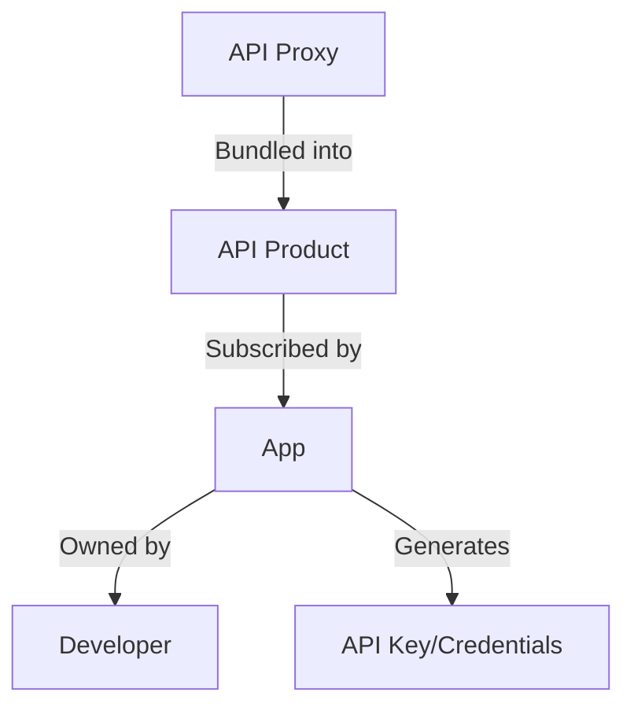
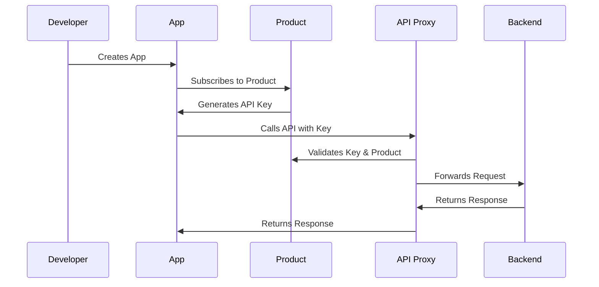
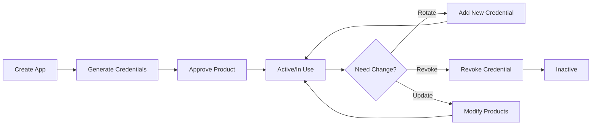

# Section 4: API Security and Traffic Management

## 4.1 Import Petstore API using OpenAPI Spec

### 📝 Importing Proxies from OpenAPI Specification

**OpenAPI Specification**: A standard format for describing REST APIs, allowing automated proxy generation in Apigee.

**Petstore API**: A common example API used for demonstrations, available at [Swagger Petstore](https://petstore.swagger.io/).

### 🔧 Import Process

#### Step 1: Download OpenAPI Spec

```
Visit: https://petstore.swagger.io/
Download: OpenAPI 3.0.x specification (JSON or YAML)
```

> [!WARNING]
> Apigee supports OpenAPI versions 3.0.0 through 3.0.3. Version 3.0.4+ may not be compatible. Check current Apigee version support.

#### Step 2: Create Proxy from Spec

```
Apigee → API Proxies → Create New
    ↓
Template: OpenAPI Spec
    ↓
Upload: petstore-openapi-3.0.1.yaml
    ↓
Name: petstore-v1
Description: Imported proxy from OpenAPI spec 3.0.1
```

#### Step 3: Select Operations

**Apigee Auto-Generates Conditional Flows** from OpenAPI endpoints:

```
Available Operations:
├─ POST /pet (Add pet)
├─ PUT /pet (Update pet)
├─ GET /pet/findByStatus
├─ GET /pet/findByTags
├─ GET /pet/{petId}
├─ POST /pet/{petId}
├─ DELETE /pet/{petId}
├─ GET /store/inventory
├─ POST /store/order
├─ POST /user
├─ GET /user/login
└─ GET /user/logout
```

**Select Only Needed Operations** to keep proxy manageable.

#### Step 4: Deploy

```
Environment: eval
    ↓
Deploy → Proxy Created
```

### 📦 Postman Collection Import

**Import OpenAPI Spec to Postman**:

```
Postman → Import → Files
    ↓
Select: petstore-openapi-3.0.1.yaml
    ↓
Import: Collection + Specification
```

**Result**:
- ✅ Collection with organized request folders
- ✅ Specification file for reference
- ✅ Auto-generated example requests

### 🔍 Proxy Structure

**Conditional Flows Created Automatically**:

```xml
<Flows>
  <Flow name="add pet">
    <Condition>request.verb == "POST" and proxy.pathsuffix MatchesPath "/pet"</Condition>
  </Flow>
  <Flow name="update pet">
    <Condition>request.verb == "PUT" and proxy.pathsuffix MatchesPath "/pet"</Condition>
  </Flow>
  <!-- More flows... -->
</Flows>
```

> [!IMPORTANT]
> **Conditional flows do NOT restrict access** to other endpoints by default. They only provide convenient attachment points for operation-specific policies. To restrict access, you must add explicit endpoint restrictions (covered in Section 3).

### 💡 Key Takeaways

✅ **Benefits of OpenAPI Import**:
- Automatic conditional flow generation
- Operation-level policy attachment
- Faster proxy development
- Consistent API structure

❌ **Limitations**:
- Version compatibility constraints
- Must manually restrict unwanted operations
- Target URL comes from spec (may need modification)

---

## 4.2 Key Authentication with VerifyAPIKey Policy

### 🔐 API Key Authentication

**API Key**: A simple authentication mechanism where clients pass a unique key to identify themselves and gain access to the API.

**VerifyAPIKey Policy**: Apigee policy that validates API keys passed in requests.

### 📋 Implementation Steps

#### Step 1: Add VerifyAPIKey Policy

**Location**: Proxy Endpoint → PreFlow → Request

```xml
<VerifyAPIKey name="VerifyAPIKey">
  <APIKey ref="request.header.apikey"/>
</VerifyAPIKey>
```

**Policy Configuration**:
- `APIKey ref`: Specifies where the key is expected
  - `request.header.apikey` = Header named "apikey"
  - `request.queryparam.key` = Query parameter named "key"
  - `request.formparam.apikey` = Form parameter

#### Step 2: Deploy and Test

**Without API Key**:
```http
GET /petstore-v1/pet/findByStatus?status=available
```

**Response**:
```json
{
  "fault": {
    "faultstring": "Failed to resolve API key variable request.header.apikey",
    "detail": {
      "errorcode": "steps.oauth.v2.FailedToResolveAPIKey"
    }
  }
}
```

**With Invalid API Key**:
```http
GET /petstore-v1/pet/findByStatus?status=available
Headers:
  apikey: invalid-key-12345
```

**Response**:
```json
{
  "fault": {
    "faultstring": "Invalid API Key",
    "detail": {
      "errorcode": "oauth.v2.InvalidApiKey"
    }
  }
}
```

### 🔑 Error Types

| Scenario | Error Message | Error Code |
|----------|---------------|------------|
| Key not provided | Failed to resolve API key | `steps.oauth.v2.FailedToResolveAPIKey` |
| Invalid key | Invalid API Key | `oauth.v2.InvalidApiKey` |
| Key for wrong resource | Invalid API Key for given resource | `oauth.v2.InvalidApiKeyForGivenResource` |

> [!NOTE]
> At this stage, we don't have valid API keys yet. The next lectures cover how to generate them through the Products, Developers, and Apps ecosystem.

### 🎯 Policy Placement

**PreFlow Request** is ideal for authentication:

```
Client Request
    ↓
PreFlow (Request) ← VerifyAPIKey HERE
    ↓
Conditional Flows
    ↓
PostFlow (Request)
    ↓
Target
```

**Why PreFlow?**
- ✅ Executes before all conditional flows
- ✅ Applies to entire API (all operations)
- ✅ Fails fast if authentication fails
- ✅ Prevents unnecessary processing

### 💡 Conditional Application

**Apply to Specific Operations Only**:

```xml
<VerifyAPIKey name="VerifyAPIKey">
  <APIKey ref="request.header.apikey"/>
  <Condition>request.verb == "POST"</Condition>
</VerifyAPIKey>
```

This would only verify API keys for POST requests.

---

## 4.3 Products, Developers, Apps

### 🏗 Apigee's API Distribution Model

**The Three-Tier Model**:



### 📦 1. API Products

**API Product**: A bundle of API proxy operations that can be distributed to consumers. Think of it as a "package" or "subscription tier" for your APIs.

**Creating a Product**:

```
Apigee → Publish → API Products → Create
```

**Product Configuration**:

```yaml
Name: petstore-free-tier
Display Name: Petstore Free Tier
Environment: eval
Access: Public/Private/Internal
Approval: Automatic/Manual
Quota: 5 calls per minute
Operations:
  - Proxy: petstore-v1
    Path: /*
    Methods: GET
```

#### Product Fields Explained

**Access Levels**:
- **Public**: Visible to anyone on developer portal
- **Private**: Visible only to specific developers
- **Internal**: Internal use only

**Approval Type**:
- **Automatic**: Apps are auto-approved
- **Manual**: Admin must approve each app

**Quota** (configured but not enforced until Quota policy is added):
- Limit: 5 calls
- Interval: 1
- Time Unit: minute

#### Operations Configuration

**Granular Operation Control**:

```
Proxy: petstore-v1
Path: /pet/*        → All paths under /pet
Methods: GET        → Only GET requests

Proxy: petstore-v1
Path: /*            → Everything (including base path)
Methods: <empty>    → All methods
```

> [!WARNING]
> Using `/*` allows calls to the base path itself. Use `/*/` or specific paths to avoid this.

**Method-Specific Access**:

```
Path: /*
Methods: GET  → Read-only access (free tier)

Path: /*
Methods: GET, POST, PUT, DELETE  → Full access (gold tier)
```

#### Custom Attributes

**Key-Value Metadata**:

```
owner: integration-team
support_email: admin@example.com
```

**Use Cases**:
- ✅ Logging and analytics
- ✅ Error handling and routing
- ✅ Team identification
- ✅ Support contact information

### 👨‍💻 2. Developers

**Developer**: An app developer who consumes your APIs. In production, developers self-register through the developer portal.

**Creating a Developer (Manual)**:

```
Apigee → Publish → Developers → Create
```

**Developer Details**:

```yaml
First Name: Sam
Last Name: Weiss
Email: sam.weiss@example.com
Username: samweiss
```

> [!NOTE]
> In production with a developer portal, developers sign up themselves. Manual creation is for testing or admin purposes.

### 📱 3. Apps

**App**: Represents a client application that consumes your API. An app subscribes to one or more products and generates credentials (API keys).

**Creating an App**:

```
Apigee → Publish → Apps → Create
```

**App Configuration**:

```yaml
Name: petclinic-app
Developer: Sam Weiss
Credentials:
  Expiration: Never / Date / Duration
Products:
  - petstore-free-tier
Custom Attributes:
  owner: cloud-team
  support_email: admin@cloudteam.xyz
```

#### Credentials

**Auto-Generated**:
- **Key (Client ID)**: Used as API key
- **Secret (Client Secret)**: Used for OAuth flows (covered later)

**Multiple Credentials**:
- ✅ Primary and secondary keys
- ✅ Key rotation without downtime
- ✅ Different keys for different environments

**Credential Status**:
- **Approved**: Active and usable
- **Revoked**: Disabled
- **Pending**: Awaiting approval

### 🔄 The Complete Flow



### 🧪 Testing with API Key

**Request**:
```http
GET /petstore-v1/pet/findByStatus?status=available
Headers:
  apikey: <KEY_FROM_APP>
```

**Success Response**:
```json
[
  {
    "id": 1,
    "name": "doggie",
    "status": "available"
  }
]
```

### 💡 Key Concepts

> [!IMPORTANT]
> **Product vs. Proxy**:
> - **Proxy** = Technical implementation
> - **Product** = Business offering
> - One product can bundle multiple proxies
> - One proxy can be in multiple products

**Relationship Summary**:

```
1 Developer → Many Apps
1 App → Many Products
1 App → Many Credentials
1 Product → Many Operations
1 Operation → 1 Proxy + Path + Methods
```

### 🎯 Best Practices

✅ **Product Design**:
- Create tiered products (free, basic, premium)
- Use meaningful names and descriptions
- Set appropriate quotas per tier
- Limit free tiers to read-only (GET)

✅ **App Management**:
- Use descriptive app names
- Add custom attributes for tracking
- Implement key rotation strategy
- Monitor app usage

✅ **Developer Experience**:
- Provide clear product descriptions
- Document API operations
- Set up developer portal for self-service
- Automate approval for trusted developers

---

## 4.4 Bundle Products, Approve-Revoke Credentials

### 🔄 Product Bundling and Management

This lecture explores advanced product management, including bundling multiple products in apps, approval workflows, and credential management.

### 📦 Multiple Products in One App

**Scenario**: An app needs access to both read-only and full-access operations.

**Solution**: Add multiple products to the same app.

```
App: petclinic-app
Products:
  ├─ petstore-free-tier (GET only)
  └─ petstore-gold-tier (All methods)
Credentials: Same key works for both products
```

#### Adding Products to Existing App

```
Apps → petclinic-app → Edit
    ↓
Scroll to Credentials
    ↓
Add Product → petstore-gold-tier
    ↓
Save
```

### 🎯 Product Configuration Comparison

#### Free Tier Product

```yaml
Name: petstore-free-tier
Operations:
  - Proxy: petstore-v1
    Path: /*
    Methods: GET
Quota: 5 per minute
Auto-Approve: ✅ Yes
```

#### Gold Tier Product

```yaml
Name: petstore-gold-tier
Operations:
  - Proxy: petstore-v1
    Path: /*
    Methods: <all>
Quota: 10000 per day
Auto-Approve: ❌ No (Manual approval required)
```

### ⚙️ Approval Workflows

#### Automatic Approval

**Product Setting**: "Automatically approve access requests" = ✅ Checked

**Behavior**:
```
App subscribes to product
    ↓
Status: Approved (immediately)
    ↓
API Key works immediately
```

#### Manual Approval

**Product Setting**: "Automatically approve access requests" = ❌ Unchecked

**Behavior**:
```
App subscribes to product
    ↓
Status: Pending Approval
    ↓
Admin reviews and approves
    ↓
Status: Approved
    ↓
API Key works
```

### 🔍 Approval Status Management

#### App-Level Status

```
Apps → petclinic-app → Edit
    ↓
Status: Approved / Revoked
```

**Effect**:
- **Approved**: App can use all approved products
- **Revoked**: App cannot use ANY products (even if product-level is approved)

#### Product-Level Status (within App)

```
Apps → petclinic-app → Edit → Credentials
    ↓
Products:
  ├─ petstore-free-tier: Approved
  └─ petstore-gold-tier: Pending / Approved / Revoked
```

**Effect**: Controls access to specific product only

### 🧪 Testing Approval Workflows

#### Test 1: App Revoked, Product Approved

**Setup**:
```
App Status: Revoked
Product Status: Approved
```

**Request**:
```http
GET /petstore-v1/pet/findByStatus?status=available
Headers:
  apikey: <KEY>
```

**Response**:
```json
{
  "fault": {
    "faultstring": "App not approved",
    "detail": {
      "errorcode": "keymanagement.service.app_not_approved"
    }
  }
}
```

#### Test 2: App Approved, Product Pending

**Setup**:
```
App Status: Approved
Product Status: Pending Approval
```

**Request**:
```http
POST /petstore-v1/pet
Headers:
  apikey: <KEY>
Body: { "name": "doggie", "status": "available" }
```

**Response**:
```json
{
  "fault": {
    "faultstring": "Invalid API Key for given resource",
    "detail": {
      "errorcode": "oauth.v2.InvalidApiKeyForGivenResource"
    }
  }
}
```

#### Test 3: Both Approved

**Setup**:
```
App Status: Approved
Product Status: Approved
```

**Request**:
```http
POST /petstore-v1/pet
Headers:
  apikey: <KEY>
Body: { "name": "doggie", "status": "available" }
```

**Response**:
```json
{
  "id": 123,
  "name": "doggie",
  "status": "available"
}
```
✅ Success!

### 🔎 Finding Apps Pending Approval

**Filter Apps**:

```
Apps → Filter: "Pending product approval"
    ↓
Shows all apps with products awaiting approval
```

**Approve Product**:

```
Apps → petclinic-app → Edit
    ↓
Find product with "Pending" status
    ↓
Click product → Approve
    ↓
Save
```

> [!NOTE]
> Changes may take a few seconds to propagate across Apigee's distributed system.

### 🔑 Key vs. Secret

**Client ID (Key)**:
- ✅ Used as API key for authentication
- ✅ Visible in app details
- ✅ Passed in requests

**Client Secret**:
- ✅ Used for OAuth 2.0 flows (covered later)
- ⚠️ NOT the API key
- ⚠️ Keep confidential

```
App Credentials:
├─ Key (Client ID): abc123xyz  ← THIS is your API key
└─ Secret: secret456def        ← For OAuth only
```

### 🎯 Multiple Operations in Products

**Adding Operations**:

```
Product → Edit → Operations → Add
    ↓
Proxy: petstore-v1
Path: /*
Methods: GET, POST, PUT, DELETE
    ↓
Proxy: another-api-v1
Path: /users/*
Methods: GET
```

> [!WARNING]
> **Apigee Best Practice**: Maintain 1:1 relationship between products and APIs.
> 
> **Why?**
> - Easier documentation on developer portal
> - Clearer product offerings
> - Simpler maintenance
> - Better analytics

### 💡 Product Management Strategies

**Tiered Products**:

```
Free Tier:
├─ Quota: 100/day
├─ Methods: GET only
└─ Auto-approve: Yes

Basic Tier:
├─ Quota: 10,000/day
├─ Methods: GET, POST
└─ Auto-approve: Yes

Premium Tier:
├─ Quota: 1,000,000/day
├─ Methods: All
└─ Auto-approve: Manual (contract required)
```

**Environment-Specific Products**:

```
petstore-dev (Development)
├─ No quota limits
└─ All methods

petstore-prod (Production)
├─ Strict quotas
└─ Controlled access
```

### 🔄 Credential Lifecycle



**Credential Operations**:
- ✅ **Add**: Create additional credentials (primary/secondary)
- ✅ **Revoke**: Disable specific credential
- ✅ **Delete**: Permanently remove credential
- ✅ **Approve/Reject**: Control product access

---

## 4.5 Implement SpikeArrest Policy

### 🚦 Traffic Management: SpikeArrest

**SpikeArrest Policy**: Protects APIs from traffic spikes and sudden bursts of requests. Used for **operational traffic management**, not business SLAs.

**Purpose**:
- ✅ Prevent DDoS attacks
- ✅ Protect backend from overload
- ✅ Smooth out traffic bursts
- ✅ Operational stability

> [!IMPORTANT]
> **SpikeArrest vs. Quota**:
> - **SpikeArrest** = Operational protection (traffic smoothing)
> - **Quota** = Business contracts (SLA enforcement)

### 📊 Policy Configuration

#### Basic Structure

```xml
<SpikeArrest name="SpikeArrest">
  <Rate>60pm</Rate>
  <UseEffectiveCount>false</UseEffectiveCount>
</SpikeArrest>
```

### 🔧 Rate Element

**Format**: `<number>pm` or `<number>ps`

**Supported Units**:
- `pm` = per minute
- `ps` = per second

**Examples**:
```xml
<Rate>60pm</Rate>    <!-- 60 requests per minute -->
<Rate>5ps</Rate>     <!-- 5 requests per second -->
<Rate>100pm</Rate>   <!-- 100 requests per minute -->
```

> [!WARNING]
> Only `pm` and `ps` are supported. You cannot use `ph` (per hour) or `pd` (per day).

### ⚡ Rate Smoothing

**UseEffectiveCount**: Controls how the rate is distributed over time.

#### UseEffectiveCount = false (Default)

**Behavior**: Rate is **smoothed out** over smaller time intervals.

**Examples**:

```
60pm → Smoothed to 1 per second
  (60 requests / 60 seconds = 1/second)

5ps → Smoothed to 1 per 200ms
  (5 requests / 1000ms = 1/200ms)

120pm → Smoothed to 2 per second
  (120 requests / 60 seconds = 2/second)
```

**Effective Rate Calculation**:

```
Rate per minute → Effective rate per second
Rate per second → Effective rate per millisecond
```

#### UseEffectiveCount = true

**Behavior**: Rate is applied **as specified** without smoothing.

```xml
<SpikeArrest name="SpikeArrest">
  <Rate>60pm</Rate>
  <UseEffectiveCount>true</UseEffectiveCount>
</SpikeArrest>
```

**Effect**: Allows 60 requests in any 1-minute window (could all come in first second).

### 🎯 Identifier Element

**Purpose**: Maintain separate counters for different request groups.

```xml
<SpikeArrest name="SpikeArrest">
  <Identifier ref="client.ip"/>
  <Rate>5pm</Rate>
</SpikeArrest>
```

**Common Identifiers**:

```xml
<!-- Per IP address -->
<Identifier ref="client.ip"/>

<!-- Per API key -->
<Identifier ref="verifyapikey.VerifyAPIKey.client_id"/>

<!-- Per user ID -->
<Identifier ref="request.header.user-id"/>

<!-- Per developer -->
<Identifier ref="developer.email"/>
```

**Behavior**:
- Each unique identifier value gets its own counter
- Prevents one client from consuming all capacity
- Useful for fair usage policies

### 📏 MessageWeight Element

**Purpose**: Count some requests as multiple requests.

```xml
<SpikeArrest name="SpikeArrest">
  <Rate>60pm</Rate>
  <MessageWeight ref="request.header.weight"/>
</SpikeArrest>
```

**Example**:

```
Rate: 60pm (effective: 1/second)
MessageWeight: 2

Request 1 with weight=2 → Counts as 2 requests
  Effective rate becomes: 0.5/second (30pm)

Request 2 with weight=3 → Counts as 3 requests
  Effective rate becomes: 0.33/second (20pm)
```

**Use Cases**:
- Batch requests (weight = batch size)
- Premium vs. standard requests
- Resource-intensive operations

### 🛠 Implementation

#### Step 1: Add Policy

**Location**: Proxy Endpoint → PreFlow → Request

```
Apigee → Proxy → Develop → Proxy Endpoint
    ↓
PreFlow → Request → Add Step
    ↓
Create New Policy → Spike Arrest
```

#### Step 2: Configure

```xml
<SpikeArrest name="SpikeArrest">
  <Rate>5pm</Rate>
  <UseEffectiveCount>true</UseEffectiveCount>
</SpikeArrest>
```

#### Step 3: Position Policy

**Critical**: Place SpikeArrest **BEFORE** VerifyAPIKey

```
Request Flow:
    ↓
1. SpikeArrest      ← Check traffic first
    ↓
2. VerifyAPIKey     ← Then authenticate
    ↓
3. Other policies
```

**Why?**
- ✅ Reject excess traffic immediately
- ✅ Don't waste resources on authentication
- ✅ Protect against DDoS before processing

**Drag and Drop** to reorder policies in UI.

### 🧪 Testing

**Test Request**:
```http
GET /petstore-v1/pet/findByStatus?status=available
Headers:
  apikey: <VALID_KEY>
```

**With Rate: 5pm**

```
Request 1: ✅ 200 OK
Request 2: ✅ 200 OK
Request 3: ✅ 200 OK
Request 4: ✅ 200 OK
Request 5: ✅ 200 OK
Request 6: ❌ 429 Too Many Requests
```

**Error Response**:
```json
{
  "fault": {
    "faultstring": "Spike arrest violation. Allowed rate : 5pm",
    "detail": {
      "errorcode": "policies.ratelimit.SpikeArrestViolation"
    }
  }
}
```

### 📊 Debug Trace

**Successful Request**:
```
Flow Variables:
├─ ratelimit.SpikeArrest.allowed.count: 5
├─ ratelimit.SpikeArrest.used.count: 3
├─ ratelimit.SpikeArrest.exceed.count: 0
└─ ratelimit.SpikeArrest.failed: false
```

**Failed Request**:
```
Flow Variables:
├─ ratelimit.SpikeArrest.allowed.count: 5
├─ ratelimit.SpikeArrest.used.count: 6
├─ ratelimit.SpikeArrest.exceed.count: 1
└─ ratelimit.SpikeArrest.failed: true

Error:
├─ fault.name: SpikeArrestViolation
├─ error.status.code: 429
└─ error.reason.phrase: Too Many Requests
```

### 💡 Best Practices

**Operational Limits**:
```xml
<!-- Development -->
<Rate>100pm</Rate>

<!-- Production - Conservative -->
<Rate>10ps</Rate>  <!-- 600pm -->

<!-- Production - High Traffic -->
<Rate>100ps</Rate>  <!-- 6000pm -->
```

**With Identifier** (Per-Client Limits):
```xml
<SpikeArrest name="SpikeArrest">
  <Identifier ref="client.ip"/>
  <Rate>10pm</Rate>
  <UseEffectiveCount>true</UseEffectiveCount>
</SpikeArrest>
```

**Policy Placement**:
```
PreFlow Request:
1. SpikeArrest (First - protect immediately)
2. VerifyAPIKey
3. Other policies
```

### 🎯 Common Configurations

#### Basic Protection

```xml
<SpikeArrest name="SpikeArrest">
  <Rate>60pm</Rate>
</SpikeArrest>
```

#### Per-IP Protection

```xml
<SpikeArrest name="SpikeArrest">
  <Identifier ref="client.ip"/>
  <Rate>10pm</Rate>
  <UseEffectiveCount>true</UseEffectiveCount>
</SpikeArrest>
```

#### High-Traffic API

```xml
<SpikeArrest name="SpikeArrest">
  <Rate>100ps</Rate>
  <UseEffectiveCount>false</UseEffectiveCount>
</SpikeArrest>
```

---

## 4.6 Implement Dynamic Quota

### 📊 Quota Policy

**Quota Policy**: Enforces business contracts and SLAs with API consumers. Unlike SpikeArrest (operational), Quota is for **business-level** rate limiting.

**Purpose**:
- ✅ Enforce subscription limits
- ✅ Implement tiered pricing
- ✅ Control API usage per product
- ✅ Business SLA compliance

> [!IMPORTANT]
> **Quota vs. SpikeArrest**:
> - **Quota** = Business contracts (100 calls/day per subscription)
> - **SpikeArrest** = Operational protection (smooth traffic spikes)

### 🎯 Quota Types

Apigee supports three quota types based on how the quota window starts and resets:

#### 1. Flexi Quota (Recommended)

**Behavior**: Counter starts when **first request** is received.

```xml
<Quota name="EnforceQuota">
  <Allow count="100"/>
  <Interval>5</Interval>
  <TimeUnit>minute</TimeUnit>
  <QuotaType>flexi</QuotaType>
</Quota>
```

**Example**:
```
First request at: 10:23:15
Quota window: 10:23:15 - 10:28:15 (5 minutes)
Resets at: 10:28:15
```

#### 2. Calendar Quota

**Behavior**: Counter starts at a **specific time** (monthly, quarterly, etc.).

```xml
<Quota name="EnforceQuota">
  <Allow count="1000000"/>
  <Interval>1</Interval>
  <TimeUnit>month</TimeUnit>
  <QuotaType>calendar</QuotaType>
  <StartTime>2024-01-01 00:00:00</StartTime>
</Quota>
```

**Use Cases**:
- Monthly subscription limits
- Quarterly billing cycles
- Annual contracts

#### 3. Rolling Window

**Behavior**: Looks back at the **past time window** for each request.

```xml
<Quota name="EnforceQuota">
  <Allow count="10"/>
  <Interval>1</Interval>
  <TimeUnit>day</TimeUnit>
  <QuotaType>rollingwindow</QuotaType>
</Quota>
```

**Example**:
```
Quota: 10 calls per day

Request at 10:00 AM → Checks calls from 10:00 AM yesterday to now
Request at 2:00 PM → Checks calls from 2:00 PM yesterday to now
```

**Algorithm**: For each request, count requests in the past 24 hours and ensure ≤ 10.

### 🔧 Policy Configuration

#### Basic Structure

```xml
<Quota name="EnforceProductQuota">
  <Allow count="10"/>
  <Interval>5</Interval>
  <TimeUnit>minute</TimeUnit>
  <Identifier ref="verifyapikey.VerifyAPIKey.client_id"/>
  <Distributed>true</Distributed>
  <Synchronous>true</Synchronous>
</Quota>
```

### 📋 Key Elements

#### Allow

**Purpose**: Maximum number of requests allowed.

```xml
<Allow count="100"/>                    <!-- Hardcoded -->
<Allow countRef="verifyapikey.VerifyAPIKey.apiproduct.developer.quota.limit"/>  <!-- Dynamic -->
```

#### Interval

**Purpose**: Number of time units for the quota window.

```xml
<Interval>5</Interval>                  <!-- Hardcoded -->
<Interval ref="verifyapikey.VerifyAPIKey.apiproduct.developer.quota.interval"/>  <!-- Dynamic -->
```

#### TimeUnit

**Purpose**: Unit of time for the interval.

**Supported Values**: `second`, `minute`, `hour`, `day`, `week`, `month`

```xml
<TimeUnit>minute</TimeUnit>             <!-- Hardcoded -->
<TimeUnit ref="verifyapikey.VerifyAPIKey.apiproduct.developer.quota.timeunit"/>  <!-- Dynamic -->
```

#### Identifier

**Purpose**: Maintain separate quota counters for different entities.

```xml
<!-- Per app -->
<Identifier ref="verifyapikey.VerifyAPIKey.client_id"/>

<!-- Per developer -->
<Identifier ref="developer.email"/>

<!-- Per product -->
<Identifier ref="verifyapikey.VerifyAPIKey.apiproduct.name"/>
```

#### Distributed

**Purpose**: Share quota counter across all message processors.

```xml
<Distributed>true</Distributed>   <!-- Shared counter (recommended) -->
<Distributed>false</Distributed>  <!-- Each node has own counter -->
```

**Why true?**
- ✅ Accurate quota enforcement
- ✅ Consistent across cluster
- ⚠️ Slight performance overhead

#### Synchronous

**Purpose**: Synchronously update counter across nodes.

```xml
<Synchronous>true</Synchronous>   <!-- Strict enforcement -->
<Synchronous>false</Synchronous>  <!-- Eventual consistency -->
```

**Synchronous = true**:
- ✅ Strict quota enforcement
- ✅ No quota overruns
- ⚠️ Slightly slower (waits for sync)

**Synchronous = false**:
- ✅ Faster performance
- ⚠️ May allow slight overruns during sync delay

### 🎯 Dynamic Quota from Product

**Product Configuration**:

```
API Product: petstore-free-tier
Quota:
  Limit: 5
  Interval: 1
  Time Unit: minute
```

**Policy Configuration**:

```xml
<Quota name="EnforceProductQuota">
  <Allow countRef="verifyapikey.VerifyAPIKey.apiproduct.developer.quota.limit"/>
  <Interval ref="verifyapikey.VerifyAPIKey.apiproduct.developer.quota.interval"/>
  <TimeUnit ref="verifyapikey.VerifyAPIKey.apiproduct.developer.quota.timeunit"/>
  <Identifier ref="verifyapikey.VerifyAPIKey.client_id"/>
  <Distributed>true</Distributed>
  <Synchronous>true</Synchronous>
</Quota>
```

**Flow Variables** (set by VerifyAPIKey policy):

```
verifyapikey.VerifyAPIKey.apiproduct.developer.quota.limit = 5
verifyapikey.VerifyAPIKey.apiproduct.developer.quota.interval = 1
verifyapikey.VerifyAPIKey.apiproduct.developer.quota.timeunit = minute
```

> [!IMPORTANT]
> **Policy Name Must Match**: The flow variable prefix must match your VerifyAPIKey policy name exactly (case-sensitive).
> 
> ```xml
> <VerifyAPIKey name="VerifyAPIKey">  ← This name
> 
> <Allow countRef="verifyapikey.VerifyAPIKey.apiproduct..."/>  ← Must match here
> ```

### 🛠 Implementation

#### Step 1: Configure Product Quota

```
API Products → petstore-free-tier → Edit
    ↓
Quota:
  Limit: 5
  Interval: 1
  Time Unit: minute
    ↓
Save
```

#### Step 2: Add Quota Policy

**Location**: Proxy Endpoint → PreFlow → Request (after VerifyAPIKey)

```
Proxy Endpoint → PreFlow → Request
    ↓
Add Step → Create New Policy → Quota
    ↓
Name: EnforceProductQuota
```

#### Step 3: Configure Policy

```xml
<Quota name="EnforceProductQuota">
  <Allow countRef="verifyapikey.VerifyAPIKey.apiproduct.developer.quota.limit"/>
  <Interval ref="verifyapikey.VerifyAPIKey.apiproduct.developer.quota.interval"/>
  <TimeUnit ref="verifyapikey.VerifyAPIKey.apiproduct.developer.quota.timeunit"/>
  <Identifier ref="verifyapikey.VerifyAPIKey.client_id"/>
  <Distributed>true</Distributed>
  <Synchronous>true</Synchronous>
</Quota>
```

#### Step 4: Disable SpikeArrest (for testing)

```xml
<SpikeArrest name="SpikeArrest" enabled="false">
  <!-- ... -->
</SpikeArrest>
```

### 🧪 Testing

**Test Request**:
```http
GET /petstore-v1/pet/findByStatus?status=available
Headers:
  apikey: <DEMO_APP_KEY>
```

**With Quota: 5 per minute**

```
Request 1: ✅ 200 OK
Request 2: ✅ 200 OK
Request 3: ✅ 200 OK
Request 4: ✅ 200 OK
Request 5: ✅ 200 OK
Request 6: ❌ 429 Too Many Requests (Quota Exceeded)
```

**Error Response**:
```json
{
  "fault": {
    "faultstring": "Rate limit quota violation. Quota limit exceeded. Identifier : demo-app",
    "detail": {
      "errorcode": "policies.ratelimit.QuotaViolation"
    }
  }
}
```

### 📊 Debug Trace

**Flow Variables** (after VerifyAPIKey):

```
verifyapikey.VerifyAPIKey.apiproduct.developer.quota.limit: 5
verifyapikey.VerifyAPIKey.apiproduct.developer.quota.interval: 1
verifyapikey.VerifyAPIKey.apiproduct.developer.quota.timeunit: minute
verifyapikey.VerifyAPIKey.apiproduct.name: petstore-free-tier
verifyapikey.VerifyAPIKey.apiproduct.owner: integration-team
verifyapikey.VerifyAPIKey.apiproduct.support_email: admin@example.com
```

**Flow Variables** (after Quota policy):

```
ratelimit.EnforceProductQuota.allowed.count: 5
ratelimit.EnforceProductQuota.used.count: 6
ratelimit.EnforceProductQuota.exceed.count: 1
ratelimit.EnforceProductQuota.failed: true
ratelimit.EnforceProductQuota.identifier: demo-app
```

### 🔄 Updating Quota Dynamically

**Change Product Quota**:

```
API Products → petstore-free-tier → Edit
    ↓
Quota:
  Limit: 100  (changed from 5)
  Interval: 1
  Time Unit: hour  (changed from minute)
    ↓
Save
```

**Result**: All apps using this product immediately get new quota limits (no code changes needed).

> [!NOTE]
> This is the power of **dynamic quota** - change business limits without redeploying proxies.

### 💡 Best Practices

**Policy Order**:
```
PreFlow Request:
1. SpikeArrest (operational protection)
2. VerifyAPIKey (authentication)
3. Quota (business limits)
4. Other policies
```

**Tiered Quotas**:

```
Free Tier:
  Limit: 100
  Interval: 1
  Time Unit: day

Basic Tier:
  Limit: 10,000
  Interval: 1
  Time Unit: day

Premium Tier:
  Limit: 1,000,000
  Interval: 1
  Time Unit: month
```

**Identifier Strategy**:
```xml
<!-- Per app (most common) -->
<Identifier ref="verifyapikey.VerifyAPIKey.client_id"/>

<!-- Per developer (all apps share quota) -->
<Identifier ref="developer.email"/>

<!-- Per product (all apps in product share quota) -->
<Identifier ref="verifyapikey.VerifyAPIKey.apiproduct.name"/>
```

**Distributed + Synchronous**:
```xml
<!-- Production (strict enforcement) -->
<Distributed>true</Distributed>
<Synchronous>true</Synchronous>

<!-- Development (performance over accuracy) -->
<Distributed>false</Distributed>
<Synchronous>false</Synchronous>
```

### 🎯 Common Patterns

#### Per-App Quota

```xml
<Quota name="EnforceProductQuota">
  <Allow countRef="verifyapikey.VerifyAPIKey.apiproduct.developer.quota.limit"/>
  <Interval ref="verifyapikey.VerifyAPIKey.apiproduct.developer.quota.interval"/>
  <TimeUnit ref="verifyapikey.VerifyAPIKey.apiproduct.developer.quota.timeunit"/>
  <Identifier ref="verifyapikey.VerifyAPIKey.client_id"/>
  <Distributed>true</Distributed>
  <Synchronous>true</Synchronous>
</Quota>
```

#### Hardcoded Quota

```xml
<Quota name="HardcodedQuota">
  <Allow count="1000"/>
  <Interval>1</Interval>
  <TimeUnit>day</TimeUnit>
  <Distributed>true</Distributed>
  <Synchronous>true</Synchronous>
</Quota>
```

#### Monthly Calendar Quota

```xml
<Quota name="MonthlyQuota">
  <Allow count="1000000"/>
  <Interval>1</Interval>
  <TimeUnit>month</TimeUnit>
  <QuotaType>calendar</QuotaType>
  <StartTime>2024-01-01 00:00:00</StartTime>
  <Distributed>true</Distributed>
  <Synchronous>true</Synchronous>
</Quota>
```

---

*[Content continues with sections 4.7-4.12 covering Shared Flows, Flow Hooks, Mocking, and Fault Handling...]*
