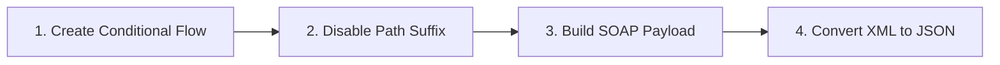
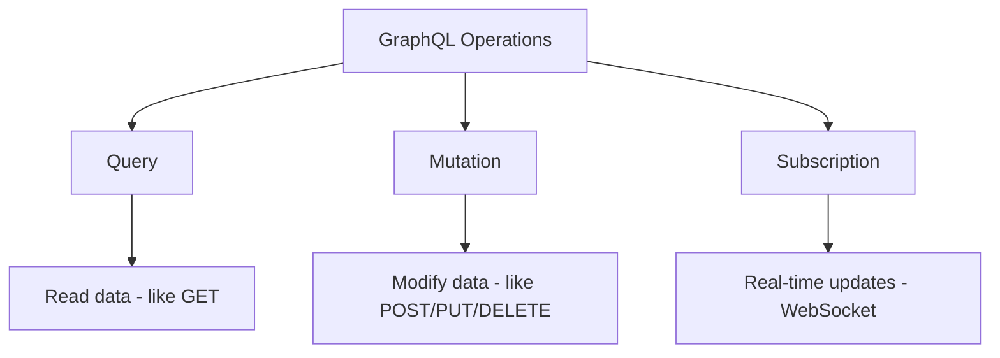
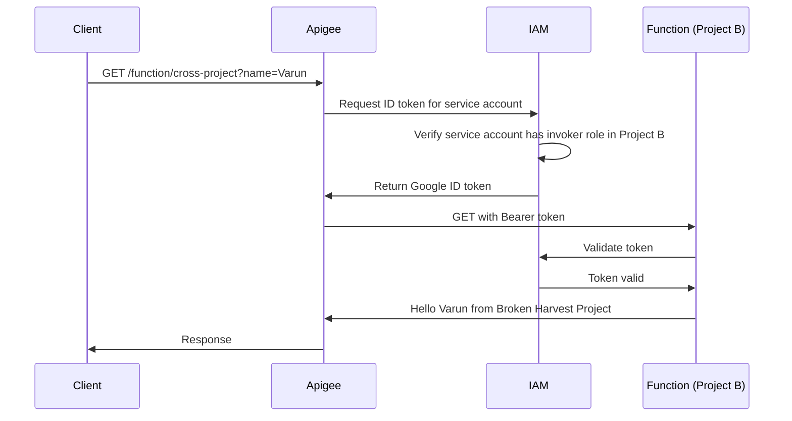

# Section 6: Application Integration

## 6.1 Application Integration with API Trigger

### 🔗 Google Cloud Application Integration

**Application Integration**: A Google Cloud service that enables you to connect applications, data, and processes using a visual integration builder.

**Key Features**:
- ✅ Visual workflow designer
- ✅ Pre-built connectors
- ✅ Event-driven architecture
- ✅ Integration with Google Cloud services
- ✅ API triggers for external invocation

> [!NOTE]
> This lecture's transcript was not available, but Application Integration is a low-code/no-code integration platform similar to services like MuleSoft or Apache Camel.

### 💡 Typical Use Cases

**Integration Scenarios**:
```
External API → Apigee → App Integration → Multiple Backends
                            ↓
                    ┌───────┴────────┐
                    ↓                ↓
              Cloud Storage    BigQuery
                    ↓                ↓
              Firestore         Pub/Sub
```

**Benefits**:
- ✅ Orchestrate complex workflows
- ✅ Transform data between systems
- ✅ Handle error recovery and retries
- ✅ Monitor integration execution
- ✅ Reduce custom code requirements

---

## 6.2 API Proxy with Integration Target

### 🎯 Connecting Apigee to Application Integration

**Goal**: Create an Apigee proxy that calls an Application Integration workflow as its backend target.

### 📋 Prerequisites

**Application Integration Setup**:
1. Integration created with API trigger
2. Integration deployed in specific region
3. Input/output parameters defined

**Example Integration**:
```yaml
Name: demo-api
Region: asia-south1
Trigger: API Trigger
Input Parameters:
  - username (string)
Output Parameters:
  - greeting (string)
```

### 🔧 Creating the Proxy

#### Step 1: Create Integration Target Proxy

```
Apigee → API Proxies → Create New
    ↓
Template: Integration Target (NEW!)
    ↓
Name: app-integration-demo
Base Path: /greeting/v1
```

#### Step 2: Select Integration

```
Integration Region: asia-south1
    ↓
Available Integrations: demo-api
    ↓
Trigger: API Trigger
    ↓
Endpoint Type: Synchronous
```

**Endpoint Types**:

| Type | Behavior | Response |
|------|----------|----------|
| **Synchronous** | Wait for integration to complete | Integration response |
| **Asynchronous** | Fire and forget | Execution ID only |

> [!IMPORTANT]
> **Synchronous** is recommended for API use cases where you need the integration result. **Asynchronous** is for background processing.

#### Step 3: Deploy with Service Account

**Deployment Error**:
```
Error: Deployment requires a service account identity
```

**Why?** Apigee needs permission to invoke Application Integration (different Google Cloud service).

**Solution**: Grant service account the Integration Invoker role

```
IAM & Admin → IAM → Add
    ↓
Principal: apigee-service-account@project-id.iam.gserviceaccount.com
Role: Application Integration Invoker
    ↓
Save
```

**Deploy**:
```
Environment: eval
Service Account: apigee-service-account@project-id.iam.gserviceaccount.com
    ↓
Deploy → Success! ✅
```

### 🔍 Auto-Generated Components

#### Integration Endpoint

**Target Endpoint Structure**:
```xml
<IntegrationEndpoint name="default">
  <ExecutionMode>
    <AsyncExecution>false</AsyncExecution>
  </ExecutionMode>
</IntegrationEndpoint>
```

**No traditional HTTPTargetConnection** - Integration endpoint is a special target type.

#### SetIntegrationRequest Policy

**Auto-Generated Policy**:
```xml
<SetIntegrationRequest name="SetIntegrationRequest">
  <IntegrationRegion>asia-south1</IntegrationRegion>
  <IntegrationName>demo-api</IntegrationName>
  <TriggerName>api_trigger_123</TriggerName>
  <ProjectId>my-first-project</ProjectId>
  
  <!-- Input Parameters -->
  <!--
  <InputParameters>
    <InputParameter>
      <Name>username</Name>
      <Type>string</Type>
      <DefaultValue>John Doe</DefaultValue>
    </InputParameter>
  </InputParameters>
  -->
</SetIntegrationRequest>
```

### ⚙️ Configuring Input Parameters

#### Uncomment and Configure

**Static Value**:
```xml
<InputParameters>
  <InputParameter>
    <Name>username</Name>
    <Type>string</Type>
    <DefaultValue>John Doe</DefaultValue>
  </InputParameter>
</InputParameters>
```

**Dynamic Value from Request Body**:
```xml
<InputParameters>
  <InputParameter>
    <Name>username</Name>
    <Type>string</Type>
    <Value ref="request.content"/>
  </InputParameter>
</InputParameters>
```

**Parameter Types**:
```xml
<!-- String -->
<Type>string</Type>

<!-- Number -->
<Type>double</Type>

<!-- Integer -->
<Type>int</Type>

<!-- Boolean -->
<Type>boolean</Type>

<!-- JSON Object -->
<Type>json</Type>

<!-- Arrays -->
<Type>string_array</Type>
<Type>double_array</Type>
<Type>int_array</Type>
<Type>boolean_array</Type>
<Type>json_array</Type>
```

### 🧪 Testing

**Request**:
```http
POST /greeting/v1
Content-Type: application/json

Nitish
```

> [!NOTE]
> **Input Format**: Pass raw value (not JSON object with `username` key). The policy wraps it in the integration's expected format.

**Response (v1 API)**:
```json
{
  "executionId": "abc123-def456-ghi789",
  "outputParameters": {
    "greeting": {
      "type": "string",
      "value": "Hello Nitish, have a nice day!"
    }
  }
}
```

**Response Structure**:
- `executionId`: Unique ID for tracking integration execution
- `outputParameters`: Integration output in structured format

### 🎨 Improving the Response

**Problem**: Response contains metadata that end users don't need.

**Solution**: Extract and format the response using policies.

#### Step 1: Extract Variables

```xml
<ExtractVariables name="ExtractGreeting">
  <Source>response</Source>
  <JSONPayload>
    <Variable name="greeting">
      <JSONPath>$.outputParameters.greeting.value</JSONPath>
    </Variable>
    <Variable name="executionId">
      <JSONPath>$.executionId</JSONPath>
    </Variable>
  </JSONPayload>
</ExtractVariables>
```

#### Step 2: Create Clean Response

```xml
<AssignMessage name="UpdateResponse">
  <Set>
    <Payload contentType="text/plain">{greeting}</Payload>
    <Headers>
      <Header name="X-Execution-ID">{executionId}</Header>
    </Headers>
  </Set>
  <IgnoreUnresolvedVariables>false</IgnoreUnresolvedVariables>
</AssignMessage>
```

#### Step 3: Attach to Response Flow

**Target Endpoint → PostFlow → Response**:
```xml
<PostFlow>
  <Response>
    <Step><Name>ExtractGreeting</Name></Step>
    <Step><Name>UpdateResponse</Name></Step>
  </Response>
</PostFlow>
```

### 🧪 Testing Improved Response

**Request**:
```http
POST /greeting/v1
Content-Type: application/json

Chiara
```

**Response**:
```
Chiara, have a nice day!
```

**Response Headers**:
```
X-Execution-ID: abc123-def456-ghi789
```

✅ **Clean, user-friendly response!**

### 📊 Debug Trace Analysis

**Flow Variables** (SetIntegrationRequest policy):
```
integration.name: demo-api
integration.region: asia-south1
integration.trigger_id: api_trigger_123
integration.project_id: my-first-project
```

**Execution Flow**:
```
1. Proxy Request Flow
2. SetIntegrationRequest Policy → Build integration request
3. Integration Target → Call Application Integration
4. Integration Executes → Returns response
5. Target Response Flow → Extract & format
6. Proxy Response Flow
7. Return to Client
```

### 💡 Key Concepts

**Integration API Versions**:
- **v1**: Returns `executionId` + `outputParameters` structure
- **v2**: Different response format (trigger ID in query param)

**Service Account Requirements**:
```
Service Account Roles Needed:
├─ Application Integration Invoker (to call integrations)
├─ Cloud Run Invoker (for Cloud Functions)
└─ Cloud Functions Invoker (legacy)
```

**Integration Execution Tracking**:
- Use `executionId` to track requests in Application Integration console
- View execution logs and debug integration flows
- Monitor integration performance

### 🎯 Best Practices

✅ **Input Parameters**:
- Use dynamic values from `request.content` or `request.queryparam`
- Validate input before passing to integration
- Document expected input format

✅ **Response Handling**:
- Extract only necessary data from integration response
- Provide clean, user-friendly responses
- Include execution ID in headers for troubleshooting

✅ **Error Handling**:
- Add fault rules for integration failures
- Provide meaningful error messages
- Log integration errors for debugging

✅ **Security**:
- Use service accounts with minimal required permissions
- Don't expose internal integration details in responses
- Validate and sanitize all inputs

### 🔄 Cleanup

**After Testing**:
```
Application Integration → Integrations
    ↓
Select: demo-api
    ↓
Delete
```

> [!WARNING]
> Delete test integrations to avoid unnecessary costs.

---

## 6.3 SOAP Essentials with CountryInfoService [Fast-track]

### 🧼 SOAP Protocol Overview

**SOAP** = **Simple Object Access Protocol**

**Key Characteristics**:
- ✅ Protocol (not just architectural style like REST)
- ✅ XML-based messages only
- ✅ Strict structure and validation
- ✅ WSDL for service definition
- ✅ Supports encryption and security

### 📄 WSDL (Web Service Definition Language)

**WSDL**: XML document that describes a SOAP web service.

**Comparison**:
```
REST API → OpenAPI Specification
SOAP API → WSDL
```

**WSDL Structure**:
```xml
<definitions>
  <types>          <!-- Data types and schemas -->
  <message>        <!-- Message definitions -->
  <portType>       <!-- Operations available -->
  <binding>        <!-- Protocol bindings (SOAP 1.1/1.2) -->
  <service>        <!-- Service endpoints -->
</definitions>
```

### 🌐 CountryInfoService

**Service URL**: `http://webservices.dinet.org/CountryInfoService.wso`

**WSDL URL**: `http://webservices.dinet.org/CountryInfoService.wso?WSDL`

**Available Operations**:
- `ListOfContinentsByName` - Get all continents
- `CapitalCity` - Get capital of a country
- `CountryCurrency` - Get currency information
- `CountryFlag` - Get country flag
- `CountryISOCode` - Get ISO code
- `FullCountryInfo` - Get comprehensive country data
- `ListOfLanguagesByName` - Get languages
- And more...

### 🔢 SOAP Versions

#### SOAP 1.1

**Namespace**:
```xml
xmlns:soap="http://schemas.xmlsoap.org/soap/envelope/"
```

**Content-Type**:
```
text/xml
```

**Example Request**:
```xml
<?xml version="1.0" encoding="utf-8"?>
<soap:Envelope xmlns:soap="http://schemas.xmlsoap.org/soap/envelope/">
  <soap:Body>
    <CapitalCity xmlns="http://www.webserviceX.NET">
      <sCountryISOCode>US</sCountryISOCode>
    </CapitalCity>
  </soap:Body>
</soap:Envelope>
```

#### SOAP 1.2

**Namespace**:
```xml
xmlns:soap12="http://www.w3.org/2003/05/soap-envelope"
```

**Content-Type**:
```
application/soap+xml
```

**Example Request**:
```xml
<?xml version="1.0" encoding="utf-8"?>
<soap12:Envelope xmlns:soap12="http://www.w3.org/2003/05/soap-envelope">
  <soap12:Body>
    <CapitalCity xmlns="http://www.webserviceX.NET">
      <sCountryISOCode>US</sCountryISOCode>
    </CapitalCity>
  </soap12:Body>
</soap12:Envelope>
```

> [!IMPORTANT]
> **Key Difference**: Namespace URI is the main difference between SOAP 1.1 and 1.2. The identifier (`soap` vs `soap12`) can be anything, but the namespace URI must be correct.

### 📦 SOAP Message Structure

```xml
<soap:Envelope>           ← Required: Root element
  <soap:Header>           ← Optional: Metadata, authentication
    <!-- Headers -->
  </soap:Header>
  <soap:Body>             ← Required: Actual message content
    <Operation>           ← Operation-specific element
      <Parameters/>       ← Input parameters
    </Operation>
  </soap:Body>
</soap:Envelope>
```

**Common Namespaces**:
```xml
<!-- SOAP 1.1 -->
xmlns:soap="http://schemas.xmlsoap.org/soap/envelope/"

<!-- SOAP 1.2 -->
xmlns:soap12="http://www.w3.org/2003/05/soap-envelope"

<!-- Service-specific (varies by API) -->
xmlns:web="http://www.webserviceX.NET"
```

### 🔧 Testing with Postman

#### Importing WSDL

```
Postman → Import → Files
    ↓
URL: http://webservices.dinet.org/CountryInfoService.wso?WSDL
    ↓
Import → Collection created
```

**Result**: Auto-generated folders for SOAP 1.1 and 1.2 with all operations.

#### Common Import Issue

**Auto-Generated Payload Problem**:
```xml
<soap:Envelope xmlns:soap="http://schemas.xmlsoap.org/soap/envelope/">
  <soap:Body>
    <dns:ListOfContinentsByName>  ← Undefined namespace!
      <!-- ... -->
    </dns:ListOfContinentsByName>
  </soap:Body>
</soap:Envelope>
```

**Error**: `dns` namespace identifier used but not defined.

**Fix**: Add namespace definition
```xml
<soap:Envelope xmlns:soap="http://schemas.xmlsoap.org/soap/envelope/"
               xmlns:dns="http://www.webserviceX.NET">  ← Add this
  <soap:Body>
    <dns:ListOfContinentsByName>
      <!-- ... -->
    </dns:ListOfContinentsByName>
  </soap:Body>
</soap:Envelope>
```

#### Testing Operations

**CapitalCity Request**:
```xml
POST http://webservices.dinet.org/CountryInfoService.wso
Content-Type: text/xml

<?xml version="1.0" encoding="utf-8"?>
<soap:Envelope xmlns:soap="http://schemas.xmlsoap.org/soap/envelope/">
  <soap:Body>
    <CapitalCity xmlns="http://www.webserviceX.NET">
      <sCountryISOCode>US</sCountryISOCode>
    </CapitalCity>
  </soap:Body>
</soap:Envelope>
```

**Response**:
```xml
<?xml version="1.0" encoding="utf-8"?>
<soap:Envelope xmlns:soap="http://schemas.xmlsoap.org/soap/envelope/">
  <soap:Body>
    <CapitalCityResponse xmlns="http://www.webserviceX.NET">
      <CapitalCityResult>Washington</CapitalCityResult>
    </CapitalCityResponse>
  </soap:Body>
</soap:Envelope>
```

**CurrencyName Request** (SOAP 1.2):
```xml
POST http://webservices.dinet.org/CountryInfoService.wso
Content-Type: application/soap+xml

<?xml version="1.0" encoding="utf-8"?>
<soap12:Envelope xmlns:soap12="http://www.w3.org/2003/05/soap-envelope">
  <soap12:Body>
    <CurrencyName xmlns="http://www.webserviceX.NET">
      <sCurrencyISOCode>INR</sCurrencyISOCode>
    </CurrencyName>
  </soap12:Body>
</soap12:Envelope>
```

**Response**:
```xml
<CurrencyNameResult>Rupees</CurrencyNameResult>
```

### 🛠️ Testing with SOAP UI

**SOAP UI**: Dedicated HTTP client for SOAP APIs with better WSDL support than Postman.

**Download**: [soapui.org](https://www.soapui.org/)

#### Creating SOAP Project

```
SOAP UI → File → New SOAP Project
    ↓
WSDL URL: http://webservices.dinet.org/CountryInfoService.wso?WSDL
    ↓
☑ Create sample requests for all operations
    ↓
OK
```

**Result**: Project with both bindings (SOAP 1.1 and 1.2) and sample requests for all operations.

#### Testing in SOAP UI

**Advantages**:
- ✅ Accurate auto-generated payloads
- ✅ No namespace issues
- ✅ Built-in WSDL validation
- ✅ Easy operation switching
- ✅ XML formatting and validation

**Example - CountryPhoneCode**:
```xml
<soapenv:Envelope xmlns:soapenv="http://schemas.xmlsoap.org/soap/envelope/" 
                  xmlns:web="http://www.webserviceX.NET">
  <soapenv:Header/>
  <soapenv:Body>
    <web:CountryIntPhoneCode>
      <web:sCountryISOCode>CA</web:sCountryISOCode>
    </web:CountryIntPhoneCode>
  </soapenv:Body>
</soapenv:Envelope>
```

**Response**: `1` (Canada's phone code)

### 🌐 Service Website Testing

**Direct Testing**: Visit service URL without `?WSDL`

```
http://webservices.dinet.org/CountryInfoService.wso
```

**Features**:
- ✅ List of all operations
- ✅ Sample SOAP 1.1 and 1.2 payloads
- ✅ Direct invocation from browser
- ✅ Immediate response display

**Example Operations**:
- `ListOfCountryNamesByCode` - No input required
- `FullCountryInfo` - Comprehensive country data
- `CountryFlag` - Returns flag image URL

### 🔄 Alternative SOAP API: Calculator

**Calculator WSDL**: Simpler SOAP service for learning

**URL**: `http://www.dneonline.com/calculator.asmx?WSDL`

**Operations**:
- `Add(intA, intB)` - Addition
- `Subtract(intA, intB)` - Subtraction
- `Multiply(intA, intB)` - Multiplication
- `Divide(intA, intB)` - Division

**Why Use Calculator?**:
- ✅ Simpler WSDL structure (easier to understand)
- ✅ Fewer operations (less overwhelming)
- ✅ Clear input/output (integers)
- ✅ Good for learning WSDL structure

**Why Use CountryInfo?**:
- ✅ More interesting data
- ✅ Real-world use case
- ✅ Variety of operations
- ✅ More fun to test!

### 💡 Key Concepts

**SOAP vs REST**:

| Aspect | SOAP | REST |
|--------|------|------|
| **Type** | Protocol | Architectural Style |
| **Format** | XML only | JSON, XML, etc. |
| **Endpoint** | Single URL for all operations | Multiple URLs (resources) |
| **Operation** | In SOAP body | HTTP method + URL |
| **Flexibility** | Strict, standardized | Flexible |
| **Security** | Built-in (WS-Security) | Varies |

**SOAP Endpoint Behavior**:
```
Same URL for ALL operations:
http://webservices.dinet.org/CountryInfoService.wso

Operation determined by SOAP body content, not URL
```

**Namespace Importance**:
- ✅ Namespaces prevent element name conflicts
- ✅ SOAP envelope namespace is standard
- ✅ Service namespace is API-specific
- ✅ Must match WSDL definitions exactly

### 🎯 Best Practices

✅ **Testing**:
- Use SOAP UI for accurate payloads
- Use Postman for quick tests (fix namespaces manually)
- Test with both SOAP 1.1 and 1.2 if supported
- Validate against WSDL

✅ **WSDL Analysis**:
- Review `<types>` for data structures
- Check `<binding>` for supported SOAP versions
- Examine `<service>` for endpoint URLs
- Understand `<portType>` for available operations

✅ **Namespace Management**:
- Always define all namespace prefixes
- Use consistent prefixes across requests
- Match namespace URIs exactly from WSDL
- Don't confuse prefix with namespace URI

---

## 6.4 SOAP Proxy with Message Validation Policy

### 🔧 Creating a SOAP Pass-Through Proxy

**Goal**: Build an Apigee proxy that calls the CountryInfoService SOAP endpoint with message validation.

#### Step 1: Create Reverse Proxy

```
Apigee → API Proxies → Create New
    ↓
Template: Reverse Proxy
    ↓
Name: soap-demo
Base Path: /soap/demo
Target URL: http://webservices.dinet.org/CountryInfoService.wso
```

> [!NOTE]
> **No WSDL Import Wizard**: Apigee currently doesn't have a built-in wizard to import WSDL files (unlike OpenAPI specs). You must build SOAP proxies manually.

#### Step 2: Deploy and Test Pass-Through

**Test WSDL Access**:
```
GET https://org-name-eval.apigee.net/soap/demo?WSDL
```

**Result**: ✅ WSDL returned (pure pass-through working)

**Test SOAP Operation** (Postman):
```xml
POST https://org-name-eval.apigee.net/soap/demo
Content-Type: application/soap+xml

<?xml version="1.0" encoding="utf-8"?>
<soap12:Envelope xmlns:soap12="http://www.w3.org/2003/05/soap-envelope">
  <soap12:Body>
    <CapitalCity xmlns="http://www.webserviceX.NET">
      <sCountryISOCode>CA</sCountryISOCode>
    </CapitalCity>
  </soap12:Body>
</soap12:Envelope>
```

**Response**: `Ottawa` ✅

### ⚠️ Problems with Pass-Through

**Issue 1: Invalid Content-Type**
```http
POST /soap/demo
Content-Type: application/json  ← Wrong!

Response: 500 Error from target (after long wait)
```

**Issue 2: Invalid Namespace**
```xml
<CapitalCity xmlns="http://INVALID.NET">  ← Wrong namespace
  <sCountryISOCode>CA</sCountryISOCode>
</CapitalCity>

Response: HTML error page (not user-friendly)
```

**Issue 3: Missing Namespace**
```xml
<CapitalCity>  ← Missing xmlns
  <sCountryISOCode>CA</sCountryISOCode>
</CapitalCity>

Response: 500 Error after timeout
```

> [!IMPORTANT]
> **Problem**: Invalid requests reach the target, waste resources, and return unclear error messages. **Solution**: Validate at Apigee layer before calling target.

### 🛡️ SOAP Message Validation Policy

**Policy Purpose**: Validate SOAP messages against WSDL schema at the proxy layer.

#### Step 1: Add WSDL Resource

```
Develop → Resources → Create New
    ↓
Resource Type: WSDL
    ↓
Upload: CountryInfoService.wsdl (downloaded locally)
    ↓
Extension: .wsdl
```

#### Step 2: Add Validation Policy

**Proxy Endpoint → PreFlow → Request**:
```
Add Policy → SOAP Message Validation
```

**Policy Configuration**:
```xml
<MessageValidation name="ValidateSOAPCall">
  <Source>request</Source>
  <ResourceURL>wsdl://CountryInfoService.wsdl</ResourceURL>
  
  <!-- Restrict to specific operations -->
  <Element namespace="http://www.webserviceX.NET">CapitalCity</Element>
  <Element namespace="http://www.webserviceX.NET">CountriesUsingCurrency</Element>
  <Element namespace="http://www.webserviceX.NET">CountryIntPhoneCode</Element>
  
  <!-- SOAP version validation -->
  <SOAPMessage version="1.2"/>
  
  <!-- Optional: Validate well-formedness only -->
  <!-- <ValidateMessageStructure>true</ValidateMessageStructure> -->
</MessageValidation>
```

**Key Elements**:

| Element | Purpose | Example |
|---------|---------|---------|
| `<Source>` | Message to validate | `request` |
| `<ResourceURL>` | WSDL file reference | `wsdl://filename.wsdl` |
| `<Element>` | Allowed root elements in SOAP body | Operation names |
| `<SOAPMessage>` | SOAP version to validate against | `1.1`, `1.2`, or `1.1,1.2` |

#### Step 3: Set Content-Type Header

**Target Endpoint → PreFlow → Request**:
```xml
<AssignMessage name="SetContentType">
  <Set>
    <Headers>
      <Header name="Content-Type">application/soap+xml</Header>
    </Headers>
  </Set>
</AssignMessage>
```

**Why?** Ensure target receives correct SOAP 1.2 header regardless of client input.

### 🧪 Testing Validation

#### Test 1: Valid Request (SOAP 1.2)

**Request**:
```xml
POST /soap/demo
Content-Type: application/soap+xml

<?xml version="1.0" encoding="utf-8"?>
<soap12:Envelope xmlns:soap12="http://www.w3.org/2003/05/soap-envelope">
  <soap12:Body>
    <CapitalCity xmlns="http://www.webserviceX.NET">
      <sCountryISOCode>CA</sCountryISOCode>
    </CapitalCity>
  </soap12:Body>
</soap12:Envelope>
```

**Response**: `Ottawa` ✅

#### Test 2: Invalid Namespace (SOAP 1.1)

**Request**:
```xml
<soap:Envelope xmlns:soap="http://schemas.xmlsoap.org/soap/envelope/">
  ...
</soap:Envelope>
```

**Response**:
```json
{
  "fault": {
    "faultstring": "Root element must be {http://www.w3.org/2003/05/soap-envelope}Envelope",
    "detail": {
      "errorcode": "steps.messagevalidation.Failed"
    }
  }
}
```

✅ **Clear error message** indicating SOAP 1.2 namespace required!

#### Test 3: Invalid XML Element

**Request**:
```xml
<soap12:Body>
  <InvalidOperation xmlns="http://www.webserviceX.NET">
    ...
  </InvalidOperation>
</soap12:Body>
```

**Response**:
```json
{
  "fault": {
    "faultstring": "Element name mismatch at line 5",
    "detail": {
      "errorcode": "steps.messagevalidation.Failed"
    }
  }
}
```

✅ **Specific error** with line number!

#### Test 4: Invalid Namespace URI

**Request**:
```xml
<CapitalCity xmlns="http://INVALID.NET">
  ...
</CapitalCity>
```

**Response**:
```json
{
  "fault": {
    "faultstring": "Root element must be {http://www.webserviceX.NET}CapitalCity",
    "detail": {
      "errorcode": "steps.messagevalidation.Failed"
    }
  }
}
```

✅ **Tells user the correct namespace to use!**

### 💡 Key Concepts

**Element Restriction**:
```xml
<!-- Allow only specific operations -->
<Element namespace="http://www.webserviceX.NET">CapitalCity</Element>
<Element namespace="http://www.webserviceX.NET">CountryIntPhoneCode</Element>

<!-- If client calls ListOfContinentsByName → Error! -->
```

**SOAP Version Enforcement**:
```xml
<!-- Allow only SOAP 1.2 -->
<SOAPMessage version="1.2"/>

<!-- Allow both versions -->
<SOAPMessage version="1.1,1.2"/>
```

**Generic Message Validation**:
> [!NOTE]
> Despite the name "SOAP Message Validation", this policy can validate **any** JSON or XML message for well-formedness, not just SOAP.

**Well-Formedness Only**:
```xml
<MessageValidation name="ValidateJSON">
  <Source>request</Source>
  <!-- No ResourceURL = only check well-formedness -->
</MessageValidation>
```

### 🎯 Best Practices

✅ **Validation Strategy**:
- Validate in proxy request PreFlow (before target call)
- Use WSDL validation for strict compliance
- Restrict operations if needed
- Provide clear error messages

✅ **Performance**:
- Validation happens at Apigee (no target call for invalid requests)
- Saves backend resources
- Faster error responses

✅ **Error Handling**:
- Policy provides detailed error messages
- Includes line numbers for XML errors
- Suggests correct values (namespaces, elements)

---

## 6.5 REST Facade on SOAP Target

### 🎯 Goal: RESTful API over SOAP Backend

**Scenario**: Expose CountryInfoService SOAP API as a RESTful API.

**SOAP Way**:
```xml
POST /CountryInfoService.wso
Content-Type: text/xml

<soap:Envelope>
  <soap:Body>
    <CountryName xmlns="http://www.webserviceX.NET">
      <sCountryISOCode>IN</sCountryISOCode>
    </CountryName>
  </soap:Body>
</soap:Envelope>
```

**REST Way** (desired):
```http
GET /country/IN
```

**Response**: JSON instead of XML

### 📋 Implementation Steps



### Step 1: Create Conditional Flow

**Proxy Endpoint → Conditional Flow**:
```
Flow Name: GetISOCode
Condition Type: Path and Verb
Path: /isocode/*
Verb: GET
```

**Condition**:
```xml
<Condition>(proxy.pathsuffix MatchesPath "/isocode/*") and (request.verb = "GET")</Condition>
```

> [!WARNING]
> Use `/isocode/*` (single star) for one path element, not `/isocode/**` (double star for multiple elements).

### Step 2: Extract ISO Code from URI

**ExtractVariables Policy** (Proxy Request Flow):
```xml
<ExtractVariables name="ExtractISOCode">
  <URIPath>
    <Pattern ignoreCase="true">/isocode/{iso_code}</Pattern>
  </URIPath>
  <VariablePrefix>uri_element</VariablePrefix>
</ExtractVariables>
```

**Result**: ISO code stored in `uri_element.iso_code`

**Example**:
```
GET /isocode/IN → uri_element.iso_code = "IN"
GET /isocode/US → uri_element.iso_code = "US"
```

### Step 3: Disable Target Path Suffix

**AssignMessage Policy** (Target Request Flow):
```xml
<AssignMessage name="DisablePathSuffix">
  <AssignTo createNew="false" type="request">request</AssignTo>
  <Set>
    <Path>/CountryInfoService.wso</Path>
  </Set>
</AssignMessage>
```

**Alternative**:
```xml
<AssignMessage name="DisablePathSuffix">
  <Set>
    <Verb>POST</Verb>
    <Path>/CountryInfoService.wso</Path>
  </Set>
  <IgnoreUnresolvedVariables>false</IgnoreUnresolvedVariables>
</AssignMessage>
```

**Why?** Prevent `/isocode/IN` from being appended to target URL.

### Step 4: Build SOAP Payload

**AssignMessage Policy** (Target Request Flow):
```xml
<AssignMessage name="CreateSOAPPayload">
  <Set>
    <Verb>POST</Verb>
    <Payload contentType="application/soap+xml">
      <soap12:Envelope xmlns:soap12="http://www.w3.org/2003/05/soap-envelope">
        <soap12:Body>
          <CountryName xmlns="http://www.webserviceX.NET">
            <sCountryISOCode>{uri_element.iso_code}</sCountryISOCode>
          </CountryName>
        </soap12:Body>
      </soap12:Envelope>
    </Payload>
  </Set>
  <IgnoreUnresolvedVariables>false</IgnoreUnresolvedVariables>
</AssignMessage>
```

> [!IMPORTANT]
> **Message Templating**: Use `{variable_name}` for variable substitution in payload. Note: `contentType` is camelCase in `<Payload>` element (not `content-type`).

**Flow Variables Updated**:
- `request.verb`: Changed from GET to POST
- `request.content`: Set to SOAP XML payload
- `request.header.content-type`: Set to `application/soap+xml`

### Step 5: Convert XML Response to JSON

**XMLToJSON Policy** (Proxy Response PostFlow):
```xml
<XMLToJSON name="XMLToJSONResponse">
  <Source>response</Source>
  <OutputVariable>response</OutputVariable>
</XMLToJSON>
```

**Requirements**:
- ✅ Input must have `Content-Type: application/xml` or `application/soap+xml`
- ✅ Converts XML to JSON automatically
- ✅ Preserves structure

> [!WARNING]
> **Conditional Flow Gotcha**: Don't attach XMLToJSON to conditional flow response! Why? The condition checks `request.verb = "GET"`, but we changed it to POST. Use PostFlow instead.

**Correct Placement**:
```xml
<ProxyEndpoint name="default">
  <PostFlow>
    <Response>
      <Step><Name>XMLToJSONResponse</Name></Step>
    </Response>
  </PostFlow>
</ProxyEndpoint>
```

### 🧪 Testing

**Request**:
```http
GET https://org-name-eval.apigee.net/soap-to-rest/isocode/IN
```

**Response**:
```json
{
  "soap:Envelope": {
    "soap:Body": {
      "CountryNameResponse": {
        "CountryNameResult": "India"
      }
    }
  }
}
```

**Test Different Countries**:
```http
GET /isocode/CA → "Canada"
GET /isocode/US → "United States"
GET /isocode/JP → "Japan"
```

### 📊 Debug Trace Analysis

**Request Flow**:
1. ✅ Conditional flow matched (`/isocode/*` + GET)
2. ✅ Extracted `uri_element.iso_code = "IN"`
3. ✅ Changed verb to POST
4. ✅ Built SOAP payload with ISO code
5. ✅ Disabled path suffix

**Response Flow**:
1. ✅ Received XML response from SOAP target
2. ✅ `Content-Type: application/soap+xml` detected
3. ✅ XMLToJSON policy executed
4. ✅ JSON response returned to client

**Flow Variables**:
```
request.verb: POST (changed from GET)
uri_element.iso_code: IN
response.header.content-type: application/json (changed from application/soap+xml)
```

### 🔄 Extending to Multiple Operations

**Additional Conditional Flows**:
```xml
<!-- Get Capital City -->
<Flow name="GetCapital">
  <Condition>(proxy.pathsuffix MatchesPath "/capital/*") and (request.verb = "GET")</Condition>
  <!-- Extract ISO code, build CapitalCity SOAP payload -->
</Flow>

<!-- Get Currency -->
<Flow name="GetCurrency">
  <Condition>(proxy.pathsuffix MatchesPath "/currency/*") and (request.verb = "GET")</Condition>
  <!-- Extract ISO code, build CountryCurrency SOAP payload -->
</Flow>

<!-- Get Phone Code -->
<Flow name="GetPhoneCode">
  <Condition>(proxy.pathsuffix MatchesPath "/phonecode/*") and (request.verb = "GET")</Condition>
  <!-- Extract ISO code, build CountryIntPhoneCode SOAP payload -->
</Flow>
```

### 💡 Key Concepts

**REST Facade Benefits**:
- ✅ Modern RESTful interface for legacy SOAP services
- ✅ JSON responses (easier for web/mobile clients)
- ✅ Simpler URL structure
- ✅ No SOAP envelope complexity for consumers

**WSDL to Apigee Tool**:
- Open-source tool: `wsdl-to-apigee`
- Generates proxy bundle from WSDL
- Requires Maven knowledge
- Alternative to manual proxy creation

### 🎯 Best Practices

✅ **Design**:
- Map SOAP operations to RESTful resources
- Use path parameters for inputs (not query params for IDs)
- Return clean JSON (optionally strip SOAP envelope)
- Document the REST API separately

✅ **Implementation**:
- Validate inputs before building SOAP payload
- Handle SOAP faults gracefully
- Add authentication/authorization at proxy level
- Cache responses where appropriate

✅ **Error Handling**:
- Convert SOAP faults to HTTP error codes
- Provide user-friendly error messages
- Log SOAP errors for debugging

---

## 6.6 GraphQL Essentials with SpaceX API [Fast-track]

### 🚀 GraphQL Overview

**GraphQL**: Query language for APIs developed by Facebook (2012, open-sourced 2015).

**Key Characteristics**:
- ✅ Single endpoint for all operations
- ✅ Client specifies exactly what data to fetch
- ✅ Strongly typed schema
- ✅ Reduces over-fetching and under-fetching
- ✅ Supports queries, mutations, and subscriptions

### 🌐 SpaceX GraphQL API

**Endpoint**: `https://spacex-production.up.railway.app/`

**Apollo Studio**: Interactive GraphQL playground

**URL**: [https://studio.apollographql.com/public/SpaceX-pxxbxen/variant/current/explorer](https://studio.apollographql.com/public/SpaceX-pxxbxen/variant/current/explorer)

### 📊 GraphQL Operation Types



### 🔍 Query Operation

**Purpose**: Fetch data (similar to GET in REST)

#### Basic Query

**Apollo Studio**:
```graphql
query {
  capsules {
    id
    landings
    status
    type
  }
}
```

**Response**:
```json
{
  "data": {
    "capsules": [
      {
        "id": "C101",
        "landings": 1,
        "status": "retired",
        "type": "Dragon 1.0"
      },
      ...
    ]
  }
}
```

#### Nested Objects

```graphql
query {
  capsules {
    id
    status
    missions {
      flight
      name
    }
  }
}
```

**Response**:
```json
{
  "data": {
    "capsules": [
      {
        "id": "C101",
        "status": "retired",
        "missions": [
          {
            "flight": 7,
            "name": "SpaceX CRS-1"
          }
        ]
      }
    ]
  }
}
```

#### Multiple Root Objects

```graphql
query {
  capsules {
    id
    status
  }
  company {
    ceo
    headquarters {
      city
    }
    valuation
  }
}
```

**Response**:
```json
{
  "data": {
    "capsules": [...],
    "company": {
      "ceo": "Elon Musk",
      "headquarters": {
        "city": "Hawthorne"
      },
      "valuation": 74000000000
    }
  }
}
```

> [!IMPORTANT]
> **GraphQL Advantage**: Fetch data from multiple resources in a single request! Not possible in traditional REST.

### 🎯 Query with Arguments

**Single Capsule by ID**:
```graphql
query {
  capsule(id: "C101") {
    id
    landings
    status
    reuse_count
  }
}
```

**Using Variables**:
```graphql
query GetCapsule($capsuleId: ID!) {
  capsule(id: $capsuleId) {
    id
    landings
    status
  }
}
```

**Variables Panel**:
```json
{
  "capsuleId": "C101"
}
```

**Benefits**:
- ✅ Reusable queries
- ✅ Type-safe variables
- ✅ Cleaner query structure

### 🔧 Fragments

**Purpose**: Reusable field sets

**Example**:
```graphql
query {
  capsules {
    id
    ...MissionParams
  }
}

fragment MissionParams on CapsuleMission {
  flight
  name
}
```

**Equivalent to**:
```graphql
query {
  capsules {
    id
    missions {
      flight
      name
    }
  }
}
```

### ✏️ Mutation Operation

**Purpose**: Modify data (similar to POST/PUT/DELETE in REST)

**Example**:
```graphql
mutation {
  insert_users(
    id: 123
    name: "Idris"
    rocket: "Vulture God"
  ) {
    affected_rows
  }
}
```

**Response**:
```json
{
  "data": {
    "insert_users": {
      "affected_rows": 1
    }
  }
}
```

> [!NOTE]
> SpaceX API is read-only, so mutations return mock responses.

### 📡 Subscription Operation

**Purpose**: Real-time data updates via WebSocket

**Example**:
```graphql
subscription {
  users {
    id
    name
  }
}
```

**Use Cases**:
- Real-time dashboards
- Live notifications
- Chat applications
- Stock tickers

> [!NOTE]
> Subscriptions require WebSocket support and are less common in API management scenarios.

### 📄 GraphQL Schema

**Schema Definition Language (SDL)**:
```graphql
type Capsule {
  id: ID
  landings: Int
  missions: [CapsuleMission]
  original_launch: Date
  reuse_count: Int
  status: String
  type: String
}

type CapsuleMission {
  flight: Int
  name: String
}

type Query {
  capsules: [Capsule]
  capsule(id: ID!): Capsule
  company: Info
}
```

**Key Elements**:
- `type`: Object definition
- `ID`, `Int`, `String`, `Date`: Scalar types
- `[Type]`: Array of Type
- `!`: Required field
- `Query`: Root query type

### 🔧 Testing with Postman

#### Method 1: HTTP Request

**Create Request**:
```http
POST https://spacex-production.up.railway.app/
Content-Type: application/json

{
  "query": "query { capsules { id landings status } }"
}
```

**Response**: Same as Apollo Studio

#### Method 2: GraphQL Request Type

```
Postman → New → GraphQL Request
    ↓
URL: https://spacex-production.up.railway.app/
    ↓
Postman fetches schema automatically
```

**Features**:
- ✅ Auto-complete for fields
- ✅ Schema explorer
- ✅ Variables panel
- ✅ Query validation

**Example Query**:
```graphql
query {
  launches(limit: 10) {
    id
    details
    launch_year
  }
}
```

### 💡 Key Concepts

**GraphQL vs REST**:

| Aspect | GraphQL | REST |
|--------|---------|------|
| **Endpoints** | Single endpoint | Multiple endpoints |
| **Data Fetching** | Client specifies fields | Server defines response |
| **Over-fetching** | No (request only needed fields) | Yes (get all fields) |
| **Under-fetching** | No (get related data in one request) | Yes (multiple requests needed) |
| **Versioning** | Schema evolution | URL versioning |

**Schema Introspection**:
- Clients can query the schema itself
- Postman/Apollo Studio use introspection to provide auto-complete
- Enables powerful tooling

**Query Language**:
- SQL-like syntax for APIs
- Declarative (what you want, not how to get it)
- Strongly typed

### 🎯 Best Practices

✅ **Query Design**:
- Request only fields you need
- Use fragments for reusable field sets
- Use variables for dynamic values
- Name your operations

✅ **Testing**:
- Use Apollo Studio for exploration
- Use Postman GraphQL requests for automation
- Test with variables
- Validate against schema

✅ **Performance**:
- Limit depth of nested queries
- Use pagination (limit/offset)
- Implement query cost analysis
- Cache responses where appropriate

---

## 6.7 GraphQL Proxy with Schema Validation

### 🎯 Creating GraphQL Proxy

**Goal**: Build Apigee proxy for SpaceX GraphQL API with validation.

#### Step 1: Create Reverse Proxy

```
Apigee → API Proxies → Create New
    ↓
Template: Reverse Proxy
    ↓
Name: space-graphql
Base Path: /graphql/space
Target URL: https://spacex-production.up.railway.app/
```

#### Step 2: Test Pass-Through

**Postman**:
```http
POST https://org-name-eval.apigee.net/graphql/space
Content-Type: application/json

{
  "query": "query { capsules { id landings status } }"
}
```

**Response**: ✅ Works (pure pass-through)

### 🛡️ GraphQL Policy

**Purpose**: Validate and restrict GraphQL queries.

#### Add GraphQL Resource

```
Develop → Resources → Create New
    ↓
Resource Type: GraphQL
    ↓
Upload: spacex-schema.graphql (downloaded from Apollo Studio)
```

**Download Schema**:
```
Apollo Studio → Schema → SDL → Download
```

#### Add GraphQL Policy

**Proxy Endpoint → PreFlow → Request**:
```xml
<GraphQL name="ValidateGraphQL">
  <Source>request</Source>
  <Action>parse,verify</Action>
  <ResourceURL>graphql://spacex-schema.graphql</ResourceURL>
  
  <!-- Restrictions -->
  <OperationType>query</OperationType>
  <MaxDepth>2</MaxDepth>
  <MaxCount>1</MaxCount>
</GraphQL>
```

**Policy Elements**:

| Element | Purpose | Example |
|---------|---------|---------|
| `<Action>` | What to do | `parse`, `verify`, or `parse,verify` |
| `<ResourceURL>` | Schema file | `graphql://filename.graphql` |
| `<OperationType>` | Allowed operations | `query`, `mutation`, or `query,mutation` |
| `<MaxDepth>` | Max query depth | `2` (prevents deep nesting) |
| `<MaxCount>` | Max fragment count | `1` (limits query complexity) |
| `<MaxPayloadSizeInBytes>` | Max request size | `10240` (10KB) |

### 🎬 Policy Actions

**parse**: Generate flow variables only
```xml
<Action>parse</Action>
<!-- No schema validation, just parse and create variables -->
```

**verify**: Validate against schema only
```xml
<Action>verify</Action>
<ResourceURL>graphql://schema.graphql</ResourceURL>
<!-- Validate but don't create flow variables -->
```

**parse,verify**: Both
```xml
<Action>parse,verify</Action>
<ResourceURL>graphql://schema.graphql</ResourceURL>
<!-- Validate AND create flow variables -->
```

### 📊 Flow Variables Generated

**Operation Variables**:
```
graphql.operation.type: "query" or "mutation"
graphql.operation.name: "GetCapsules"
graphql.fragment.count: 2
```

**Selection Set Variables**:
```
graphql.selection.set.0: "capsules"
graphql.selection.set.1: "company"
graphql.selection.set.0.0: "id"
graphql.selection.set.0.1: "landings"
```

### 🧪 Testing Validation

#### Test 1: Valid Query (Depth 2)

**Request**:
```graphql
query {
  capsules {
    id
    landings
  }
}
```

**Response**: ✅ Success

#### Test 2: Exceeds Max Depth

**Request**:
```graphql
query {
  capsules {
    id
    missions {
      flight
      name
    }
  }
}
```

**Response**:
```json
{
  "fault": {
    "faultstring": "Payload depth exceeds the size set in the policy",
    "detail": {
      "errorcode": "steps.graphql.MaxDepthExceeded"
    }
  }
}
```

**Why?** Depth is 3 (capsules → missions → flight/name), but max is 2.

#### Test 3: Invalid Field

**Request**:
```graphql
query {
  capsules {
    id
    mass
  }
}
```

**Response**:
```json
{
  "fault": {
    "faultstring": "Payload failed schema validation",
    "detail": {
      "errorcode": "steps.graphql.SchemaValidationFailed"
    }
  }
}
```

**Why?** `mass` field doesn't exist in Capsule type.

#### Test 4: Exceeds Max Fragment Count

**Request**:
```graphql
query {
  capsules {
    id
    ...SampleFragment
  }
}

fragment SampleFragment on Capsule {
  landings
  status
}
```

**Response**:
```json
{
  "fault": {
    "faultstring": "Max count mentioned in the policy has exceeded",
    "detail": {
      "errorcode": "steps.graphql.MaxCountExceeded"
    }
  }
}
```

**Why?** Fragment count is 2 (query + fragment), but max is 1.

#### Test 5: Mutation Not Allowed

**Request**:
```graphql
mutation {
  insert_users(id: 123, name: "Test") {
    affected_rows
  }
}
```

**Response**:
```json
{
  "fault": {
    "faultstring": "Operation type not allowed",
    "detail": {
      "errorcode": "steps.graphql.OperationTypeNotAllowed"
    }
  }
}
```

**Why?** Policy only allows `query` operations.

### 💡 Key Concepts

**Query Depth**:
```
Depth 1:
query { capsules }

Depth 2:
query { capsules { id } }

Depth 3:
query { capsules { missions { name } } }
```

**Fragment Count**:
```
Count 1: Just the query
Count 2: Query + 1 fragment
Count 3: Query + 2 fragments
```

**Schema Validation Benefits**:
- ✅ Prevent invalid queries from reaching backend
- ✅ Reduce backend load
- ✅ Provide clear error messages
- ✅ Enforce API governance

### 🎯 Best Practices

✅ **Restrictions**:
- Set `MaxDepth` to prevent expensive nested queries
- Set `MaxCount` to limit query complexity
- Restrict `OperationType` based on use case
- Set `MaxPayloadSizeInBytes` to prevent abuse

✅ **Schema Management**:
- Keep schema resource updated
- Version schemas if backend changes
- Document allowed operations
- Test schema validation thoroughly

✅ **Error Handling**:
- Policy provides detailed error messages
- Log validation failures
- Monitor query patterns
- Adjust limits based on usage

---

## 6.8 Cross-Project Function Call with Apigee

### 🔗 Cross-Project Scenario

**Goal**: Call a Cloud Function in a different Google Cloud project from Apigee.

**Setup**:
- **Project A**: `my-first-project` (Apigee instance)
- **Project B**: `broken-harvest` (Cloud Function)

### 📋 Prerequisites

**Project B - Cloud Function**:
```yaml
Name: function-auth
Region: asia-south1
Authentication: Require authentication (IAM)
Code: Returns "Hello {name} from Broken Harvest Project"
```

**Project A - Service Account**:
```
Service Account: apigee-service-account@my-first-project.iam.gserviceaccount.com
```

### 🔐 IAM Configuration

#### Grant Cross-Project Access

**Navigate to Project B IAM**:
```
Broken Harvest Project → IAM & Admin → IAM
    ↓
Grant Access
```

**Add Principal**:
```
Principal: apigee-service-account@my-first-project.iam.gserviceaccount.com
Roles:
  - Cloud Run Invoker
  - Cloud Functions Invoker
    ↓
Save
```

> [!IMPORTANT]
> **Cross-Project Permission**: Service account from Project A can now invoke functions in Project B!

### 🔧 Creating the Proxy

#### Step 1: Duplicate Existing Proxy

```
Apigee → function-auth proxy → Duplicate
    ↓
Name: cross-project-function
Base Path: /function/cross-project
```

#### Step 2: Update Target Endpoint

**Target Endpoint XML**:
```xml
<TargetEndpoint name="default">
  <HTTPTargetConnection>
    <URL>https://asia-south1-broken-harvest.cloudfunctions.net/function-auth</URL>
    <Authentication>
      <GoogleIDToken>
        <Audience>https://asia-south1-broken-harvest.cloudfunctions.net/function-auth</Audience>
      </GoogleIDToken>
    </Authentication>
  </HTTPTargetConnection>
</TargetEndpoint>
```

**Key Change**: URL points to Project B's function

#### Step 3: Deploy with Service Account

```
Environment: eval
Service Account: apigee-service-account@my-first-project.iam.gserviceaccount.com
    ↓
Deploy
```

### 🧪 Testing

**Direct Function Call** (fails):
```http
GET https://asia-south1-broken-harvest.cloudfunctions.net/function-auth

Response: 403 Forbidden
Error: Your client does not have permission to get URL
```

**Apigee Proxy Call** (succeeds):
```http
GET https://org-name-eval.apigee.net/function/cross-project?name=Varun

Response: Hello Varun from Broken Harvest Project
```

✅ **Success!** Apigee authenticated and called cross-project function.

### 📊 How It Works



### 💡 Key Concepts

**Service Account Scope**:
- Service accounts can be granted permissions across projects
- IAM is project-level, but principals can be from any project
- Use service accounts for app-to-app authentication

**Google ID Token**:
- Apigee automatically generates token using service account
- Token includes audience (function URL)
- Function validates token with Google IAM
- No manual token management needed

**Cross-Project Patterns**:
```
Same pattern works for:
├─ Cloud Functions in different projects
├─ Cloud Run services in different projects
├─ Other Google Cloud services with IAM
└─ Multi-tenant architectures
```

### 🎯 Best Practices

✅ **Security**:
- Grant minimal required permissions
- Use separate service accounts for different purposes
- Audit cross-project access regularly
- Rotate service account keys if using JSON keys

✅ **Organization**:
- Document cross-project dependencies
- Use descriptive service account names
- Tag resources for tracking
- Monitor cross-project API calls

✅ **Cost Management**:
- Cross-project calls may incur egress charges
- Monitor usage across projects
- Consider project organization for cost allocation

### 🔄 Extending to Other Services

**Same approach works for**:

**Cloud Run**:
```xml
<URL>https://service-name-abc123.run.app</URL>
<Authentication>
  <GoogleIDToken>
    <Audience>https://service-name-abc123.run.app</Audience>
  </GoogleIDToken>
</Authentication>
```

**Application Integration**:
```xml
<IntegrationEndpoint>
  <!-- Service account needs Application Integration Invoker role -->
</IntegrationEndpoint>
```

**Other IAM-Protected APIs**:
```xml
<Authentication>
  <GoogleAccessToken>
    <Scopes>
      <Scope>https://www.googleapis.com/auth/cloud-platform</Scope>
    </Scopes>
  </GoogleAccessToken>
</Authentication>
```

---

## Summary

Section 6 covered advanced integration patterns in Apigee:

### ✅ Application Integration
- Connecting Apigee to Application Integration workflows
- Using SetIntegrationRequest policy
- Service account configuration for cross-service calls
- Response transformation for user-friendly outputs

### ✅ SOAP Integration
- WSDL structure and SOAP protocol (1.1 vs 1.2)
- Testing with Postman and SOAP UI
- SOAP Message Validation policy
- Building REST facades over SOAP backends
- XML to JSON conversion

### ✅ GraphQL Integration
- GraphQL essentials (queries, mutations, subscriptions)
- Testing with Apollo Studio and Postman
- GraphQL policy for schema validation
- Restricting operations, depth, and complexity

### ✅ Cross-Project Integration
- IAM configuration for cross-project access
- Service account permissions across projects
- Google ID token authentication
- Secure function invocation across project boundaries

These patterns enable Apigee to integrate with diverse backend systems and protocols, providing a unified API management layer regardless of the underlying technology.
