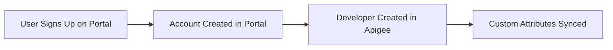
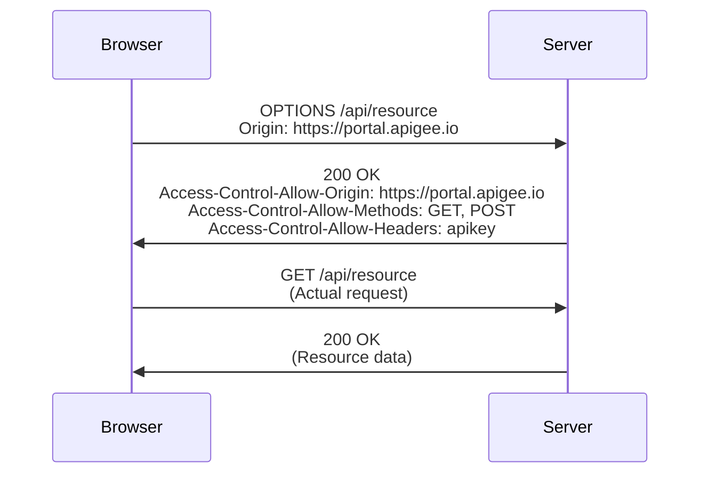
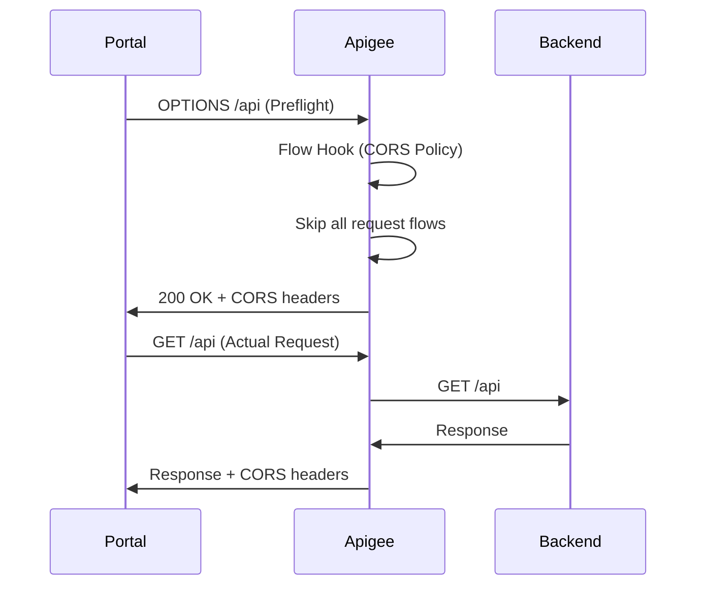
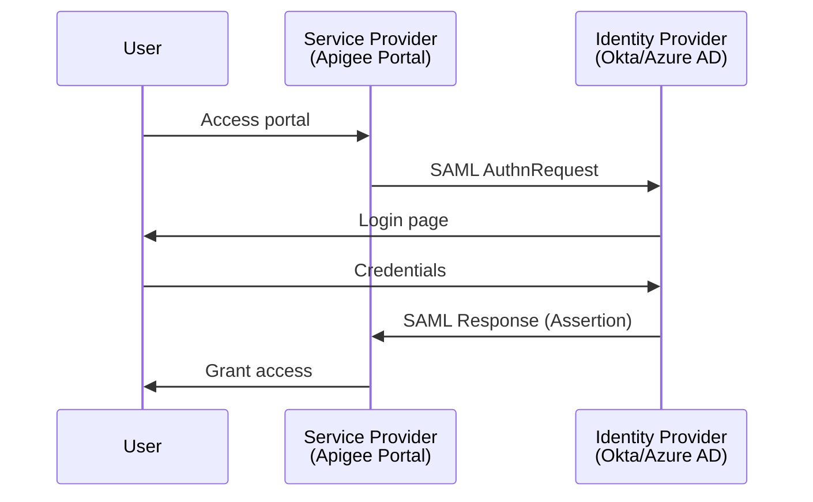

# Section 7: Developer Portal

## 7.1 Create, Customize and Publish Integrated Portal in Minutes

### 🌐 Apigee Developer Portal Overview

**Developer Portal**: A self-service platform where API consumers can discover, learn about, and consume your APIs.

**Two Types of Portals**:

| Type | Description | Use Case |
|------|-------------|----------|
| **Integrated Portal** | Built-in, quick to deploy | Standard use cases, fast time-to-market |
| **Drupal-based Portal** | Highly customizable CMS | Complex governance, extensive customization |

> [!NOTE]
> This course focuses on the **Integrated Developer Portal**, which can be published in minutes and provides sufficient customization for most use cases.

### 🚀 Creating Your First Portal

#### Step 1: Navigate to Portals

```
Apigee → Distribution → Portals → Create
```

#### Step 2: Configure Portal

**Portal Settings**:
```yaml
Name: API Portal
URL: project-id-api-portal.apigee.io
Description: Demo developer portal
```

**URL Structure**:
```
{project-id}-{portal-name}.apigee.io
```

#### Step 3: View Live Portal

```
Portal → View Live Portal
```

✅ **Portal created and published in seconds!**

### 🎨 Portal Customization Options

#### Home Page (Index Page)

**Navigate to**:
```
Portal → Pages → index
```

**Edit Content**:
```html
<h1>Launch your APIs with Apigee API Portal</h1>
<h2>Get started with our comprehensive API program</h2>

<!-- Custom company branding -->
<h1>XYZ Consultants</h1>
<h2>Welcome to our API Program</h2>
```

**HTML Customization**:
```html
<!-- Change font color -->
<font color="#FF5733">Welcome Message</font>

<!-- Add custom styling -->
<div style="background-color: #f0f0f0; padding: 20px;">
  <h2>Featured APIs</h2>
</div>
```

**Page Visibility**:
- **Public**: Anyone can view (no authentication required)
- **Authenticated**: Only signed-in users
- **Audience-specific**: Specific user groups only

**Menu Links**:
- Pages can appear in **Header** and/or **Footer** menus
- Configure via **Menus** section

#### Theme Settings

**Navigate to**:
```
Portal → Theme → Edit
```

**Customizable Elements**:
```yaml
Primary Color: #3498db
Accent Color: #e74c3c
Fonts: Roboto, Open Sans, etc.
Logo: Company logo (PNG/SVG)
Mobile Logo: Optimized for mobile devices
Favicon: Browser tab icon
```

**Example Theme Configuration**:
```
Primary Color: #2C3E50 (Dark blue-gray)
Accent Color: #E67E22 (Orange)
Font Family: Inter
```

#### Logo Upload

**Logo Types**:
1. **Primary Logo**: Main header logo
2. **Mobile Logo**: Responsive mobile view
3. **Favicon**: Browser tab icon

**Upload Process**:
```
Theme → Logo Section → Browse → Upload
```

### 👥 Account Settings

#### Authentication Configuration

**Navigate to**:
```
Portal → Accounts → Authentication
```

**Account Creation Settings**:
```yaml
Logo: Company logo for signup page
Company Name: XYZ Consultants
Copyright: © 2024 XYZ Consultants
Custom Fields:
  - Business Unit (required)
  - Department (optional)
```

**Custom Field Example**:
```
Field Name: Business Unit
Type: Text
Required: Yes
```

**Approval Settings**:
- ☑ **Require approval for all new user accounts**
  - Admin must manually approve signups
  - Prevents unauthorized access
  - Recommended for production

- ☑ **Notify portal administrator on new signups**
  - Email: admin@company.com
  - Real-time notifications

**Identity Providers**:
- **Built-in**: Default email/password authentication
- **SAML** (Preview): Enterprise SSO integration

### 📄 Pages Management

**Default Pages**:
1. **index**: Home page
2. **Get Started**: Onboarding guide
3. **Terms and Conditions**: Legal terms

**Creating New Pages**:
```
Pages → Create New → Add content → Publish
```

**Page Configuration**:
- **Title**: Page name
- **Content**: HTML/Markdown content
- **Visibility**: Public/Authenticated/Audience
- **Menu**: Header/Footer/None

### 🔗 Menus

**Two Menu Types**:

**Header Menu**:
```
- Home
- APIs
- Sign In
```

**Footer Menu**:
```
- Home
- APIs
- Terms and Conditions
```

**Adding Menu Items**:
```
Menus → Header/Footer → Add Item
    ↓
Title: Documentation
URL: /docs
    ↓
Publish
```

### 🖼️ Assets

**Asset Types**:
- Images (PNG, JPG, SVG)
- Documents (PDF)
- Other files

**Upload Assets**:
```
Assets → Upload
```

**Using Assets**:
```html
<!-- In page content -->


<!-- In theme settings -->
Select from uploaded assets
```

**Example Assets**:
- `company-logo.png` - Main logo
- `background-image.jpg` - Homepage background
- `api-diagram.svg` - Architecture diagram

### ⚙️ Settings

#### Google Analytics Integration

**Setup**:
```
Settings → Google Analytics
    ↓
Tracking ID: UA-XXXXXXXXX-X or G-XXXXXXXXXX
    ↓
Save
```

**Benefits**:
- Track portal usage
- Monitor API discovery patterns
- Measure developer engagement

#### Custom Scripts

**Add Custom JavaScript**:
```javascript
// Example: Custom tracking
<script>
  console.log('Portal loaded');
  // Your custom analytics or behavior
</script>
```

#### Custom Domain

**Configure Custom Domain**:
```
Settings → Custom Domain
    ↓
Domain: portal.example.com
    ↓
Configure DNS (covered in lecture 7.9-7.10)
```

#### Security

**Content Security Policy (CSP)**:
```
Settings → Security → CSP
```

**Purpose**: Specify trusted sources for scripts, images, and other content.

**Example CSP**:
```
default-src 'self'; 
script-src 'self' https://trusted-cdn.com; 
img-src 'self' data: https:;
```

#### SMTP Settings

**Custom Email Configuration**:
```yaml
SMTP Host: smtp.gmail.com
Port: 587
Username: noreply@company.com
Password: ********
From Address: noreply@company.com
```

### 👥 Audiences (Preview Feature)

**Purpose**: Group users for targeted content visibility.

**Default Audience**:
- **Authenticated**: All signed-in users

**Creating Custom Audiences**:
```
Audiences → Create New
    ↓
Name: Developers
Members: Select users
    ↓
Save
```

**Use Cases**:
- **Developers**: Technical API documentation
- **Admins**: Administrative APIs
- **Partners**: Partner-specific APIs
- **Internal**: Internal-only APIs

**Default Visibility**:
```
Settings → Default Visibility → Public/Authenticated/Audience
```

### 💡 Key Concepts

**Portal Structure**:
```
Portal
├── Pages (Content)
├── Theme (Appearance)
├── Menus (Navigation)
├── Assets (Media files)
├── Settings (Configuration)
└── Accounts (User management)
```

**Customization Levels**:
- ✅ **Basic**: Logo, colors, welcome message
- ✅ **Intermediate**: Custom pages, menus, themes
- ✅ **Advanced**: Custom scripts, CSP, SMTP, custom domain

**Portal vs. Drupal Portal**:

| Feature | Integrated Portal | Drupal Portal |
|---------|-------------------|---------------|
| **Setup Time** | Minutes | Hours/Days |
| **Customization** | Moderate | Extensive |
| **Maintenance** | Low (managed) | High (self-managed) |
| **Cost** | Included | Additional infrastructure |
| **Use Case** | Most scenarios | Complex governance |

### 🎯 Best Practices

✅ **Branding**:
- Upload high-quality logos (SVG preferred)
- Choose consistent color scheme
- Use professional fonts
- Add company information

✅ **Content**:
- Write clear welcome messages
- Provide getting started guides
- Include terms and conditions
- Add contact information

✅ **Security**:
- Require approval for new accounts
- Enable email notifications
- Use custom fields for user metadata
- Configure CSP for security

✅ **User Experience**:
- Keep navigation simple
- Use descriptive menu labels
- Organize content logically
- Test on mobile devices

---

## 7.2 API Catalog, Visibility, and Self-Service Sign-up/Sign-In

### 📚 API Catalog Overview

**API Catalog**: Central repository where you publish API products for discovery and consumption.

> [!IMPORTANT]
> **APIs are NOT automatically visible on the portal.** You must explicitly add them to the API Catalog.

### 🗂️ Creating Categories

**Purpose**: Organize APIs by type, purpose, or audience.

**Create Category**:
```
Portals → API Catalog → Categories → Create
    ↓
Name: REST API
Description: RESTful APIs
    ↓
Add Category
```

**Example Categories**:
- REST API
- GraphQL
- Internal APIs
- External APIs
- Public APIs
- Paid APIs
- Free Tier

### ➕ Adding APIs to Catalog

#### Step 1: Add API Product

```
API Catalog → APIs → Add API
```

> [!NOTE]
> Despite the UI saying "Add API", you're actually adding an **API Product**, not a proxy.

#### Step 2: Configure Catalog Item

**Configuration**:
```yaml
Product: pet-store-gold-tier
☑ Publish to catalog
Display Title: Pet Store Gold Tier
Description: Premium pet store API with advanced features
Display Image: Select from assets (pet-store-image.png)
Category: REST API
API Documentation: (Add later)
Visibility: Public / Authenticated / Audience
```

**Visibility Options**:

| Option | Who Can See |
|--------|-------------|
| **Public** | Everyone (including guests) |
| **Authenticated** | Only signed-in users |
| **Audience** | Specific user groups |

#### Step 3: Publish

```
Save → API appears in catalog
```

### 🧪 Testing Visibility

**Public Visibility**:
```
Portal → APIs → See product listed
```

**Authenticated Only**:
```
Portal → APIs → Empty (must sign in first)
```

### 👤 Self-Service Sign-Up

#### User Registration Flow

**Step 1: Navigate to Sign-Up**:
```
Portal → Sign In → Create Account
```

**Step 2: Fill Registration Form**:
```yaml
First Name: John
Last Name: Doe
Email: john.doe@example.com
Business Unit: Enterprise Integration  # Custom field
Password: ********  # Must meet criteria
```

**Password Requirements**:
- Minimum 8 characters
- At least one uppercase letter
- At least one lowercase letter
- At least one number
- At least one special character

**Step 3: Email Verification**:
```
User receives verification email
    ↓
Click verification link
    ↓
Account activated (if auto-approval enabled)
```

### 🔐 Admin Approval Process

#### Manual Approval (Recommended)

**When enabled**:
```
Accounts → Authentication → 
☑ Require approval for all new user accounts
```

**Approval Flow**:
```
1. User signs up
2. User receives "pending approval" message
3. Admin receives notification (if configured)
4. Admin reviews user in Apigee
5. Admin enables user account
6. User can sign in
```

**Admin Steps**:
```
Apigee → Portals → API Portal → Accounts → Users
    ↓
Find user (Status: Disabled)
    ↓
Edit → Status: Active → Save
```

**User Status in Apigee**:
```
Apigee → Distribution → Developers
    ↓
User appears in developers list
    ↓
Automatically synced from portal
```

### 🔄 Portal-Apigee Synchronization

**Automatic Sync**:


**Custom Attributes**:
- Portal custom fields → Apigee developer attributes
- Example: `Business Unit` → `businessUnit` attribute

### 🔍 Discovering APIs

**Browse by Category**:
```
Portal → APIs → Filter by Category
    ↓
Select: REST API
    ↓
View filtered products
```

**Search by Title**:
```
Portal → APIs → Search: "Pet Store"
    ↓
Results displayed
```

### 📊 Product Configuration for Portal

**Navigate to Product**:
```
Apigee → Products → pet-store-gold-tier
```

**Key Settings**:

**Access Level**:
```
- Public: Visible to all on portal
- Private/Internal: Only internal users
```

**Approval Mode**:
```
☐ Automatically approve access requests
  → Manual approval required

☑ Automatically approve access requests
  → Instant access
```

**Proxies in Product**:
```
Proxies: pet-store-v2
Paths: /
Operations: All
```

> [!WARNING]
> **Best Practice**: Maintain 1:1:1 relationship
> - 1 OpenAPI Spec
> - 1 API Proxy
> - 1 API Product
> 
> This simplifies documentation and management.

### 💡 Key Concepts

**Catalog Item vs. Product**:
- **Catalog Item**: Portal representation
- **Product**: Apigee entity with proxies and quotas

**Visibility Hierarchy**:
```
Public → Anyone
    ↓
Authenticated → Signed-in users
    ↓
Audience → Specific groups
```

**User Lifecycle**:
```
Sign Up → Email Verification → Admin Approval → Active User
```

### 🎯 Best Practices

✅ **Catalog Organization**:
- Create meaningful categories
- Use descriptive titles
- Add compelling descriptions
- Upload relevant images

✅ **Visibility Strategy**:
- Public: Marketing/discovery APIs
- Authenticated: Standard APIs
- Audience: Sensitive/partner APIs

✅ **Approval Process**:
- Enable manual approval for production
- Configure email notifications
- Review users promptly
- Document approval criteria

✅ **Product Design**:
- One proxy per product (recommended)
- Clear product naming
- Appropriate access levels
- Documented approval process

---

## 7.3 Register Apps and Add REST API Documentation on Portal

### 📱 Creating Apps from Portal

**Purpose**: Developers create apps to obtain API keys for consuming APIs.

#### App Creation Flow

**Step 1: Navigate to Apps**:
```
Portal (signed in) → User Menu → Apps → Create New App
```

**Step 2: Configure App**:
```yaml
Name: Pet Store Gold App from Developer Portal
Short Name: DP
Description: Testing app created from portal
Products: 
  - Pet Store Gold Tier (Request)
```

**Step 3: Request Product Access**:
```
Select Product → Request
    ↓
Status: Save to Request
    ↓
Save App
```

**App Status**: **Inactive** (pending product approval)

### 🔐 Admin Approval for Apps

#### Why Pending Approval?

**Product Setting**:
```
Apigee → Products → pet-store-gold-tier → Edit
    ↓
☐ Automatically approve access requests (DISABLED)
    ↓
Manual approval required
```

#### Approval Process

**Step 1: Find Pending App**:
```
Apigee → Apps → Filter: Pending Product Approval
    ↓
Find: Pet Store Gold App from Developer Portal
```

**Step 2: Approve Product**:
```
Open App → Scroll to Products
    ↓
Product Status: Pending
    ↓
Edit → Approve Product → Save
```

**Step 3: Credentials Generated**:
```
API Key: abc123...
API Secret: xyz789...
Status: Active
```

### 🔄 Portal-Apigee Sync for Apps

**Credential Display**:
```
Portal → Apps → Pet Store Gold App DP
    ↓
API Key: abc123... (same as Apigee)
    ↓
Status: Active
```

> [!NOTE]
> Portal fetches credentials from Apigee via API. Credentials are NOT stored in the portal—only displayed.

**Custom Attributes**:
```
App Description (portal) → Custom Attribute (Apigee)
```

### 📖 Adding API Documentation

**Problem**: Without documentation, developers can't test or understand the API.

**Error Message**:
```
Portal → APIs → Pet Store Gold Tier → Docs
    ↓
"No content exists at this URL, or you do not have permission to visit"
```

#### Preparing OpenAPI Spec

**Step 1: Get Existing Spec**:
```
Use the spec from which proxy was created
OR
Generate from existing proxy
```

**Step 2: Update Server URL**:

**Original (Target URL)**:
```yaml
servers:
  - url: https://petstore.swagger.io/v2
```

**Updated (Proxy URL)**:
```yaml
servers:
  - url: https://org-name-eval.apigee.net/petstore/v2
```

> [!IMPORTANT]
> **Critical Change**: Update server URL to your **proxy URL**, not the target backend URL. Otherwise, portal requests bypass Apigee!

**Step 3: Update Security Scheme**:

**Check Proxy Policy**:
```xml
<VerifyAPIKey name="VerifyAPIKey">
  <APIKey ref="request.header.apikey"/>
</VerifyAPIKey>
```

**Update Spec**:
```yaml
components:
  securitySchemes:
    api_key:
      type: apiKey
      name: apikey          # Match policy header name
      in: header

security:
  - api_key: []
```

**Step 4: Update Metadata**:
```yaml
info:
  title: Pet Store Proxy v2
  description: Pet Store API via Apigee proxy
  version: "2.0"
```

#### Uploading Documentation

**Navigate to**:
```
Portals → API Catalog → Pet Store Gold Tier → Edit
    ↓
Scroll to: API Documentation
    ↓
Type: OpenAPI Documentation
    ↓
Upload: petstore-v2-spec.yaml
    ↓
Save
```

### 🧪 Testing from Portal

**Step 1: View Documentation**:
```
Portal → APIs → Pet Store Gold Tier
    ↓
Documentation appears with:
  - Overview
  - Endpoints
  - Schemas
  - Try it out functionality
```

**Step 2: Authorize**:
```
Click: Authorize
    ↓
Select App: Pet Store Gold App DP
  OR
Enter API Key manually
    ↓
Authorize → Close
```

**Step 3: Test Endpoint**:
```
Endpoint: GET /pet/findByStatus
    ↓
Parameter: status = sold
    ↓
Execute
```

**Error**: CORS error (covered in next lectures)

### ⚠️ Common Issues

#### Issue 1: Wrong Server URL

**Symptom**: Requests bypass Apigee, go directly to backend

**Fix**: Update `servers[0].url` to proxy URL

#### Issue 2: Wrong Security Header

**Symptom**: Authentication fails

**Fix**: Match `securitySchemes.api_key.name` to policy header name

#### Issue 3: Multiple Proxies in Product

**Problem**: Which spec to upload?

**Recommendation**:
```
1 OpenAPI Spec ↔ 1 Proxy ↔ 1 Product
```

**Solution**: Remove extra proxies from product

```
Products → pet-store-gold-tier → Edit
    ↓
Remove: pet-store-v1
Keep: pet-store-v2
    ↓
Save
```

### 💡 Key Concepts

**App Registration Flow**:
```
Portal User Creates App
    ↓
Requests Product Access
    ↓
Admin Approves (if manual approval)
    ↓
Credentials Generated
    ↓
User Can Test APIs
```

**Documentation Requirements**:
- OpenAPI spec with correct proxy URL
- Security scheme matching proxy policy
- Complete endpoint documentation
- Example requests/responses

**Portal Testing Workflow**:
```
Upload Spec → View Docs → Authorize → Test Endpoints
```

### 🎯 Best Practices

✅ **OpenAPI Spec**:
- Always use proxy URL, never target URL
- Match security schemes to policies
- Include examples and descriptions
- Keep spec updated with proxy changes

✅ **Product Design**:
- One proxy per product
- Clear approval process
- Appropriate access levels
- Documented quotas and limits

✅ **App Management**:
- Descriptive app names
- Clear approval criteria
- Monitor app usage
- Revoke inactive apps

✅ **Documentation**:
- Comprehensive endpoint docs
- Clear parameter descriptions
- Example payloads
- Error code documentation

---

## 7.4 Understand CORS and Pre-flight Requests

### 🔒 CORS Overview

**CORS** = **Cross-Origin Resource Sharing**

**Purpose**: Security mechanism enforced by browsers to prevent malicious scripts from accessing unauthorized resources.

**Enforced By**: Browsers (not Postman, cURL, or other HTTP clients)

### 🌐 Same-Origin Policy

**Same Origin**: Protocol + Domain + Port must match

**Examples**:

| Origin A | Origin B | Same Origin? |
|----------|----------|--------------|
| `https://foo.com` | `https://foo.com/api` | ✅ Yes |
| `https://foo.com` | `http://foo.com` | ❌ No (protocol) |
| `https://foo.com` | `https://bar.com` | ❌ No (domain) |
| `https://foo.com:443` | `https://foo.com:8080` | ❌ No (port) |

### 🚫 The CORS Problem

**Scenario**:
```
Browser loads: https://project-id-api-portal.apigee.io
    ↓
JavaScript tries to call: https://org-name-eval.apigee.net/api
    ↓
Browser blocks: Different origin!
```

**Error Message**:
```
Access to fetch at 'https://org-name-eval.apigee.net/petstore/v2/pet/findByStatus'
from origin 'https://project-id-api-portal.apigee.io' has been blocked by CORS policy:
Response to preflight request doesn't pass access control check:
No 'Access-Control-Allow-Origin' header is present on the requested resource.
```

### ✈️ Preflight Requests

**Preflight**: OPTIONS request sent by browser before actual request to check if cross-origin access is allowed.

#### Preflight Flow



**When Preflight is Sent**:
- Cross-origin request
- Custom headers (e.g., `apikey`)
- Methods other than GET/POST
- Content-Type other than simple types

### 📋 CORS Headers

#### Request Headers (Browser → Server)

**Preflight Request**:
```http
OPTIONS /petstore/v2/pet/findByStatus
Origin: https://project-id-api-portal.apigee.io
Access-Control-Request-Method: GET
Access-Control-Request-Headers: apikey
```

#### Response Headers (Server → Browser)

**Required Headers**:

| Header | Purpose | Example |
|--------|---------|---------|
| `Access-Control-Allow-Origin` | Allowed origins | `https://portal.apigee.io` or `*` |
| `Access-Control-Allow-Methods` | Allowed HTTP methods | `GET, POST, PUT, DELETE` |
| `Access-Control-Allow-Headers` | Allowed request headers | `apikey, Content-Type` |
| `Access-Control-Allow-Credentials` | Allow cookies/auth | `true` or `false` |
| `Access-Control-Expose-Headers` | Headers browser can access | `X-Custom-Header` |
| `Access-Control-Max-Age` | Preflight cache duration | `3600` (1 hour) |

### 🔍 Detailed Header Explanations

#### Access-Control-Allow-Origin

**Purpose**: Specifies which origins can access the resource.

**Options**:
```
Specific origin: https://portal.apigee.io
Wildcard: *
Dynamic: {request.header.origin}
Multiple: https://portal1.com, https://portal2.com
```

> [!WARNING]
> Using `*` (wildcard) is **not recommended for production**. Explicitly list trusted origins.

#### Access-Control-Allow-Methods

**Purpose**: HTTP methods allowed for cross-origin requests.

**Example**:
```
GET, POST, PUT, DELETE, PATCH, OPTIONS
```

#### Access-Control-Allow-Headers

**Purpose**: Request headers allowed in actual request.

**Example**:
```
apikey, Content-Type, Authorization
```

#### Access-Control-Allow-Credentials

**Purpose**: Whether requests can include credentials (cookies, auth headers).

**Values**:
- `true`: Credentials allowed
- `false`: No credentials

> [!IMPORTANT]
> When `Access-Control-Allow-Credentials: true`, you **cannot** use `Access-Control-Allow-Origin: *`. Must specify exact origin.

#### Access-Control-Expose-Headers

**Purpose**: Response headers that JavaScript can access.

**Default Accessible Headers**:
- `Cache-Control`
- `Content-Language`
- `Content-Type`
- `Expires`
- `Last-Modified`
- `Pragma`

**Custom Headers** (must be exposed):
```
X-RateLimit-Remaining, X-Custom-Header
```

#### Access-Control-Max-Age

**Purpose**: How long (in seconds) browser can cache preflight response.

**Examples**:
```
3600 = 1 hour
86400 = 24 hours
-1 = Don't cache (useful for debugging)
```

**Benefit**: Reduces preflight requests, improves performance.

### 🎭 The Preflight Analogy

> Think of CORS preflight like a bouncer at a club:
> 
> **Browser**: "Hey, can someone from portal.apigee.io come in and make a GET request with an apikey header?"
> 
> **Server** (via CORS policy): "Yes, portal.apigee.io is on the list. GET is allowed. apikey header is fine. Come on in!"
> 
> **Browser**: "Great!" *Sends actual request*

### 💡 Key Concepts

**Why Browsers Enforce CORS**:
- Prevent malicious websites from stealing data
- Protect users from CSRF attacks
- Enforce security boundaries

**Why Postman Doesn't Enforce CORS**:
- Postman is a developer tool, not a browser
- No JavaScript execution context
- Direct HTTP client

**CORS is Configured on Server, Enforced by Browser**:
- Server sends CORS headers
- Browser decides whether to allow request
- Server has no control over enforcement

### 🎯 Best Practices

✅ **Origin Whitelisting**:
- Never use `*` in production
- Explicitly list trusted origins
- Use environment variables for flexibility

✅ **Header Management**:
- Only allow necessary methods
- Only allow required headers
- Minimize exposed headers

✅ **Caching**:
- Use appropriate `Max-Age` for production
- Use `-1` or `0` for debugging
- Balance performance vs. security

✅ **Credentials**:
- Only enable if necessary
- Cannot combine with wildcard origin
- Increases security requirements

---

*[Continuing with sections 7.5-7.12...]*

## 7.5 Add CORS Policy and Test APIs from Portal

### 🛡️ Implementing CORS in Apigee

**Goal**: Enable cross-origin requests from developer portal to Apigee proxies.

#### Implementation Strategy

**Where to Add CORS**:
- ✅ **Environment Level** (Shared Flow + Flow Hook) - Recommended
- ❌ **Proxy Level** - Not recommended (must repeat for every proxy)

**Why Environment Level?**:
- Applies to ALL proxies in environment
- Single point of configuration
- Handles preflight requests automatically
- Consistent CORS behavior

### 🔧 Step-by-Step Implementation

#### Step 1: Navigate to Flow Hooks

```
Apigee → Environments → eval → Flow Hooks
```

**Existing Flow Hook**:
```
Pre-Proxy Flow Hook: spike-arrest (shared flow)
```

#### Step 2: Edit Shared Flow

```
Proxy Development → Shared Flows → spike-arrest
```

> [!NOTE]
> Consider renaming to `common-environment-policies` for clarity.

#### Step 3: Add CORS Policy

**Create Policy**:
```
Default Shared Flow → Add Policy → CORS
```

**Policy Configuration**:
```xml
<CORS name="AddCORS">
  <!-- Trusted Origins -->
  <AllowOrigins>project-id-api-portal.apigee.io</AllowOrigins>
  
  <!-- Allowed HTTP Methods -->
  <AllowMethods>GET,POST,PUT,DELETE,PATCH,OPTIONS</AllowMethods>
  
  <!-- Allowed Request Headers -->
  <AllowHeaders>apikey,Content-Type,Authorization</AllowHeaders>
  
  <!-- Exposed Response Headers -->
  <ExposeHeaders>X-RateLimit-Remaining,X-Custom-Header</ExposeHeaders>
  
  <!-- Preflight Cache Duration (seconds) -->
  <MaxAge>-1</MaxAge>  <!-- -1 = no cache (for debugging) -->
  
  <!-- Allow Credentials -->
  <AllowCredentials>true</AllowCredentials>
  
  <!-- Generate Preflight Response -->
  <GeneratePreflightResponse>true</GeneratePreflightResponse>
</CORS>
```

**Multiple Origins**:
```xml
<AllowOrigins>
  portal1.apigee.io,portal2.apigee.io,app.example.com
</AllowOrigins>
```

**Wildcard (NOT recommended for production)**:
```xml
<AllowOrigins>*</AllowOrigins>
```

**Dynamic Origin (NOT recommended for production)**:
```xml
<AllowOrigins>{request.header.origin}</AllowOrigins>
```

#### Step 4: Deploy Shared Flow

```
Save as New Revision → Deploy
```

### 🧪 Testing CORS

#### Test from Portal

**Step 1: Authorize**:
```
Portal → APIs → Pet Store Gold Tier → Authorize
    ↓
Select App: Pet Store Gold App DP
    ↓
Authorize
```

**Step 2: Execute Request**:
```
GET /pet/findByStatus?status=sold
    ↓
Execute
```

**Result**: ✅ Success!

#### Analyze Debug Trace

**Navigate to**:
```
Apigee → Proxies → pet-store-v2 → Debug → Start Session
```

**Request Pair Pattern**:
```
1. OPTIONS /pet/findByStatus (Preflight)
2. GET /pet/findByStatus (Actual Request)
```

**Preflight Request Flow**:
```
1. Proxy Request Flow starts
2. Flow Hook executed (spike-arrest + CORS)
3. CORS policy processes OPTIONS request
4. Flow SKIPS all remaining request steps
5. Jumps directly to Proxy Response Flow
6. Special CORS execution step adds headers
7. Response sent to client
```

> [!IMPORTANT]
> **CORS Policy Behavior**: When CORS policy encounters an OPTIONS request, it automatically skips all subsequent request flows and jumps to the response flow. This prevents unnecessary policy execution for preflight requests.

**Preflight Request Headers**:
```http
OPTIONS /petstore/v2/pet/findByStatus
Origin: https://project-id-api-portal.apigee.io
Access-Control-Request-Method: GET
Access-Control-Request-Headers: apikey
```

**Preflight Response Headers**:
```http
HTTP/1.1 200 OK
Access-Control-Allow-Origin: https://project-id-api-portal.apigee.io
Access-Control-Allow-Methods: GET,POST,PUT,DELETE,PATCH,OPTIONS
Access-Control-Allow-Headers: apikey,Content-Type,Authorization
Access-Control-Allow-Credentials: true
Access-Control-Max-Age: -1
```

**Actual Request**:
```http
GET /petstore/v2/pet/findByStatus?status=sold
Origin: https://project-id-api-portal.apigee.io
apikey: abc123...
```

**Actual Response**:
```http
HTTP/1.1 200 OK
Access-Control-Allow-Origin: https://project-id-api-portal.apigee.io
Content-Type: application/json

[{"id": 123, "name": "Doggo", "status": "sold"}, ...]
```

### 📊 CORS Execution Flow



### 🔍 Cache Behavior

**MaxAge = -1** (No Cache):
```
Every resource request → Paired with preflight request
```

**MaxAge = 3600** (1 hour cache):
```
First request → Preflight + Actual
Subsequent requests (within 1 hour) → Actual only
After 1 hour → Preflight + Actual again
```

**Testing Different Endpoints**:
```
POST /pet (Create) → OPTIONS + POST
GET /pet/123 (Read) → OPTIONS + GET
PUT /pet/123 (Update) → OPTIONS + PUT
```

### 💡 Key Concepts

**Special CORS Execution Step**:
- Happens just before response is sent to client
- Adds `Access-Control-*` headers based on policy
- Validates origin against allowed origins
- Fails request if origin not allowed

**Why OPTIONS Method?**:
- Standard HTTP method for preflight
- Lightweight (no body)
- Indicates "asking for permission"
- Separate from actual resource request

**CORS Headers Added Automatically**:
- `Access-Control-Allow-Origin`
- `Access-Control-Allow-Methods`
- `Access-Control-Allow-Headers`
- `Access-Control-Allow-Credentials`
- `Access-Control-Expose-Headers`
- `Access-Control-Max-Age`

### 🎯 Best Practices

✅ **Environment-Level CORS**:
- Use shared flow + flow hook
- Applies to all proxies
- Single configuration point
- Easier maintenance

✅ **Origin Whitelisting**:
- Never use `*` in production
- List specific trusted origins
- Use comma-separated values
- Validate origins carefully

✅ **Cache Strategy**:
- Use `-1` for debugging
- Use `3600` (1 hour) for production
- Balance performance vs. security
- Monitor preflight request volume

✅ **Header Management**:
- Only allow necessary methods
- Only allow required headers
- Minimize exposed headers
- Document CORS configuration

---

## 7.6 Publish GraphQL API on Portal

### 🚀 Creating GraphQL Product

**Goal**: Publish SpaceX GraphQL API on developer portal.

#### Step 1: Create Product

```
Apigee → Products → Create
```

**Product Configuration**:
```yaml
Name: space-graph
Display Name: Space GraphQL
Environment: eval
Access: Public
Auto-approve: Yes (☑)
Quota: 10 requests per 1 minute
```

#### Step 2: Add GraphQL Operation

**Instead of REST Operations**:
```
Proxies & Operations → Add Operation
    ↓
Proxy: space-graphql
Operation Name: Query Space Data
Operation Type: query  # NOT mutation
    ↓
Save
```

> [!NOTE]
> **GraphQL Operations**: Unlike REST where you specify paths, for GraphQL you specify operation types (query/mutation/subscription).

**Why Only Query?**:
```
GraphQL Policy (in proxy) restricts to query operations only
```

### 📚 Adding to API Catalog

#### Step 1: Add Catalog Item

```
Portals → API Catalog → Add API
```

**Configuration**:
```yaml
Product: space-graph
☑ Publish to catalog
Display Title: Space GraphQL
Display Image: space-image.png (from assets)
Category: GraphQL
```

#### Step 2: Add GraphQL Documentation

**Documentation Type**: GraphQL Schema (not OpenAPI)

**Get Schema**:
```
Apollo Studio → Schema → SDL → Download
    ↓
Save as: spacex-schema.graphql
```

**Upload**:
```
API Documentation → GraphQL Schema
    ↓
Select File: spacex-schema.graphql
    ↓
Endpoint URL: https://org-name-eval.apigee.net/graphql/space
```

> [!IMPORTANT]
> **Endpoint URL**: Use your **proxy URL**, not the target URL (`https://spacex-production.up.railway.app/`).

**Visibility**:
```
Authenticated Users (or Public/Audience)
```

### 🧪 Testing GraphQL from Portal

#### View Documentation

```
Portal (signed in) → APIs → Space GraphQL
```

**Features**:
- Documentation Explorer
- Query builder with autocomplete
- Schema browser
- Execute queries directly

#### Build Query

**Using Autocomplete**:
```graphql
query MyQuery {
  capsules {
    original_launch
    landings
    status
  }
  company {
    ceo
    employees
    summary
  }
}
```

**Autocomplete Behavior**:
- Type `capsules` → Suggestions appear
- Select fields → Auto-complete available fields
- Nested objects → Continue selecting

**Execute Query**:
```
Execute → Response appears
```

**Debug Trace**:
```
Apigee → space-graphql → Debug
    ↓
See: OPTIONS (preflight) + POST (actual GraphQL query)
```

### 🔐 Adding API Key Protection

**Current State**: No API key required (anyone can query)

**Add to Existing App**:
```
Portal → Apps → Pet Store Gold App DP → Edit
    ↓
Add Product: Space GraphQL
    ↓
Save → Auto-approved (based on product setting)
```

**Same Credentials**:
```
API Key: abc123... (same key for both products)
```

**Update Proxy** (if needed):
```
Add VerifyAPIKey policy to space-graphql proxy
OR
Add to flow hook (environment-level)
```

### 📊 GraphQL vs. REST on Portal

| Aspect | REST API | GraphQL API |
|--------|----------|-------------|
| **Doc Type** | OpenAPI Spec | GraphQL Schema |
| **Operations** | Paths + Methods | Query/Mutation/Subscription |
| **Product Config** | Add paths | Add operation types |
| **Testing** | Endpoint-by-endpoint | Query builder |
| **Autocomplete** | Parameter hints | Field suggestions |

### 💡 Key Concepts

**GraphQL Schema Upload**:
- Defines available types and operations
- Enables documentation explorer
- Powers autocomplete
- Validates queries

**Operation Types in Products**:
- **query**: Read operations
- **mutation**: Write operations
- **subscription**: Real-time updates

**Portal GraphQL Features**:
- ✅ Documentation explorer
- ✅ Field autocomplete
- ✅ Query execution
- ❌ Visual query builder (like Apollo Studio)

### 🎯 Best Practices

✅ **Schema Management**:
- Keep schema updated with backend
- Document custom types
- Include descriptions in schema
- Version schemas if needed

✅ **Security**:
- Add API key verification
- Restrict operation types
- Set query depth limits
- Implement rate limiting

✅ **Visibility**:
- Authenticated for internal APIs
- Public for marketing APIs
- Audience for partner APIs

---

## 7.7 Teams and Audience for Portal Access Control

### 👥 Teams Feature (Preview)

**Purpose**: Group users for collaborative app management.

**Enabled When**: Enrolling in Audiences preview feature

### 🏢 Creating Teams

#### Step 1: Create Team

```
Portal (signed in) → User Menu → Teams → Create Team
```

**Team Configuration**:
```yaml
Name: Cloud Architect Team
Owner: Current user (auto-assigned)
Members:
  - user@example.com (App Admin)
  - user2@example.com (Viewer)
```

#### Team Roles

| Role | Team Permissions | App Permissions |
|------|------------------|-----------------|
| **Owner** | Full (read/write) | Full (read/write) |
| **App Admin** | Read-only | Full (read/write) |
| **Viewer** | Read-only | Read-only |

**Detailed Permissions**:

**Owner**:
- ✅ Manage team members
- ✅ Update team details
- ✅ Create/edit/delete apps
- ✅ View credentials

**App Admin**:
- ❌ Cannot manage team members
- ❌ Cannot update team details
- ✅ Create/edit/delete apps
- ✅ View credentials

**Viewer**:
- ❌ Cannot manage team
- ❌ Cannot modify apps
- ✅ View team details
- ✅ View app details (read-only)

### 📱 Team-Owned Apps

#### Creating Team App

```
Portal → Apps → Create New App
    ↓
Name: Team App Demo
Owner: Cloud Architect Team  # Select team
Products: Space GraphQL
    ↓
Save
```

**Benefits**:
- All team members can see app
- Shared credentials access
- Collaborative management
- Role-based permissions

**Apigee View**:
```
Apigee → Apps → Team App Demo
    ↓
Owner: Cloud Architect Team
Credentials: Visible to all team members
```

### 🎭 Audiences Feature (Preview)

**Purpose**: Control visibility of portal resources (pages, APIs) for specific user groups.

#### Creating Audiences

```
Apigee → Portals → API Portal → Audiences → Create
```

**Audience Configuration**:
```yaml
Name: API SMEs
Members:
  - Cloud Architect Team (all members)
  - user@example.com (individual)
  - user2@example.com (individual)
```

**Member Types**:
- **Teams**: All team members included
- **Individual Users**: Specific users

### 🔒 Using Audiences

#### Page Visibility

```
Portals → Pages → Terms and Conditions → Edit
    ↓
Visibility: Selected Audience
Audience: API SMEs
    ↓
Save → Publish
```

**Result**: Only API SMEs can view Terms and Conditions page

#### API Catalog Visibility

```
Portals → API Catalog → Space GraphQL → Edit
    ↓
Visibility: Selected Audience
Audience: API SMEs
    ↓
Save
```

**Result**: Only API SMEs can see Space GraphQL in catalog

### 🧪 Testing Access Control

**User in Audience**:
```
Portal (signed in as SME) → APIs
    ↓
Space GraphQL visible ✅
```

**User NOT in Audience**:
```
Portal (signed in as non-SME) → APIs
    ↓
Space GraphQL NOT visible ❌
```

### 💡 Key Concepts

**Teams vs. Audiences**:

| Feature | Teams | Audiences |
|---------|-------|-----------|
| **Purpose** | App collaboration | Content visibility |
| **Scope** | Apps and credentials | Pages and APIs |
| **Roles** | Owner, App Admin, Viewer | Member or not |
| **Use Case** | Shared app management | Access control |

**Access Control Hierarchy**:
```
Public → Anyone
    ↓
Authenticated → All signed-in users
    ↓
Audience → Specific groups
    ↓
Team → App-level collaboration
```

**Team Membership Benefits**:
- Shared credential access
- Collaborative app creation
- Role-based permissions
- Organizational structure

### 🎯 Best Practices

✅ **Team Structure**:
- Align with organizational structure
- Clear role assignments
- Document team purposes
- Regular membership review

✅ **Audience Design**:
- Create meaningful groups
- SMEs, Partners, Internal, etc.
- Avoid over-segmentation
- Document audience purposes

✅ **Access Control**:
- Start with least privilege
- Grant access as needed
- Regular access reviews
- Audit audience membership

✅ **App Ownership**:
- Use teams for shared apps
- Individual ownership for personal apps
- Clear ownership documentation
- Credential rotation policies

---

## 7.8 Restrict Signups by Domain, Customize Auto-Generated Emails

### 📧 Email Configuration

#### SMTP Settings

**Purpose**: Use custom email domain for portal notifications.

**Configure**:
```
Portals → Settings → SMTP
```

**Configuration**:
```yaml
SMTP Host: smtp.gmail.com
From Email: noreply@mycompany.com
Username: noreply@mycompany.com
Password: ********
Auth Type: TLS
Port: 587
```

**Benefits**:
- Professional email addresses
- Company branding
- Better deliverability
- Centralized email management

### 🚫 Domain Restrictions

**Purpose**: Limit signups to specific email domains.

**Configure**:
```
Portals → Accounts → Authentication → Built-in → Edit
```

**Domain Whitelist**:
```yaml
Allowed Domains:
  - mycompany.com
  - *.mycompany.com  # Includes subdomains
```

**Specific Email Addresses**:
```
user1@mycompany.com
user2@partner.com
```

**Domain vs. Subdomain**:
- `mycompany.com`: Only `user@mycompany.com`
- `*.mycompany.com`: Includes `user@dev.mycompany.com`, `user@staging.mycompany.com`

### ✉️ Email Customization

#### Account Verification Email

**Default Email**:
```
Subject: Welcome {firstName}!
Body: Thanks for signing up. Click this link to verify your account.
```

**Customize**:
```
Accounts → Authentication → Built-in → Account Verify → Edit
```

**Custom Template**:
```
Subject: Welcome to {companyName} API Portal
Body:
Hello {firstName} {lastName},

Thank you for registering with {companyName} API Portal.

Please click the link below to verify your email address:
{verificationLink}

If manual approval is required, our team will review your request shortly.

Best regards,
{companyName} API Team
```

**Available Variables**:
- `{firstName}`
- `{lastName}`
- `{email}`
- `{companyName}`
- `{verificationLink}`

#### Admin Notification Email

**Purpose**: Notify admins when new users sign up.

**Configure**:
```
Accounts → Authentication → Built-in → Account Notify → Edit
```

**Custom Template**:
```
Subject: New Portal User Registration
Body:
A new user has registered on the API Portal:

Name: {firstName} {lastName}
Email: {email}
Business Unit: {customField.businessUnit}

Please review and approve the account in Apigee.

{portalLink}
```

### 🔔 Notification Settings

**Enable Notifications**:
```
Accounts → Authentication
    ↓
☑ Notify portal administrator on new signups
Email: admin@mycompany.com
```

**When to Enable**:
- Manual approval required
- Security compliance
- User tracking needed
- Audit requirements

### 💡 Key Concepts

**Email Types**:
1. **Account Verify**: Sent to user for email verification
2. **Account Notify**: Sent to admin on new signup
3. **Password Reset**: Sent when user requests password reset
4. **Account Approved**: Sent when admin approves account

**Domain Restriction Use Cases**:
- **Internal Portal**: Only company domain
- **Partner Portal**: Company + partner domains
- **Public Portal**: No restrictions (or broad restrictions)

**SMTP vs. Default**:
- **Default**: `noreply@apigee.google.com`
- **Custom SMTP**: Your company domain

### 🎯 Best Practices

✅ **SMTP Configuration**:
- Use dedicated email account
- Configure SPF/DKIM records
- Test email deliverability
- Monitor bounce rates

✅ **Domain Restrictions**:
- Whitelist specific domains for internal portals
- Use subdomain wildcards carefully
- Document allowed domains
- Review restrictions periodically

✅ **Email Templates**:
- Professional tone
- Clear instructions
- Company branding
- Contact information

✅ **Notifications**:
- Enable for manual approval workflows
- Use distribution lists for admins
- Set up email filters
- Monitor notification volume

---

## 7.9-7.10 Custom Domain for Portal (Design & Implementation)

### 🌐 Custom Domain Overview

**Goal**: Access portal on your own domain instead of `*.apigee.io`.

**Example**:
```
Default: project-id-api-portal.apigee.io
Custom: portal.mycompany.com
```

### 📋 Prerequisites

**Requirements**:
1. Own a domain (e.g., `mycompany.com`)
2. Access to DNS management
3. SSL certificate (optional, recommended)
4. Apigee portal created

### 🏗️ Design Considerations

#### DNS Configuration

**CNAME Record**:
```
Type: CNAME
Name: portal
Value: project-id-api-portal.apigee.io
TTL: 3600
```

**Result**: `portal.mycompany.com` → `project-id-api-portal.apigee.io`

#### SSL/TLS

**Options**:
1. **Google-managed certificate** (Recommended)
   - Automatic renewal
   - Free
   - Easy setup

2. **Custom certificate**
   - Your own CA
   - More control
   - Manual renewal

### 🔧 Implementation Steps

#### Step 1: Configure in Apigee

```
Portals → Settings → Custom Domain
```

**Configuration**:
```yaml
Domain: portal.mycompany.com
Certificate: Google-managed (or upload custom)
```

#### Step 2: Verify Domain Ownership

**Verification Methods**:
1. **DNS TXT Record**:
   ```
   Type: TXT
   Name: _acme-challenge.portal
   Value: <verification-string>
   ```

2. **HTML File Upload**:
   ```
   Upload file to: portal.mycompany.com/.well-known/acme-challenge/
   ```

#### Step 3: Update DNS

**Add CNAME**:
```
portal.mycompany.com → project-id-api-portal.apigee.io
```

**Wait for Propagation**: 5 minutes to 48 hours (typically < 1 hour)

#### Step 4: Enable HTTPS

**Google-Managed Certificate**:
- Automatically provisioned
- Auto-renewal
- No action required

**Custom Certificate**:
```
Upload:
  - Certificate (.crt)
  - Private Key (.key)
  - Certificate Chain (optional)
```

### 🧪 Testing

**Verify DNS**:
```powershell
nslookup portal.mycompany.com
```

**Expected Output**:
```
portal.mycompany.com
    CNAME: project-id-api-portal.apigee.io
    Address: <IP address>
```

**Access Portal**:
```
https://portal.mycompany.com
```

### 💡 Key Concepts

**CNAME vs. A Record**:
- **CNAME**: Points to another domain name
- **A Record**: Points to IP address
- **Use CNAME** for Apigee portals

**SSL Certificate Provisioning**:
- Google-managed: 15-30 minutes
- Custom: Immediate after upload

**Domain Propagation**:
- DNS changes take time to propagate globally
- Use `nslookup` or `dig` to verify
- Patience is key!

### 🎯 Best Practices

✅ **Domain Selection**:
- Use subdomain (`portal.mycompany.com`)
- Avoid root domain for portals
- Choose descriptive names
- Consider regional subdomains

✅ **SSL/TLS**:
- Always use HTTPS
- Prefer Google-managed certificates
- Monitor certificate expiration
- Redirect HTTP to HTTPS

✅ **DNS Management**:
- Document DNS changes
- Use low TTL during setup
- Increase TTL after verification
- Monitor DNS health

---

## 7.11-7.12 SSO for Portal (SAML Flow & Implementation)

### 🔐 SAML SSO Overview

**SAML** = **Security Assertion Markup Language**

**Purpose**: Enable enterprise single sign-on for developer portal.

**Benefits**:
- Centralized authentication
- No password management in portal
- Enterprise security policies
- Better user experience

### 🏢 SAML Actors



**Roles**:
- **Service Provider (SP)**: Apigee Developer Portal
- **Identity Provider (IdP)**: Okta, Azure AD, Google Workspace, etc.
- **User**: Developer accessing portal

### 📋 SAML Flow

#### 1. SP-Initiated Flow

```
1. User accesses portal.mycompany.com
2. Portal redirects to IdP login page
3. User authenticates with IdP
4. IdP sends SAML assertion to portal
5. Portal validates assertion
6. Portal creates session
7. User accesses portal
```

#### 2. IdP-Initiated Flow

```
1. User logs into IdP dashboard
2. User clicks "API Portal" app
3. IdP sends SAML assertion to portal
4. Portal validates assertion
5. Portal creates session
6. User accesses portal
```

### 🔧 SAML Configuration

#### Prerequisites

**IdP Requirements**:
- SAML 2.0 support
- Metadata XML or manual configuration
- User attributes (email, firstName, lastName)

**Apigee Requirements**:
- Portal created
- Custom domain (recommended)
- Admin access

#### Step 1: Configure IdP

**Create SAML App** (Example: Okta):
```
Okta Admin → Applications → Create App Integration
    ↓
SAML 2.0
    ↓
App Name: Apigee Developer Portal
```

**SAML Settings**:
```yaml
Single Sign-On URL: https://portal.mycompany.com/saml/acs
Audience URI (SP Entity ID): https://portal.mycompany.com
Name ID Format: EmailAddress
Attribute Statements:
  - email: user.email
  - firstName: user.firstName
  - lastName: user.lastName
```

**Download Metadata**:
```
Download IdP Metadata XML
```

#### Step 2: Configure Apigee Portal

```
Portals → Accounts → Authentication → Identity Providers
```

**Add SAML Provider**:
```yaml
Provider Type: SAML
Name: Company SSO
IdP Metadata: Upload XML file
OR
Manual Configuration:
  - IdP Entity ID: https://idp.mycompany.com
  - SSO URL: https://idp.mycompany.com/sso
  - Certificate: Upload X.509 certificate
```

**Attribute Mapping**:
```yaml
Email: email
First Name: firstName
Last Name: lastName
```

#### Step 3: Test SSO

**Access Portal**:
```
https://portal.mycompany.com
    ↓
Click: Sign In with Company SSO
    ↓
Redirected to IdP
    ↓
Enter credentials
    ↓
Redirected back to portal
    ↓
Signed in ✅
```

### 🔍 SAML Assertion Example

```xml
<saml:Assertion>
  <saml:Subject>
    <saml:NameID>user@mycompany.com</saml:NameID>
  </saml:Subject>
  <saml:AttributeStatement>
    <saml:Attribute Name="email">
      <saml:AttributeValue>user@mycompany.com</saml:AttributeValue>
    </saml:Attribute>
    <saml:Attribute Name="firstName">
      <saml:AttributeValue>John</saml:AttributeValue>
    </saml:Attribute>
    <saml:Attribute Name="lastName">
      <saml:AttributeValue>Doe</saml:AttributeValue>
    </saml:Attribute>
  </saml:AttributeStatement>
</saml:Assertion>
```

### 💡 Key Concepts

**SAML Metadata**:
- XML file describing IdP configuration
- Contains SSO URL, entity ID, certificate
- Simplifies configuration

**Attribute Mapping**:
- Maps IdP attributes to portal user fields
- Required: email
- Optional: firstName, lastName, custom fields

**Just-in-Time (JIT) Provisioning**:
- User created automatically on first login
- No pre-registration required
- Attributes populated from SAML assertion

**Session Management**:
- Portal manages session after SAML authentication
- Logout from portal doesn't log out from IdP
- Consider SLO (Single Logout) for complete logout

### 🎯 Best Practices

✅ **Security**:
- Use HTTPS for all SAML endpoints
- Validate SAML signatures
- Set appropriate session timeouts
- Monitor failed authentication attempts

✅ **User Experience**:
- Provide clear SSO button
- Handle errors gracefully
- Support multiple IdPs if needed
- Document SSO process for users

✅ **Configuration**:
- Use metadata XML when possible
- Test both SP and IdP-initiated flows
- Document attribute mappings
- Keep certificates updated

✅ **Troubleshooting**:
- Enable SAML debug logging
- Validate SAML assertions
- Check attribute mappings
- Verify certificate validity

---

## Summary

Section 7 covered comprehensive Developer Portal management:

### ✅ Portal Setup
- Creating and publishing integrated portals in minutes
- Customizing themes, logos, colors, and content
- Managing pages, menus, and assets
- Configuring settings (Analytics, SMTP, Security)

### ✅ API Distribution
- Adding APIs to catalog with categories
- Configuring visibility (Public/Authenticated/Audience)
- Self-service signup and signin
- App registration and credential management
- Adding REST and GraphQL documentation

### ✅ CORS Implementation
- Understanding same-origin policy and preflight requests
- Implementing CORS at environment level
- Testing cross-origin requests from portal
- Analyzing CORS headers and flow execution

### ✅ Access Control
- Creating teams for collaborative app management
- Defining audiences for content visibility
- Role-based permissions (Owner, App Admin, Viewer)
- Restricting signups by domain

### ✅ Advanced Features
- Customizing auto-generated emails
- Configuring custom domains with SSL
- Implementing SAML SSO for enterprise authentication
- Publishing GraphQL APIs with schema documentation

These features enable organizations to create professional, self-service developer portals that facilitate API discovery, onboarding, and consumption while maintaining security and governance.
