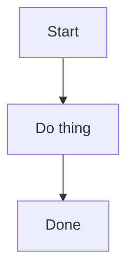

# Hand-authoring Mermaid diagrams as SVG

## Why this is necessary

Word (.docx) cannot render Mermaid syntax natively. The normal fix is to run
the diagram through a Mermaid renderer (`mermaid-cli` via Puppeteer, or a
hosted service like mermaid.ink/kroki) and embed the resulting image.

In a sandboxed environment, both of those usually fail:
- `npm install -g @mermaid-js/mermaid-cli` pulls in Puppeteer, which tries to
  download a Chromium binary — this typically isn't on the network allowlist.
- No system Chromium/Chrome is preinstalled.
- Hosted rendering services (mermaid.ink, kroki.io) require outbound network
  access to domains that usually aren't allowlisted either.

**Check these first before falling back to hand-authoring** — if either a
headless browser or one of those domains IS available in your environment,
just use the real Mermaid renderer; it'll be faster and exactly match the
source. Only use the approach below if those are unavailable.

## The fallback: hand-translate to SVG, rasterize with `sharp`

1. Read the mermaid block and identify its type:
   - `graph TD` / `graph LR` — flowchart (top-down or left-right)
   - `sequenceDiagram` — sequence/swimlane diagram
   - `stateDiagram` — state machine (treat similarly to graph TD)
2. Hand-draw the equivalent structure directly as SVG. See the patterns
   below for each diagram type — they're simple enough to write by hand for
   typical course-material diagrams (4-10 nodes).
3. Rasterize with `node scripts/render_svg.js <in>.svg <out>.png`.
4. Save the PNGs as `diagram1.png`, `diagram2.png`, `diagram3.png`, ... in
   your `--diagrams-dir`, in the SAME ORDER the mermaid blocks appear in the
   source markdown. `md_to_docx.js` numbers mermaid blocks in document order
   and looks for matching filenames automatically.

## Flowchart pattern (graph TD / graph LR)

- Each `A[Label]` node → a rounded `<rect>` + centered `<text>`.
- Each `A --> B` edge → a `<line>` or `<path>` with `marker-end="url(#arrow)"`.
- Each `A -->|label| B` edge → same, plus a `<text>` near the midpoint for
  the edge label.
- Decision nodes `E{Need Change?}` → a `<polygon>` diamond instead of a rect.
- Use a consistent color per "kind" of node if the source implies category
  (e.g. success states green, danger states red, neutral states blue) —
  this often communicates more than mermaid's default styling would anyway.
- Define one arrowhead marker once and reuse it:
  ```svg
  <defs>
    <marker id="arrow" markerWidth="10" markerHeight="10" refX="8" refY="3"
            orient="auto" markerUnits="strokeWidth">
      <path d="M0,0 L0,6 L9,3 z" fill="#2E75B6" />
    </marker>
  </defs>
  ```
- For `graph LR` (left-right) layouts with many branches (e.g. a node with
  3+ outgoing edges going to boxes above/below), route return edges with
  multi-segment `<path>` elements (`M x,y L x,y L x,y`) or smooth curves
  (`M x,y C ...`) rather than straight lines, to avoid overlapping text.

## Sequence diagram pattern (sequenceDiagram)

- Each `participant X as Label` → a small rounded box at the top, plus a
  full-height dashed vertical "lifeline" (`stroke-dasharray="4,3"`) below it.
- Evenly space participants along the x-axis (e.g. 180-200px apart).
- Each `A->>B: message` → a solid horizontal arrow at the next available
  y-position (increment y by ~50px per message), with the message text
  centered above the line.
- Use a different color for "request" vs "response" arrows if the diagram
  has a clear request/response pattern (e.g. blue for calls going one
  direction, green for returns going the other) — this mirrors what
  mermaid's default theme often does and aids readability.

## Rendering tips

- `sharp` rasterizes at the SVG's `viewBox` size by default; the
  `render_svg.js` script auto-detects the viewBox and scales 2x for crisper
  text in Word. Increase `--scale` for very text-dense diagrams.
- Keep font-family as `Arial, sans-serif` in the SVG to match the rest of
  the generated document.
- Preview each PNG with the `view` tool before embedding — check for
  overlapping labels, arrowheads pointing the wrong way, or text running
  outside its box. Iterate on the SVG directly; it's just markup.
- Common mistake: a `path` curve drawn FROM the decision node TO a
  downstream box will point its arrowhead at the downstream box (correct),
  but if you accidentally reverse the `d=` coordinates, the arrowhead ends
  up at the wrong end. Always re-view the rendered PNG after edits to
  confirm arrow direction matches the source's logical flow.

## Example: minimal flowchart end-to-end

Mermaid source:


Equivalent hand-authored SVG (abbreviated):
```svg
<svg viewBox="0 0 400 300" xmlns="http://www.w3.org/2000/svg" font-family="Arial, sans-serif">
  <defs>
    <marker id="arrow" markerWidth="10" markerHeight="10" refX="8" refY="3" orient="auto">
      <path d="M0,0 L0,6 L9,3 z" fill="#2E75B6"/>
    </marker>
  </defs>
  <rect x="20" y="20" width="140" height="50" rx="8" fill="#EAF3FB" stroke="#2E75B6" stroke-width="2"/>
  <text x="90" y="50" text-anchor="middle" font-size="14" font-weight="bold" fill="#1F4E79">Start</text>

  <rect x="20" y="120" width="140" height="50" rx="8" fill="#EAF3FB" stroke="#2E75B6" stroke-width="2"/>
  <text x="90" y="150" text-anchor="middle" font-size="14" font-weight="bold" fill="#1F4E79">Do thing</text>

  <rect x="20" y="220" width="140" height="50" rx="8" fill="#E9F7EC" stroke="#2E7D32" stroke-width="2"/>
  <text x="90" y="250" text-anchor="middle" font-size="14" font-weight="bold" fill="#1b5e20">Done</text>

  <line x1="90" y1="70" x2="90" y2="120" stroke="#2E75B6" stroke-width="2" marker-end="url(#arrow)"/>
  <line x1="90" y1="170" x2="90" y2="220" stroke="#2E75B6" stroke-width="2" marker-end="url(#arrow)"/>
</svg>
```

Then:
```bash
node scripts/render_svg.js start.svg diagrams/diagram1.png
```

## Worked examples

`references/example-svgs/` contains three complete, real SVG diagrams from a
past conversion (a 3-tier ownership flowchart, a 5-participant sequence
diagram, and a flowchart with a decision diamond and multiple return paths).
Open them as concrete references for spacing, color choices, and arrow
routing on more complex diagrams than the minimal example above.

