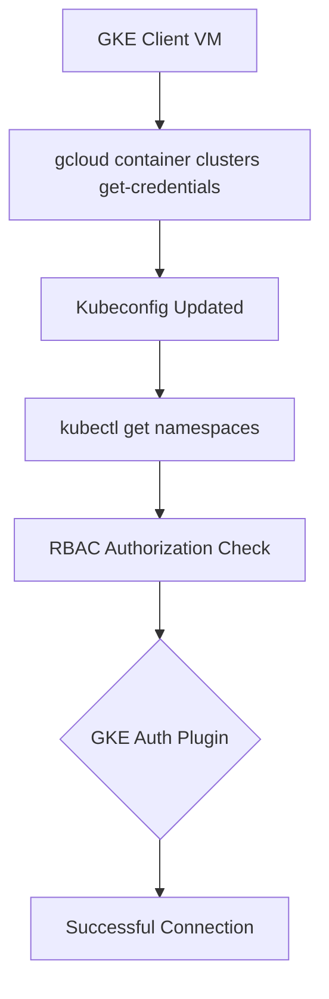

# Session 62: Private GKE Cluster with Private Endpoint Part 2, GKE Client to connect to Pvt Endpoint

> **Estimated Duration**: ~1 hour

## Table of Contents
1. [GKE Cluster Types Review](#gke-cluster-types-review)
2. [Shared VPC Networking Architecture](#shared-vpc-networking-architecture)
3. [Creating GKE Client VMs](#creating-gke-client-vms)
4. [Service Accounts for Cross-Project Access](#service-accounts-for-cross-project-access)
5. [Private Google Access Requirements](#private-google-access-requirements)
6. [GKE Connectivity and Tools Installation](#gke-connectivity-and-tools-installation)
7. [Troubleshooting Connection Issues](#troubleshooting-connection-issues)
8. [Authorized Networks for Control Plane](#authorized-networks-for-control-plane)
9. [Gateway API Demo with Canary Deployment](#gateway-api-demo-with-canary-deployment)
10. [Cloud SQL Connectivity via Internal IPs](#cloud-sql-connectivity-via-internal-ips)
11. [Autopilot GKE with Private Endpoint](#autopilot-gke-with-private-endpoint)
12. [VPN Concepts Introduction](#vpn-concepts-introduction)

## GKE Cluster Types Review

### Overview
This session builds on Session 61 concepts, focusing on connecting GKE clients to private Kubernetes clusters with private endpoints in shared VPC environments.

### Key Concepts

#### GKE Cluster Configuration Types

| Cluster Type | Worker Nodes | Control Plane Endpoint | Use Case |
|-------------|--------------|----------------------|----------|
| **Public Cluster** | External IPs | Public | Development, non-sensitive workloads |
| **Private Cluster (Public Endpoint)** | Internal IPs | Public | Development with controlled network access |
| **Private Cluster (Private Endpoint)** | Internal IPs | Private | Production, secure environments |

#### Critical Configuration Points
✅ **Private Nodes** = Worker nodes have internal IPs only
✅ **Private Endpoint** = Control plane accessible via internal IP only
✅ **Shared VPC** = Required for cross-project connectivity

## Shared VPC Networking Architecture

### Network Architecture Diagram
```
Shared VPC Host Project
├── Subnet US Central
│   ├── GKE Cluster (Service Project A)
│   │   └── Private Endpoint: 10.x.x.x
│   └── Client VMs (Service Project B)
│       ├── US Central Client
│       ├── London Client
│       └── Singapore Client
├── Subnet London
│   └── Client VMs
├── Subnet Singapore
│   ├── Client VMs
│   └── Cloud SQL Instance
└── Networking Resources
    ├── Private Service Access
    ├── NAT Gateway (deleted for isolation)
    ├── Firewall Rules
    └── Private Google Access
```

### VPC Peering Requirement
```yaml
apiVersion: v1
kind: ConfigMap
metadata:
  name: private-connection-config
  namespace: kube-system
data:
  # Cloud SQL instance with internal IP
  CLOUD_SQL_INTERNAL_IP: "10.x.x.x"
  # Private GKE endpoint access
  GKE_CONTROL_PLANE_IP: "10.x.x.x"
```

> [!IMPORTANT]
> Private GKE clusters with private endpoints **CANNOT** be accessed from Cloud Shell. GKE client VMs must be deployed in the same VPC network.

## Creating GKE Client VMs

### VM Creation in Shared VPC

**Service Project B - GKE Client Creation:**

```bash
gcloud compute instances create gke-client-us \
    --zone=us-central1-a \
    --machine-type=e2-micro \
    --network=projects/host-project/global/networks/shared-vpc \
    --subnet=projects/host-project/regions/us-central1/subnetworks/subnet-us \
    --no-address \
    --service-account=gke-client-sa@service-b.iam.gserviceaccount.com \
    --scopes=https://www.googleapis.com/auth/cloud-platform
```

### VM Configuration Requirements
- **No External IP**: `--no-address` flag
- **Shared VPC Network**: Specify full network path
- **Dedicated Service Account**: For cross-project IAM roles
- **Organization Policy**: Must allow external IP restrictions

### Regional Client Deployment Strategy

| Region | Purpose | Network Requirements |
|--------|---------|-------------------|
| **US Central** | Primary admin access | Same subnet as cluster |
| **London** | Cross-region access | Authorized network enabled |
| **Singapore** | CI/CD client | Startup script with kubectl |

### Startup Script for Singapore Client

```bash
#!/bin/bash
# Install Google Cloud SDK
sudo apt-get update
sudo apt-get install -y google-cloud-sdk

# Install kubectl
gcloud components install kubectl -y

# Install GKE auth plugin
gcloud components install gke-gcloud-auth-plugin -y
```

## Service Accounts for Cross-Project Access

### Service Account Setup Flow

1. **Create Service Account in Client Project**
   ```bash
   gcloud iam service-accounts create gke-client-sa \
       --description="GKE cluster access service account" \
       --display-name="GKE Client SA"
   ```

2. **Grant IAM Roles in Service Project A**
   ```bash
   gcloud projects add-iam-policy-binding service-a \
       --member="serviceAccount:gke-client-sa@service-b.iam.gserviceaccount.com" \
       --role="roles/container.viewer"

   # For deployment capabilities
   gcloud projects add-iam-policy-binding service-a \
       --member="serviceAccount:gke-client-sa@service-b.iam.gserviceaccount.com" \
       --role="roles/container.developer"
   ```

### Cross-Project Permissions Matrix

| Project | Service Account | Required Role | Purpose |
|---------|----------------|---------------|---------|
| **Service B** | `gke-client-sa@service-b` | Owner | VM service account |
| **Service A** | `gke-client-sa@service-b` | Container Developer | GKE operations |

> [!WARNING]
> IAM roles at project level grant access to **ALL** clusters in the project. Use Kubernetes RBAC for cluster-level access control.

## Private Google Access Requirements

### Subnet-Level Configuration

**Host Project - Network Engineering Project:**
1. VPC Network → Subnets
2. Select region subnet (e.g., Singapore)
3. Edit → **Private Google Access** → On
4. Command equivalent:
   ```bash
   gcloud compute networks subnets update subnet-singapore \
       --region=asia-southeast1 \
       --enable-private-ip-google-access
   ```

### Private Google Access Use Cases
- **Package Downloads**: `package.cloud.google.com`
- **GCS Access**: `storage.googleapis.com`
- **Artifact Registry**: `*.pkg.dev`
- **API Endpoints**: `*.googleapis.com`

### Package Installation Commands
```bash
# Ubuntu/Debian base
sudo apt-get update
sudo apt-get install apt-transport-https ca-certificates gnupg

# Add Google Cloud SDK source
echo "deb https://packages.cloud.google.com/apt cloud-sdk main" \
    | sudo tee /etc/apt/sources.list.d/google-cloud-sdk.list

# Install components without external internet
gcloud components install kubectl --quiet -y
```

## GKE Connectivity and Tools Installation

### Authentication Flow



### Required Tools Installation Sequence

1. **Google Cloud SDK**
   ```bash
   curl https://packages.cloud.google.com/apt/doc/apt-key.gpg \
       | sudo apt-key --keyring /usr/share/keyrings/cloud.google.gpg add -
   ```

2. **kubectl**
   ```bash
   gcloud components install kubectl -y
   gcloud components install gke-gcloud-auth-plugin -y
   ```

3. **Get Cluster Credentials**
   ```bash
   gcloud container clusters get-credentials private-gke-cluster \
       --region=us-central1 \
       --project=service-a
   ```

### Connection Validation Commands
```bash
# Initial connectivity test
kubectl get namespaces

# Verify cluster context
kubectl config current-context

# View control plane endpoint
kubectl config view --minify | grep server
```

## Troubleshooting Connection Issues

### Common Connectivity Problems

| Error Scenario | Symptom | Resolution |
|----------------|---------|------------|
| **Private Google Access Disabled** | Timeout on component install | Enable private access in subnet |
| **Wrong Region** | Network unreachable | Enable "Access from any region" |
| **Missing Firewall Rules** | Connection refused | Create load balancer firewall rules |
| **Incorrect Service Account** | Forbidden (403) | Grant Container Developer role |
| **Wrong Kubeconfig Context** | Cluster not found | Update kubectl context |

### Advanced Troubleshooting Commands

```bash
# Check network connectivity
ping -c 3 google.com

# Verify private access
curl -I https://storage.googleapis.com

# Check VM service account
gcloud auth list

# Test GKE connectivity
kubectl cluster-info
```

### Authorized Network Configuration

**When to Use Authorized Networks:**

| Scenario | Recommended Approach |
|----------|---------------------|
| **Single Corporate Office** | Whitelist corporate subnet |
| **Multiple Admin Locations** | Whitelist specific IP ranges |
| **Dynamic IP Addresses** | Consider VPN or bastion hosts |
| **Internal Network Only** | Disable authorized networks |

**Control Plane Access Control:**
```yaml
apiVersion: networking.k8s.io/v1
kind: NetworkPolicy
metadata:
  name: control-plane-access
  namespace: kube-system
spec:
  podSelector:
    matchLabels:
      component: kube-apiserver
  policyTypes:
    - Ingress
  ingress:
    - from:
        - ipBlock:
            cidr: 10.0.0.0/8  # Authorized subnets
```

## Gateway API Demo with Canary Deployment

### Demo Architecture
```
Load Balancer (Global External) → Gateway → HTTPRoutes (Canary)
                                     ↓
                              [90%] v1.0 ← Service ← Deployment
                              [10%] v2.0 ← Service ← Deployment
                                        ↓
                                   Cloud SQL (Internal IP)
```

### Gateway API Configuration

**Gateway.yaml:**
```yaml
apiVersion: gateway.networking.k8s.io/v1
kind: Gateway
metadata:
  name: hello-gateway
spec:
  gatewayClassName: gke-l7-global-external-managed
  listeners:
  - name: http
    protocol: HTTP
    port: 80
```

**HTTPRoute with Canary:**
```yaml
apiVersion: gateway.networking.k8s.io/v1
kind: HTTPRoute
metadata:
  name: canary-route
spec:
  parentRefs:
  - kind: Gateway
    name: hello-gateway
  rules:
  - matches:
    - path:
        type: PathPrefix
        value: /
    backendRefs:
    - name: hello-app-v1
      port: 8080
      weight: 90
    - name: hello-app-v2
      port: 8080
      weight: 10
```

### Health Check Configuration

**Firewall Rule for Health Checks:**
```bash
gcloud compute firewall-rules create health-check-allow \
    --network=shared-vpc \
    --source-ranges=130.211.0.0/22,35.191.0.0/16 \
    --target-tags=gke-cluster-worker \
    --allow=tcp:8080 \
    --description="Allow health check probes"
```

### Traffic Distribution Verification
```bash
# Test multiple requests to observe canary routing
for i in {1..20}; do
  curl -s http://<load-balancer-ip>/ | grep "Hello"
done
```

## Cloud SQL Connectivity via Internal IPs

### Private Service Access Setup

**Host Project - Networking:**
```bash
# Allocate IP range for Cloud SQL
gcloud compute addresses create google-managed-services-default \
    --global \
    --purpose=VPC_PEERING \
    --prefix-length=20 \
    --network=shared-vpc \
    --project=host-project

# Create VPC peering
gcloud services vpc-peerings connect \
    --service=servicenetworking.googleapis.com \
    --ranges=google-managed-services-default \
    --network=shared-vpc \
    --project=host-project
```

### Cloud SQL Instance Creation

```bash
gcloud sql instances create cloudsql-demo \
    --database-version=MYSQL_8_0 \
    --region=asia-southeast1 \
    --network=projects/host-project/global/networks/shared-vpc \
    --no-assign-ip \
    --project=service-b
```

### Container Connectivity Configuration

**Deployment with Cloud SQL Proxy:**
```yaml
apiVersion: apps/v1
kind: Deployment
metadata:
  name: mysql-app
spec:
  replicas: 1
  selector:
    matchLabels:
      app: mysql-app
  template:
    metadata:
      labels:
        app: mysql-app
    spec:
      containers:
      - name: mysql-client
        image: mysql:8.0
        env:
        - name: MYSQL_HOST
          value: "10.x.x.x"  # Cloud SQL internal IP
        - name: MYSQL_USER
          valueFrom:
            secretKeyRef:
              name: mysql-secret
              key: username
        - name: MYSQL_PASSWORD
          valueFrom:
            secretKeyRef:
              name: mysql-secret
              key: password
        command: ["/bin/sh", "-c"]
        args:
        - |
          mysql -h $MYSQL_HOST -u $MYSQL_USER -p$MYSQL_PASSWORD \
                -e "SELECT VERSION(); SHOW DATABASES;"
```

## Autopilot GKE with Private Endpoint

### Autopilot Private Cluster Configuration

**Key Differences from Standard GKE:**
- Automatic node provisioning based on workloads
- No direct node visibility/access
- Managed upgrade and security patches
- Higher cost per workload vCPU

### Cluster Creation Command
```bash
gcloud container clusters create-auto autopilot-private \
    --region=us-central1 \
    --network=projects/host-project/global/networks/shared-vpc \
    --subnetwork=projects/host-project/regions/us-central1/subnetworks/subnet-us \
    --cluster-ipv4-cidr=/17 \
    --services-ipv4-cidr=/22 \
    --enable-private-nodes \
    --enable-private-endpoint \
    --enable-ip-alias \
    --master-authorized-networks=10.x.x.x/24
```

### Workload Deployment Verification

```bash
# Deploy test workload
kubectl create deployment nginx --image=nginx

# Observe node auto-provisioning
kubectl get nodes -w

# Verify pod scheduling
kubectl get pods -o wide
```

### Autopilot Operational Characteristics

| Aspect | Standard GKE | Autopilot GKE |
|--------|--------------|---------------|
| **Node Management** | Manual | Automatic |
| **Scaling** | HPA/VPA | Built-in |
| **Security** | Manual hardening | Automated |
| **Cost** | Lower baseline | Higher with workload |
| **Flexibility** | High | Medium |

## VPN Concepts Introduction

### Networking Requirements for Multicloud

> [!NOTE]
> This session introduces VPN concepts for cross-cloud connectivity and provides foundation for upcoming sessions covering Cloud VPN and Cloud Interconnect.

### Multicloud Connectivity Scenarios

| Use Case | Network Requirement | GCP Solution |
|----------|-------------------|--------------|
| **On-premise to GCP** | Encrypted tunnel | Cloud VPN / Cloud Interconnect |
| **AWS to GCP** | Cross-cloud connection | Partner Interconnect / Cloud VPN |
| **Disaster Recovery** | Backup connectivity | Multiple VPN tunnels |
| **Development Isolation** | Developer networks | Authorized networks on VPN |

### Cloud VPN Types

- **Classic VPN**: Basic IPSec tunnel (up to 3 Gbps/tunnel)
- **HA VPN**: 99.99% SLA, redundant tunnels
- **Cloud Interconnect**: Dedicated physical connection (200 Gbps max)

> **Bandwidth Considerations:**
> - Classic VPN: 1.5-3 Gbps per tunnel
> - HA VPN: Same bandwidth with redundancy
> - Cloud Interconnect: 50 Gbps-200 Gbps

## Summary

### Key Takeaways

```diff
+ Private GKE clusters with private endpoints require GKE client VMs in same VPC
+ Shared VPC enables cross-project connectivity with proper IAM roles
+ Private Google Access must be enabled for package installations
+ Authorized networks provide granular control plane access
+ Gateway API supports canary deployments with weight-based routing
+ Cloud SQL with internal IPs eliminates need for whitelisting in private environments
+ Autopilot GKE automates node management but operates within same networking constraints
- Public endpoints on private clusters should be restricted for production security
! Cross-project networking requires careful service account and IAM configuration
```

### Quick Reference

#### Essential Commands

```bash
# Get cluster credentials for private endpoint
gcloud container clusters get-credentials private-cluster --region=us-central1 --project=service-a

# Enable private Google access on subnet
gcloud compute networks subnets update subnet-name --region=region --enable-private-ip-google-access

# Check GKE component installation
gcloud components list | grep kubectl

# Set kubectl context for cluster switching
kubectl config use-context gke_project_region_cluster-name

# Verify control plane internal IP
kubectl cluster-info | grep master
```

#### Firewall Rules for Health Checks

```bash
# GCP health check source ranges
130.211.0.0/22,35.191.0.0/16
```

### Expert Insight

#### Real-world Application
In production environments, private GKE clusters with restricted authorized networks provide defense-in-depth security by limiting control plane exposure to trusted administrator subnets. Cross-project GKE client access patterns enable secure remote administration while maintaining network segmentation.

#### Expert Path
- Master Kubernetes RBAC integration with GCP IAM for granular workload permissions
- Implement service mesh (Istio/ASM) for advanced traffic management beyond Gateway API
- Design multi-region GKE architectures with VPC peering and cross-region access patterns
- Leverage Private Service Connect for enhanced microservices connectivity across projects

#### Common Pitfalls
- **NAT Configuration**: Removing NAT without ensuring private Google access leads to isolation failures
- **Service Account Scope**: Broad IAM roles provide excessive permissions; use Kubernetes RBAC for fine-grained control
- **Firewall Rule Management**: Automated rules don't account for custom health check ports
- **Authorized Networks**: Too restrictive networks can impede legitimate administrative access

#### Lesser-Known Facts
- GKE autopilot clusters automatically enable private Google access for system operations
- Gateway API canary weights support 0-100 distribution with load balancer-level traffic splitting
- Cloud SQL internal IP connections bypass traditional authorization proxies within GCP VPC
- Control plane authorized networks can reference on-premises ranges for hybrid management
- Private endpoints eliminate external DNS dependencies for cluster operations
- Shared VPC service projects automatically gain peering capabilities without explicit configuration

{{-}}

**🤖 Generated with [Claude Code](https://claude.com/claude-code)**

**Co-Authored-By: Claude <noreply@anthropic.com>**
